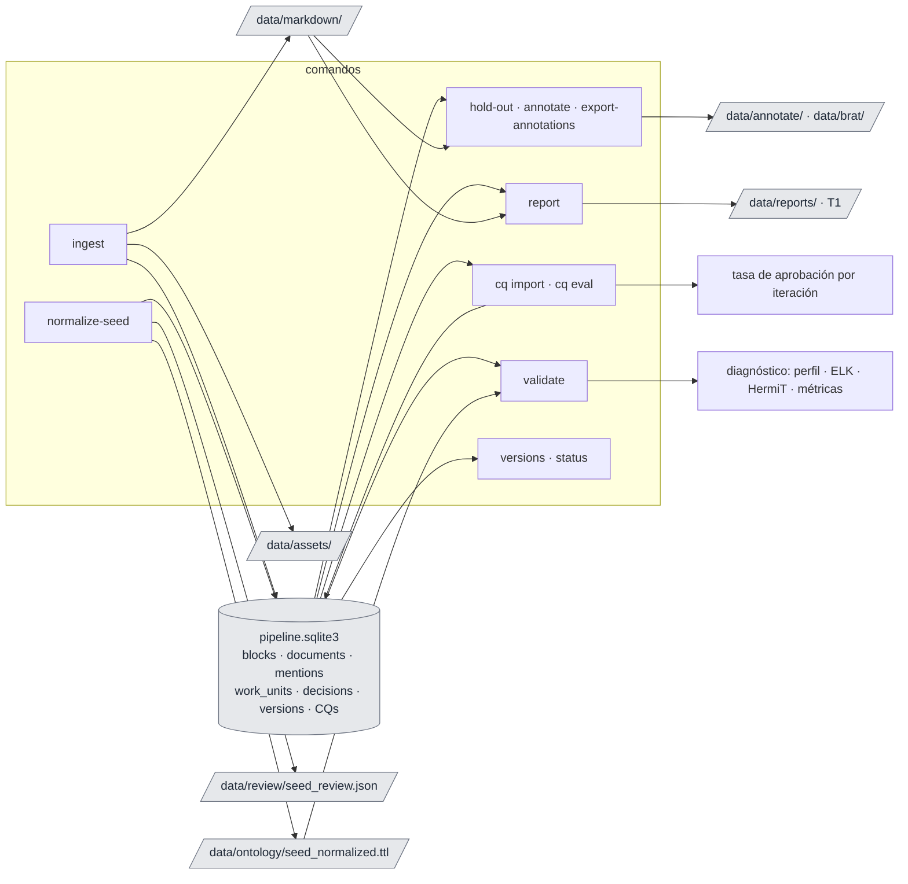
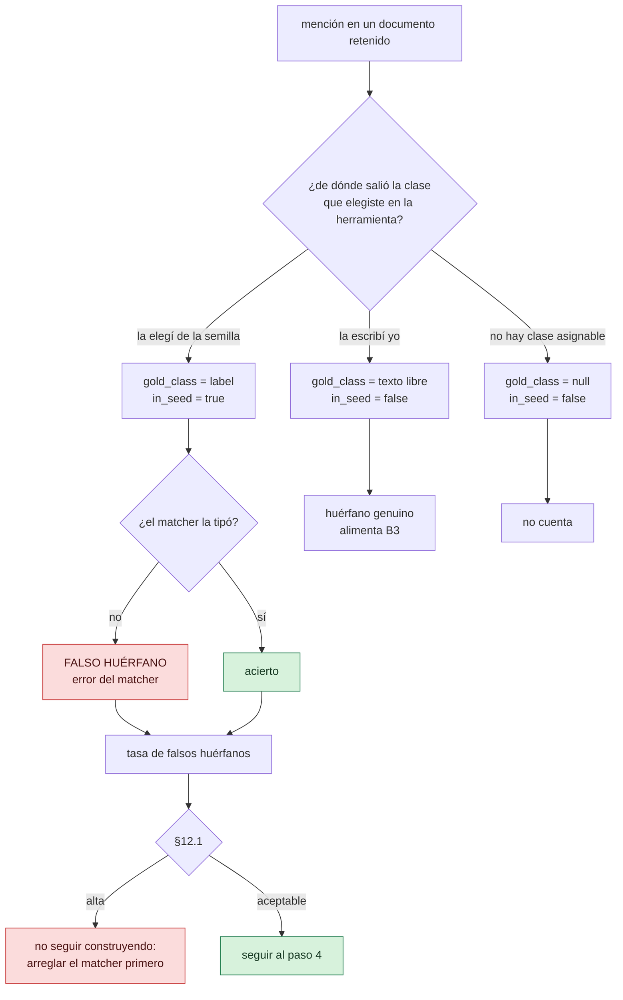

# onto-pipeline

Enriquecimiento ontológico asistido por LLM. La especificación de diseño es
[`especificacion_pipeline_ontologia.md`](especificacion_pipeline_ontologia.md); este README
sólo explica cómo se usa lo que está construido y qué falta.

El sistema opera en inglés (prompts, esquemas, logs). El corpus y las glosas son bilingües
es/en con etiqueta de idioma.

## Las etapas, por nombre

El spec las llama A0…B8 y esos códigos siguen siendo la referencia cruzada canónica, pero los
códigos no dicen qué hace cada una. Estos son los nombres que usan el CLI y los módulos.

| Código | Nombre | Qué hace |
|---|---|---|
| A0.0 | **profile** | Detecta el perfil OWL de la semilla (EL/QL/RL/DL) |
| A0.1–A0.3 | **normalize** | IRIs opacos, etiquetas derivadas, detección de erratas |
| A0.4 | **gloss** | Escribe una definición para cada clase |
| A1 | **classify** | Decide por página: born-digital, escaneada o incierta |
| A2 | **parse** | Extrae bloques con procedencia y arma el Markdown |
| — | **chunk** | Agrupa bloques en unidades de extracción sin partir tablas |
| A3 | **propose-cq** | Genera competency questions desde el corpus |
| A4 | **import-cq** | Carga las competency questions que escribís vos |
| B1 | **extract** | Saca menciones de concepto de cada chunk |
| B1b | **corefer** | Agrupa las menciones que hablan del mismo individuo |
| B2 | **match** | Tipa cada mención contra una clase, y resuelve entidades |
| B2b | **bridge** | Conecta huérfanas con la semilla por conocimiento del mundo |
| 6.4 | **conflicts** · **mark** | Documentos que se contradicen; notarizar, forzar, refutar |
| B3 | **induce** | Convierte huérfanas en clases nuevas |
| B4 | **axiomatize** | Propone axiomas; el código arma el OWL |
| B4b | **enrich** | Mejora las glosas con pasajes definicionales del corpus |
| B5 | **validate** | Cadena de filtros: ELK, HermiT, SHACL, OntoClean, OOPS!, evidencia, estructura |
| B6 | **branch** | Arma las alternativas coherentes entre las que elegís |
| B7–B8 | **apply** | Aplica la rama, versiona en el DAG, detecta loops |
| — | **regenerate** | Recomputa el ABox desde las menciones |

Los comandos del CLI ya usan estos nombres (`extract`, `coref`, `match`, `validate`), y los
módulos también (`extraction.py`, `coreference.py`, `matching.py`).

## Estado

El spec define una secuencia de construcción de 5 pasos (§12) y prohíbe explícitamente armar
el pipeline completo antes de ver datos. Vamos por el paso 3.

| Etapa | Estado |
|---|---|
| A0.0 detección de perfil OWL | listo |
| A0.1–A0.3 IRIs opacos, etiquetas, erratas | listo |
| A0.4 glosas | listo (requiere proveedor LLM) |
| A1 clasificación por página | listo |
| A2 parseo e ingesta | listo, sólo ruta born-digital |
| A3 generación de CQ | **no implementado** |
| A4 CQ del usuario | listo |
| Chunking estructura-consciente | listo |
| B1 extracción de candidatos | listo |
| B1b correferencia intra-documento | listo |
| B2 matching y resolución de entidades | cableado y calibrado contra CRAFT (ver Calibración) |
| Conjunto de retención: hold-out, anotador, exportador | listo |
| Banco de calibración contra corpus publicado | listo (`calibrate`) |
| B2b puenteo por conocimiento del mundo | listo (`bridge`) |
| B3 inducción de clases | listo (`induce`) |
| B4 axiomatización | listo (`axiomatize`) |
| B4b enriquecimiento de glosas | listo (`enrich`, `circular`) |
| B5 filtros 1, 2, 7 (ELK, HermiT, estructurales) | listo |
| B5 filtros 3–6 (SHACL, OntoClean, OOPS!, evidencia) | **no implementado** |
| B6 construcción de ramas | listo (`branch`); dos patrones de modelado del catálogo |
| B7–B8 DAG de versiones, hash de estado, loops | listo |
| Conflictos fácticos (§6.4) | listo (`conflicts`, `mark`) |
| Regeneración del ABox | listo (`regenerate`); falta el disparador tras aplicar una rama |


Verde: listo. Ámbar: parcial —`A2` sólo born-digital, `B2` calibrado contra un corpus publicado
pero no contra el par de aplicación, `B5` con 3 de 7 filtros—. Rojo: no implementado. **El
corte hoy está en B4:** el corpus llega hasta clases propuestas —extraídas, correferidas,
tipadas, puenteadas e inducidas— y la semilla hasta la TBox normalizada y validada, pero nada
convierte todavía una propuesta en axiomas.

**No hay sesión interactiva.** Hoy esto es un CLI de comandos discretos. El spec tiene varios
puntos donde el usuario decide —elegir rama (§6.6), zona gris del matcher (§6.2), pregunta por
propiedad funcional (§6.8), validación de CQ (§4.4), revisión de erratas en bloque (§4.3)— y
ninguno tiene interfaz todavía. Lo que sí existe es la maquinaria que **produce** esas
preguntas: quedan en archivos JSON bajo `data/review/` y en los objetos `Decision` de B2.

## Instalación

```bash
uv sync --extra dev                      # base + pytest/ruff
uv sync --extra dev --extra reasoning    # + JPype (ELK, HermiT)
uv sync --extra dev --extra matching     # + sentence-transformers (B2)
```

El razonador necesita jars que no se versionan:

```bash
./scripts/fetch-jars.sh        # ~83 jars a lib/, resueltos con Maven
```

Baja Maven a `.tools/` si no lo tenés instalado. Requiere Java 11+.

## Configuración

Un solo archivo central, `config/default.yaml` (§7 del spec). Todo umbral vive ahí; nada está
hardcodeado. Las rutas relativas se resuelven contra el archivo de config, así que los
comandos funcionan desde cualquier directorio.

```yaml
paths:
  corpus_root: ../../Corpus-08052026/General/files
  seed_ontology: ../../qualitative_ontology.rdf
  work_dir: ../data
  reasoner_lib: ../lib
  calibration_root: ../../calibration    # pares de calibración; ver la sección 9 de Uso
```

**Credenciales.** Nunca en el config, que se versiona. Van en un archivo de entorno explícito
—nunca autodescubierto— que se pasa con `--env-file`:

```bash
cp example.env opencode.env    # y completar OPENCODE_API_KEY
chmod 600 opencode.env         # gitignoreado por *.env
```

El config sólo guarda el **nombre** de la variable:

```yaml
llm:
  provider: openai_compatible
  base_url: https://opencode.ai/zen/go/v1
  api_key_env: OPENCODE_API_KEY
  models: {small: glm-5.3-flash, medium: deepseek-v4-flash, large: glm-5.2}
```

Para Ollama local: `base_url: http://127.0.0.1:11434/v1`, `api_key_env: ""`.

**Generación de candidatos de `match`** (`matching.blocking_strategy`). Comparar todas las
menciones entre sí es cuadrático, así que hay que decidir qué pares se comparan. Con
`embedding` —el default— un par es candidato si su coseno llega a `grey_zone_lower`, o si la
ontología afirma algo sobre él: misma forma superficial, mismo valor de una clave declarada, o
sinónimo declarado. **No agrega ninguna constante propia:** el umbral es el mismo desde el que
se leen las zonas, y por debajo de él la decisión habría sido `separate` de todos modos. Las
tres fuentes exactas van aparte justamente porque no dependen de ningún puntaje.

Los vectores se calculan una vez y se reusan entre el tipado y la resolución. Medido sobre las
848 menciones reales de la base, repartidas en 10 documentos:

| Estrategia | Pares candidatos | Tiempo |
|---|---|---|
| `embedding` | 4.566 | **0,5 s** |
| `surface_and_keys` | 5.283 | 1,7 s |
| `surface_and_keys`, re-encodeando cada par | 5.283 | 29,6 s |

`surface_and_keys` es el heurístico anterior —prefijo de 4 caracteres del primer token
alfabético— y queda disponible para comparar. Separa `in-depth interview` de
`semi-structured interview`, junta en un solo bloque todo lo que empiece con una stopword, y
sus constantes no se pueden calibrar con ningún experimento.

## Uso

`--env-file` es una opción global y va **antes** del subcomando.

Cada comando es una etapa discreta que deja su salida en disco; el siguiente la levanta de ahí.
No hay estado en memoria entre comandos.




### 1. Ingesta del corpus (A1 + A2)

```bash
uv run onto-pipeline ingest --limit 5      # primeros 5 documentos
uv run onto-pipeline ingest                # todo el corpus
uv run onto-pipeline ingest -d ruta/al.pdf # documentos puntuales
```

Clasifica cada página (`born_digital` / `scan` / `uncertain`), parsea las born-digital, y
puebla `blocks`, `documents` y `page_classification` en SQLite más un Markdown por documento.
Las páginas `scan`/`uncertain` se registran como `unparsed`: son la ruta VLM, que no está
implementada. La columna **table gap** cuenta páginas con caption de tabla pero sin tabla
extraída — el parser born-digital sólo ve tablas con líneas.

Es cacheable: re-ingestar un documento sin cambios no reprocesa nada. Cambiar un umbral del
config invalida el caché de esa etapa.

### 2. Normalización de la semilla (A0)

```bash
uv run onto-pipeline --env-file opencode.env normalize-seed
```

Acuña IRIs opacos (uuid5, reproducible), deriva etiquetas, corre los cuatro detectores de
erratas, arma los contextos de glosa y —si hay proveedor— genera las glosas. Commitea la
ontología al DAG de versiones.

Salida: `data/ontology/seed_normalized.ttl`. Los hallazgos que necesitan tu decisión
—divergencias de etiqueta, pares sin verificar entre idiomas, erratas— van a la tabla
`review_items`:

```bash
uv run onto-pipeline review list                       # lo que espera decisión
uv run onto-pipeline review list --kind typo --json    # para máquina
uv run onto-pipeline review resolve <id> rejected --comment "es un término del dominio"
```

Un hallazgo tiene identidad derivada de su contenido, así que re-correr `normalize-seed` no
duplica nada ni reabre lo ya decidido: lo que rechazaste queda rechazado. Y si un hallazgo deja
de aparecer porque cambiaste la semilla, pasa a `superseded` en vez de quedar colgado como
pendiente.

Sin proveedor configurado saltea A0.4 y te dice cuántas glosas quedaron pendientes.

### 3. Iteración sobre el corpus (B1 → B3)

```bash
uv run onto-pipeline --env-file opencode.env extract    # menciones por chunk
uv run onto-pipeline --env-file opencode.env coref      # agrupar las del mismo individuo
uv run onto-pipeline match                              # tipar contra la semilla
uv run onto-pipeline --env-file opencode.env bridge     # puentear huérfanas (§6.2b)
uv run onto-pipeline --env-file opencode.env induce     # las que quedan, a clases nuevas
```

**`bridge` no es opcional si vas a correr `induce`.** Antes de dar por huérfana una mención,
pregunta si se relaciona con una clase que la semilla ya tiene *aunque ningún documento lo
diga*: el corpus escribe "focus group" y la semilla tiene `Technique`. Sin esa etapa, cada
mención que la semilla sí cubría pero el matcher no conectó se vuelve una clase inducida
espuria — el falso huérfano alimentando al inductor, que es justo lo que la compuerta no-go de
§12.1 quiere evitar. `induce` avisa si no encuentra puentes para esa versión.

Al modelo **nunca se le pide OWL**: recibe un sintagma y una lista corta de clases candidatas, y
responde un juicio atómico —ejemplo de, tipo de, o ninguna—. Una clase que no estaba en la lista
es respuesta rechazada, no puente; se verifica mecánicamente, igual que `coref` verifica que
todo id agrupado exista.

Los puentes quedan marcados `world_knowledge`, y esa marca tiene consecuencia: **el filtro de
evidencia de B5 no se les aplica**. Sin la distinción, "todo axioma sin cita se descarta"
mataría exactamente los puentes que hacen útil a la semilla. Pasan igual por el razonador y por
OntoClean, y te llegan marcados como lo que son.

Medido sobre las 686 huérfanas de `v2`: con `min_candidate_score: 0.45` son 403 preguntas que
cubren el 70% de las huérfanas; bajarlo a 0,30 son 582 preguntas y el 98%. El umbral no está
calibrado, como todos los demás.

### 4. Axiomatización, enriquecimiento y ramas (B4 + B4b + B6)

```bash
uv run onto-pipeline --env-file opencode.env axiomatize   # propuestas -> axiomas
uv run onto-pipeline branch                               # ¿hay algo que decidir?
uv run onto-pipeline branch --choose b_fceba3e2 --why "el medio es el corte"
```

`axiomatize` le hace al modelo **una sola pregunta atómica** por propuesta —¿es un tipo de esa
clase, un ejemplo de esa clase, o ninguna?— y el código escribe el OWL. Un modelo que sólo
responde eso no puede confundir subsunción con instanciación, porque nunca escribe el axioma;
esa confusión es el primer sesgo que lista §6.1. "Ejemplo de" **rechaza** la propuesta en vez de
colgarla: no era una clase. "Ninguna" la deja raíz, porque un padre forzado es peor que ninguno.

`branch` busca qué hay que decidir entre esos axiomas. **A ningún modelo se le piden
alternativas** — es la única prohibición explícita del spec para esta etapa, porque pedir tres
devuelve tres correlacionadas. Los ejes salen de dos lados y nada más:

- **El razonador.** Una justificación de una clase insatisfacible, restringida a los axiomas de
  esta iteración, es un conjunto de conflicto mínimo; las salidas son sus hitting sets mínimos
  (diagnóstico de Reiter). Si la justificación no toca ningún axioma propuesto, la ontología ya
  estaba rota antes: eso se reporta como defecto, no como rama.
- **Un catálogo enumerado de compromisos de modelado**, que el razonador *no* puede encontrar
  porque los dos lados son consistentes. Hoy tiene dos entradas con detector mecánico:
  `attribute_as_class` (varias subclases que son el padre calificado por un modificador:
  ¿`Semi-Structured Interview` es una clase, o `schedule` es una dimensión de `Interview`?) y
  `division_criterion` (un padre partido por dos criterios a la vez, §8.2). Una tercera queda
  catalogada y sin detector a propósito —reificar vs. propiedad directa— para que el hueco se
  vea en vez de insinuarse.

Lo normal es que no haya ningún eje: entonces aplica todo y lo dice. **El multi-rama es el
camino excepcional.** Preguntar en cada iteración sin conflicto real es exactamente el trabajo
manual que el pipeline existe para evitar (D21).

Los ejes que no comparten axiomas se presentan **por separado**: k ejes binarios son k
preguntas, no 2^k ramas. Sólo los acoplados se expanden en ramas completas, con techo de cinco.

Cada rama trae su puntaje —cobertura de huérfanas, costo de reorganización, costo de
regeneración del ABox— y el hash del estado que produciría, así que una rama que vuelve a una
versión ya visitada te lo avisa antes de elegirla. La afinidad histórica llega vacía hasta que
haya algo decidido: es el cold start de §11, reportado como ausente y no como cero.

Elegir una rama es lo que **graba los rechazos**. Lo aceptado ya está en la ontología; lo
rechazado no está en ningún otro lado, y es lo que una iteración posterior lee para no volver a
proponer lo mismo (§6.7). Se graba después de aplicar, no antes: el razonador todavía puede
rechazar la rama, y una decisión registrada sobre un estado que nunca se aplicó sería mentira.

#### Enriquecimiento de glosas (B4b)

```bash
uv run onto-pipeline enrich --dry-run                     # qué pasajes hay, sin preguntar nada
uv run onto-pipeline --env-file opencode.env enrich       # mejorar glosas y cosechar sinónimos
uv run onto-pipeline circular                             # los matches que no cuentan como evidencia
```

La glosa no es un valor fijo de A0: se arranca desde el vecindario estructural y cada iteración
la mejora con lo que el corpus efectivamente dice. Eso cierra el bucle autocorrectivo de §4.3
—mejor glosa → mejor matching → menos falsos huérfanos— y una mención huérfana en la iteración 3
puede tiparse bien en la 8.

**Los pasajes se encuentran mecánicamente**, por señal definitoria: "X is a", "we define X as",
"X refers to", "también llamado". No se le pregunta a un modelo cuáles párrafos son
definitorios, porque un corpus tiene muchos más párrafos que presupuesto tiene pedidos, y un
filtro que cuesta un pedido por párrafo no es un filtro. Recién los pasajes que pasan el filtro
llegan al modelo, y sólo se le pregunta por ellos.

Dos cosas propias de este pipeline cambian cómo corre ese bucle, y conviene decirlas:

- El matcher resultó mejor contra **etiquetas** que contra glosas, al revés de la premisa del
  spec. Así que lo que realimenta al matching es el `skos:altLabel` que la etapa cosecha, no la
  `skos:definition` que reescribe. La definición sigue importando —es lo que el prompt de
  axiomatización muestra como significado de un candidato, y es lo que lee una persona— pero el
  bucle pasa por los sinónimos.
- Un sinónimo que no aparece literalmente en los pasajes **se descarta**, igual que `coref`
  verifica que todo id agrupado exista y `bridge` que la clase nombrada esté en la ontología. Un
  sinónimo salido del conocimiento del modelo puede incluso ser correcto, pero quedaría grabado
  con una procedencia que no se cumple — y el control de circularidad se apoya en que esa
  procedencia diga la verdad.

**Control de circularidad (§4.3).** Cada enriquecimiento registra qué documentos contribuyeron.
Si después una mención de uno de esos documentos matchea contra esa clase, ese match no es
evidencia independiente: la clase se describió usando ese documento, así que el match es en
parte el pipeline reconociendo su propia escritura. `circular` los cuenta. No son errores y no
se tiran; son los que no hay que sumar como cobertura.

Sobre el par actual el resultado es cero pasajes para las 34 clases de la semilla, que es
exactamente lo que predice el desajuste temático documentado más abajo: no es una falla de la
etapa, es la etapa reportando que el corpus no define nada de lo que la semilla nombra.

### 5. Conflictos fácticos (§6.4)

```bash
uv run onto-pipeline conflicts                       # ¿quién se contradice con quién?
uv run onto-pipeline mark -m m123 --mark refuted --comment "el paper se equivoca"
uv run onto-pipeline mark -m m456 --mark misextracted --export data/eval/b1-errors.jsonl
uv run onto-pipeline regenerate                      # recién ahí el ABox lo refleja
```

Distintos de los compromisos de modelado de `branch`: acá el documento 12 afirma X y el 47
afirma ¬X. Como el ABox deriva de la capa de menciones, lo que un documento afirma sobre una
entidad es su tipo, así que el desacuerdo es una entidad tipada a dos clases por documentos
distintos.

**El filtro de volumen es el diseño.** Decidir caso por caso es la revisión manual que el
pipeline existe para evitar (D5), así que la división es mecánica:

| El conflicto… | Destino |
|---|---|
| no rompe al razonador | **notarizado sin preguntar** — ambos hechos, con su procedencia, y una marca `notarizedTypeConflict` para que el desacuerdo siga siendo encontrable |
| rompe al razonador | llega a `review`, y van a ser pocos |

Notarizar es el default silencioso porque es la única política que no destruye información. Las
otras dos existen y son por caso: `force` (gana una fuente; sin excepción nombrada gana la clase
mejor atestiguada, empate por IRI para que la salida sea reproducible) y `refute`.

**La subsunción no es desacuerdo.** Una entidad tipada a `Interview` y a `Technique`, siendo la
primera un tipo de la segunda, es un hecho dicho a dos niveles de detalle. Sin ese filtro el
reporte se llena de la jerarquía discutiendo consigo misma — medido sobre el caso de prueba: 4
conflictos aparentes, 1 real.

**Un conflicto es un caso; un patrón es una pregunta sobre la TBox.** Si el mismo par de clases
choca sobre `conflict_pattern_threshold` entidades o más, eso no son N casitos: o las dos clases
se están usando para lo mismo, o la propiedad necesita contextualizarse. Y contextualizar cambia
la forma de todas las consultas sobre esa propiedad, incluidas las SPARQL de las CQ, así que es
un eje de `branch` y nunca una decisión por caso.

**`refuted` y `misextracted` no son lo mismo y no hay que mezclarlos.** Parecen iguales en una
interfaz y son señales opuestas:

- `refuted`: el documento lo afirma y no es cierto. La aserción sale del ABox.
- `misextracted`: el documento nunca dijo eso, el extractor leyó mal. **Es un bug de B1**, sale
  igual del ABox, y además va al conjunto de evaluación con `--export`. Son etiquetas de error
  de extracción que nadie anotó a propósito: la única fuente gratuita que el sistema tiene.

Las marcas viajan como excepciones de las reglas de mapeo, así que entran al `rules_hash`: una
decisión que no cambiara ninguna regla sería una decisión que el ABox nunca nota, porque
`regenerate` es idempotente sobre (estado, reglas).

Bajo mundo abierto, no asertar X y asertar ¬X son cosas distintas: la primera es silencio, la
segunda es conocimiento. Marcar algo falso **no** escribe una aserción negativa en la ontología.

### 6. Validación (A0.0 + B5)

```bash
uv run onto-pipeline validate                    # última versión
uv run onto-pipeline validate --version v0
```

Perfil OWL, ELK, HermiT con justificaciones, y métricas estructurales.

**ELK nunca aprueba.** Devuelve `REJECTED` (encontró algo, y es real) o `INCONCLUSIVE` (no
encontró nada, pero puede haber ignorado el axioma culpable), nunca `OK`. Si la cobertura EL
cae por debajo del umbral, devuelve `SKIPPED`.

### 7. Competency questions

```bash
uv run onto-pipeline cq import examples/competency_questions.json
uv run onto-pipeline cq eval --iteration 3
```

Cada CQ va pareada con su SPARQL, que tiene que parsear; una CQ generada además necesita cita.
`eval` corre todo contra una versión del DAG y registra la tasa de aprobación, que es el
criterio de parada primario.

### 8. Regeneración del ABox

```bash
uv run onto-pipeline regenerate                  # última versión
uv run onto-pipeline regenerate --version v3
uv run onto-pipeline regenerate --force          # reescribir aunque las reglas no cambien
```

Recomputa el ABox desde la capa de menciones y los tipados de una versión de ontología, y lo
escribe en `data/ontology/<version>.abox.trig`. **No es una migración**: como el ABox se deriva
de las menciones y no de fuentes externas, reorganizar la TBox nunca necesita una — cambian las
reglas y esto se corre de nuevo.

La función es pura y **sólo lee** la capa de menciones, que es el invariante de §3 y lo único
que esta etapa podría romper por descuido. Las reglas de mapeo salen de `mapping:` en el config;
el contrato completo está en [`plan_reglas_de_mapeo.md`](plan_reglas_de_mapeo.md). Dos cosas que
conviene saber al leer la salida:

- **El IRI de un individuo se acuña desde su mención ancla**, no desde el grupo entero. Sumar
  menciones a una entidad —lo que pasa en cada iteración— conserva su IRI; sólo partir el grupo
  genera uno nuevo, que es cuando corresponde.
- **La zona gris no tipa.** Con `type_from: [auto]`, una mención que quedó en zona gris produce
  un individuo con procedencia y sin clase. Existe, y lo que falta es la decisión, no el dato.

La versión queda estampada con el hash de las reglas que produjeron su ABox, así que re-correr
con las mismas reglas no hace nada y lo dice.

### 9. Inspección

```bash
uv run onto-pipeline report                 # T1: HTML por documento
uv run onto-pipeline chunks <doc_id>        # unidades de extracción de B1
uv run onto-pipeline blocks <doc_id> -p 3   # bloques con procedencia, JSON
uv run onto-pipeline versions               # el DAG
uv run onto-pipeline diff                   # qué cambió la última versión
uv run onto-pipeline diff --version v3 --against v1
uv run onto-pipeline status                 # telemetría: llamadas y tokens por etapa
uv run onto-pipeline hold-out --help        # qué documentos están retenidos
```

**El diff es semántico, no textual** (§6.8): compara conjuntos canónicos de axiomas lógicos con
los blank nodes canonicalizados, así que reordenar la serialización no es un cambio y un
renombre aparece como cambio de anotación, no como axiomas que van y vienen. En pantalla se lee
por etiquetas —con IRIs opacos, un diff de IRIs crudos no es revisable— y el JSON que queda en
`data/ontology/<origen>-to-<destino>.diff.json` conserva los IRIs completos.

Cada comando que commitea una versión lo emite solo: además de la ontología entera, deja el
diff contra la versión inmediatamente anterior del DAG. Una versión raíz lo dice y no genera
archivo.

El **reporte T1** es el criterio de avance del paso 1: un HTML autocontenido por documento con
el render de cada página al lado de lo que el parser entendió, mostrando clase de página con
sus señales, tipo de bloque, bbox, idioma y span en el Markdown. Los bloques que el filtro de
boilerplate descartó aparecen atenuados.

### 10. Conjunto de retención

Son 5–10 documentos anotados por vos que **nunca entran al proceso** (§10.1). Sirven para medir
la tasa de falsos huérfanos, que es lo que gobierna el punto de decisión no-go de §12.1.

```bash
uv run onto-pipeline ingest -d ruta/al/doc.pdf      # 1. parsear
uv run onto-pipeline hold-out <doc_id> [<doc_id>…]  # 2. marcar como retenidos
uv run onto-pipeline annotate                       # 3. generar la herramienta
uv run onto-pipeline export-annotations doc.jsonl   # 4. validar e ir a BRAT
```

Hay que parsearlos aunque no entren al proceso: los offsets de la anotación indexan el
Markdown que produce A2, así que sin parsear no hay a qué anclarlos. `hold-out` marca la
diferencia; sin esa marca el conjunto se filtra a B1 y la evaluación mediría el pipeline contra
su propio insumo. La marca sobrevive a una re-ingesta.

**La herramienta de anotación** (paso 3) es un HTML autocontenido por documento en
`data/annotate/`. Se abre en el navegador —el corpus no sale de tu máquina— y tiene tres
acciones: seleccionar texto y elegir una clase de la semilla, escribir una clase que la semilla
no tiene, o marcar la mención como válida sin clase asignable.

`in_seed` no se pregunta: se deriva de por dónde elegiste la clase. Es la distinción sobre la
que descansa toda la métrica y es demasiado fácil de errar si es un checkbox.

| Acción en la herramienta | `gold_class` | `in_seed` | Qué significa si el matcher no la tipa |
|---|---|---|---|
| Clase de la semilla | el label | `true` | **falso huérfano** — un error del matcher |
| Clase nueva | lo que escribas | `false` | **huérfano genuino** — alimenta B3 |
| Sin clase asignable | `null` | `false` | no cuenta: no es falla del matcher |




Va guardando en `localStorage` del navegador; exportá antes de cerrar. El JSONL exportado
valida los offsets contra el `markdown_hash`: si cambió el parser, se niega en vez de
desalinear en silencio.

El formato es propio porque `in_seed` no lo contempla ningún estándar; el exportador a
BRAT/INCEpTION lo degrada a atributo ad-hoc, que es la única pérdida.

### 11. Calibración contra un corpus publicado

El conjunto de retención mide el **caso de aplicación**. Para fijar los umbrales hace falta otra
cosa: un corpus ya anotado contra una ontología, donde `in_seed` **es decidible por
construcción** —la clase gold está en la ontología o no está— y por lo tanto la métrica que
gobierna la compuerta del §12.1 no necesita campaña de anotación.

```bash
uv run onto-pipeline calibrate craft-cl -m label -m gloss -m label_and_gloss
uv run onto-pipeline calibrate craft-cl -m label --cross-encoder
uv run onto-pipeline calibrate craft-cl -m label --holdout 0.2
```

Los pares viven fuera del repo, en [`../calibration/`](../calibration/README.md), al lado de los
demás corpus de prueba; `paths.calibration_root` apunta ahí. Cada uno trae su `pair.yml` y una
nota de fase 0 con procedencia, licencia, formato y decisiones de importación. El primario es
**CRAFT · CL+extensions**: 97 artículos, 8.723 menciones, 3.418 clases.

Lo que reporta, además del barrido de umbrales:

- **La separación** entre los scores del top-1 correcto y los del top-1 equivocado. Es la
  pregunta que va *antes* de dónde poner el umbral: si las dos distribuciones se pisan, ningún
  umbral ayuda y lo que hay que arreglar es el ranking.
- **Huérfanos genuinos fabricados.** Un corpus anotado contra O no tiene ninguno, así que esa
  mitad de la compuerta quedaría sin probar. `--holdout` retiene una fracción determinista del
  inventario: toda mención de una clase retenida es un huérfano genuino de respuesta conocida.
- **Clases que nunca pueden ser correctas.** CRAFT publica, por conjunto de anotación, las clases
  que sus anotadores decidieron no usar. Salen del inventario por defecto; `--keep-excluded`
  mide cuánto error causaban.

El plan completo y los resultados están en
[`plan_cambio_corpus_calibracion.md`](plan_cambio_corpus_calibracion.md).

## Dónde queda todo

```
data/                 gitignoreado; todo es derivado y regenerable
  pipeline.sqlite3    menciones, bloques, work_units, decisiones, versiones, CQs
  markdown/           un .md por documento; los spans de los bloques indexan esto
  assets/             recortes de figuras
  reports/            HTML de evaluación del parser (T1)
  ontology/           la semilla normalizada, el diff y el ABox de cada versión
  review/             lo que espera tu revisión
  brat/               exportación del conjunto de retención
  calibration/        resultados del barrido, un JSON por par
lib/                  jars del razonador (gitignoreado)

../calibration/       fuera del repo, al lado de Corpus-08052026 y qualitative_ontology.rdf
  README.md           índice de pares
  craft-cl/           pair.yml, NOTA_FASE0.md, ontology/
  _craft/             el clone esparso de CRAFT; regenerable, ver la nota
```

## Caché, checkpoint y telemetría

Son **un solo mecanismo**, la tabla `work_units` (§8.3). La clave incluye etapa, versión del
prompt, temperatura y hash del input, así que editar un prompt invalida el caché de esa etapa.
Cada etapa enumera todas sus unidades antes de emitir nada; reanudar es volver a correr el
comando. Los fallos reintentan con backoff y quedan registrados sin frenar la etapa, salvo que
la tasa supere `execution.stage_failure_rate_abort`.

`onto-pipeline status` muestra unidades, fallos y tokens por etapa.

## Desarrollo

```bash
uv run pytest -q                                       # 126 tests
uv run --extra reasoning --extra matching pytest -q    # incluye razonador y encoders
uv run ruff check .
```

Los tests del razonador se saltean solos si no corriste `fetch-jars.sh`.

Las mejoras a futuro y las decisiones tomadas con evidencia insuficiente están en
[`DEUDA_TECNICA.md`](DEUDA_TECNICA.md), que además lleva la nota de coordinación entre las
conversaciones que trabajan sobre este repo.

## Limitaciones conocidas

- **El corpus y la semilla no se corresponden.** Medido sobre los 495.213 caracteres de los 10
  documentos parseados: `field note`, `informant`, `ethnograph`, `coding scheme`,
  `thematic analysis`, `content analysis`, `grounded theory` y `theoretical framework` aparecen
  **cero veces**. La semilla es de metodología cualitativa; el corpus son papers de política de
  ciencia abierta, que hablan *sobre* investigación en vez de reportar estudios cualitativos.
  Una tasa de falsos huérfanos medida sobre este par no sería mala: sería sin significado,
  porque mediría el desajuste temático y no la calidad del matcher.

- **Corrido sobre datos reales, B2 tipa mal.** De 1.725 menciones: 32 automáticas, 219 en zona
  gris, 1.474 huérfanas (85%). Y las 32 automáticas son **todas** eco léxico — `question` 0.998,
  `information` 0.998, `support` 0.993, `subject` 0.992 — el nombre de la clase apareciendo como
  palabra corriente, ninguna una instanciación real. Con el par corpus/semilla desalineado ese
  85% no es un veredicto sobre el matcher.
- **El matcher compara contra etiquetas, no contra glosas, al revés de lo que dice §6.2.**
  Ya no es provisional. Medido sobre CRAFT/CL —8.723 menciones gold contra 3.418 clases, 96% con
  definición escrita por curadores— recall@1: etiqueta 69,8%, etiqueta+glosa 13,3%, glosa 7,9%.
  Y lo que decide no es el recall sino el signo de la separación entre aciertos y errores:
  +1,61 con etiquetas, **−0,42 con glosas**, donde los errores puntúan más alto que los
  aciertos y ningún umbral ayuda. Una mención es un sintagma corto y una etiqueta también; una
  glosa es una oración, y un encoder simétrico pierde más por esa diferencia de forma de lo que
  gana en significado. Se revisa con un encoder asimétrico, no con un umbral.
- **La zona gris se desborda mientras los umbrales no estén calibrados.** Con generación de
  candidatos por embedding, todo par candidato ya está por encima de `grey_zone_lower` por
  construcción, así que sobre las 848 menciones caen 2.155 pares en zona gris contra 480 del
  heurístico anterior. No es una regresión: esos pares antes no se formaban, y se separaban en
  silencio sin que nadie los mirara. Ahora son visibles, y son trabajo para el usuario hasta
  que la calibración mueva el piso a donde corresponda.
- **Los umbrales 0.92/0.70 resultaron bien puestos, sobre otro par.** El barrido sobre CRAFT/CL
  pone el máximo de F1 en 0,774 con el corte en 0,90, así que 0,92 está casi en el óptimo. Dos
  salvedades: el óptimo de F1 deja la tasa de falsos huérfanos en 26,3%, y el punto de operación
  depende del tamaño del inventario, que acá son 3.418 clases contra las 34 de la semilla.
- **El cross-encoder viene apagado, ahora con evidencia.** Re-rankeando el top-5 del bi-encoder
  sobre CRAFT/CL, el recall@1 cae de 6.090 a 2.220 y la separación se va a **−0,56**: no solo
  aplasta los puntajes a ~0,1–0,3 —que es el falso huérfano que nombra R1— sino que además
  ordena peor. Recién sirve tuneado con LoRA sobre etiquetas acumuladas (§6.3).
- **Tablas sin bordes salen como prosa.** `find_tables` sólo ve tablas con líneas; la
  estrategia por texto devuelve la página entera como tabla. El pipeline reporta el hueco en
  vez de adivinar. La respuesta del spec es rutear esas páginas a MinerU.
- **No hay ruta VLM.** Páginas `scan`/`uncertain`, captioning de figuras y fórmulas quedan sin
  procesar.
- **Fuera de v1** (§12.2): embeddings de grafos, minería de reglas, herramientas dedicadas de
  correferencia, persistencia en Fuseki, importador desde BRAT.
