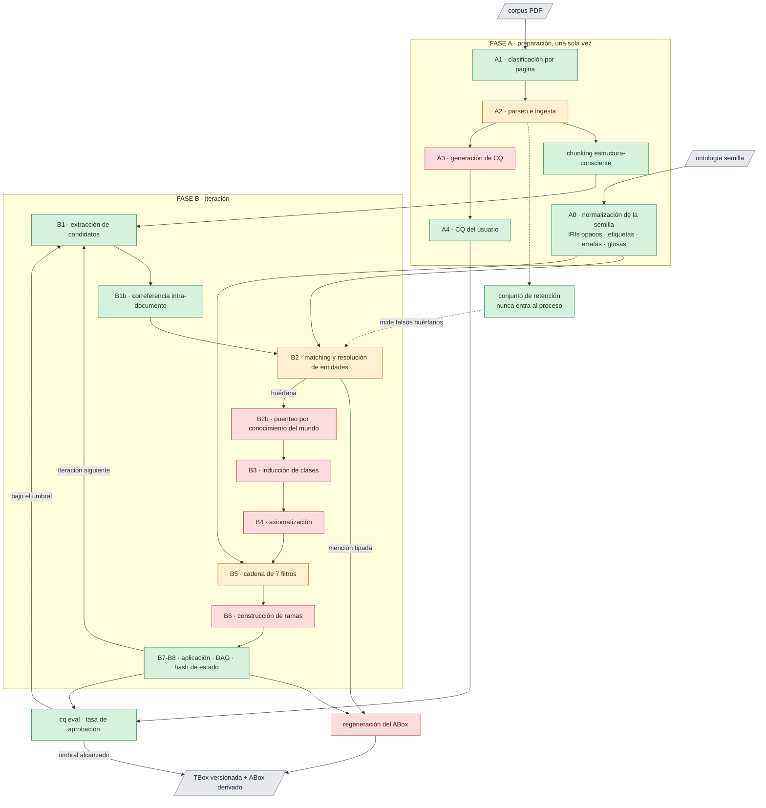
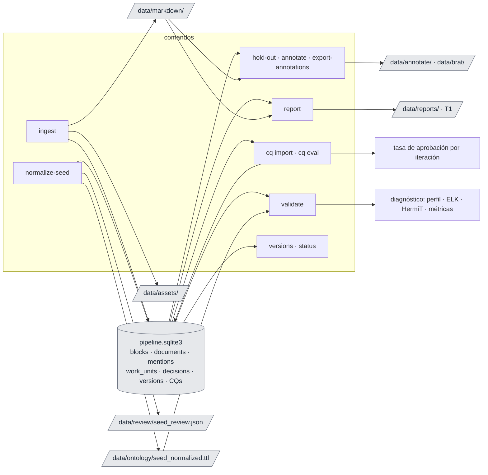
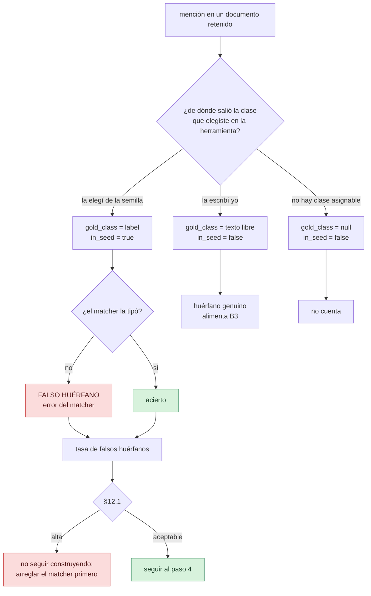

# onto-pipeline

Enriquecimiento ontológico asistido por LLM. La especificación de diseño es
[`especificacion_pipeline_ontologia.md`](especificacion_pipeline_ontologia.md); este README
sólo explica cómo se usa lo que está construido y qué falta.

El sistema opera en inglés (prompts, esquemas, logs). El corpus y las glosas son bilingües
es/en con etiqueta de idioma.

## Las etapas, por nombre

El spec las llama A0…B8 y esos códigos siguen siendo la referencia cruzada canónica, pero los
códigos no dicen qué hace cada una. Estos son los nombres que usan el CLI y los módulos.

| Código | Nombre | Qué hace |
|---|---|---|
| A0.0 | **profile** | Detecta el perfil OWL de la semilla (EL/QL/RL/DL) |
| A0.1–A0.3 | **normalize** | IRIs opacos, etiquetas derivadas, detección de erratas |
| A0.4 | **gloss** | Escribe una definición para cada clase |
| A1 | **classify** | Decide por página: born-digital, escaneada o incierta |
| A2 | **parse** | Extrae bloques con procedencia y arma el Markdown |
| — | **chunk** | Agrupa bloques en unidades de extracción sin partir tablas |
| A3 | **propose-cq** | Genera competency questions desde el corpus |
| A4 | **import-cq** | Carga las competency questions que escribís vos |
| B1 | **extract** | Saca menciones de concepto de cada chunk |
| B1b | **corefer** | Agrupa las menciones que hablan del mismo individuo |
| B2 | **match** | Tipa cada mención contra una clase, y resuelve entidades |
| B2b | **bridge** | Conecta huérfanas con la semilla por conocimiento del mundo |
| B3 | **induce** | Convierte huérfanas en clases nuevas |
| B4 | **axiomatize** | Propone axiomas; el código arma el OWL |
| B4b | **enrich** | Mejora las glosas con pasajes definicionales del corpus |
| B5 | **validate** | Cadena de filtros: ELK, HermiT, SHACL, OntoClean, OOPS!, evidencia, estructura |
| B6 | **branch** | Arma las alternativas coherentes entre las que elegís |
| B7–B8 | **apply** | Aplica la rama, versiona en el DAG, detecta loops |
| — | **regenerate** | Recomputa el ABox desde las menciones |

Los comandos del CLI ya usan estos nombres (`extract`, `coref`, `match`, `validate`), y los
módulos también (`extraction.py`, `coreference.py`, `matching.py`).

## Estado

El spec define una secuencia de construcción de 5 pasos (§12) y prohíbe explícitamente armar
el pipeline completo antes de ver datos. Vamos por el paso 3.

| Etapa | Estado |
|---|---|
| A0.0 detección de perfil OWL | listo |
| A0.1–A0.3 IRIs opacos, etiquetas, erratas | listo |
| A0.4 glosas | listo (requiere proveedor LLM) |
| A1 clasificación por página | listo |
| A2 parseo e ingesta | listo, sólo ruta born-digital |
| A3 generación de CQ | **no implementado** |
| A4 CQ del usuario | listo |
| Chunking estructura-consciente | listo |
| B1 extracción de candidatos | listo |
| B1b correferencia intra-documento | listo |
| B2 matching y resolución de entidades | cableado, **sin calibrar** (ver Limitaciones) |
| Conjunto de retención: hold-out, anotador, exportador | listo |
| B2b puenteo por conocimiento del mundo | **no implementado** |
| B3 inducción de clases | **no implementado** |
| B4 axiomatización · B4b enriquecimiento de glosas | **no implementado** |
| B5 filtros 1, 2, 7 (ELK, HermiT, estructurales) | listo |
| B5 filtros 3–6 (SHACL, OntoClean, OOPS!, evidencia) | **no implementado** |
| B6 construcción de ramas | **no implementado** |
| B7–B8 DAG de versiones, hash de estado, loops | listo |
| Regeneración del ABox | **no implementado** (depende de B1–B2) |




Verde: listo. Ámbar: parcial —`A2` sólo born-digital, `B2` sin calibrar, `B5` con 3 de 7
filtros—. Rojo: no implementado. **El corte hoy está en B2b:** el corpus ya llega
hasta menciones extraídas y correferidas, y la semilla hasta la TBox normalizada y validada,
pero nada cruza todavía de las menciones huérfanas a la inducción de clases.

**No hay sesión interactiva.** Hoy esto es un CLI de comandos discretos. El spec tiene varios
puntos donde el usuario decide —elegir rama (§6.6), zona gris del matcher (§6.2), pregunta por
propiedad funcional (§6.8), validación de CQ (§4.4), revisión de erratas en bloque (§4.3)— y
ninguno tiene interfaz todavía. Lo que sí existe es la maquinaria que **produce** esas
preguntas: quedan en archivos JSON bajo `data/review/` y en los objetos `Decision` de B2.

## Instalación

```bash
uv sync --extra dev                      # base + pytest/ruff
uv sync --extra dev --extra reasoning    # + JPype (ELK, HermiT)
uv sync --extra dev --extra matching     # + sentence-transformers (B2)
```

El razonador necesita jars que no se versionan:

```bash
./scripts/fetch-jars.sh        # ~83 jars a lib/, resueltos con Maven
```

Baja Maven a `.tools/` si no lo tenés instalado. Requiere Java 11+.

## Configuración

Un solo archivo central, `config/default.yaml` (§7 del spec). Todo umbral vive ahí; nada está
hardcodeado. Las rutas relativas se resuelven contra el archivo de config, así que los
comandos funcionan desde cualquier directorio.

```yaml
paths:
  corpus_root: ../../Corpus-08052026/General/files
  seed_ontology: ../../qualitative_ontology.rdf
  work_dir: ../data
  reasoner_lib: ../lib
```

**Credenciales.** Nunca en el config, que se versiona. Van en un archivo de entorno explícito
—nunca autodescubierto— que se pasa con `--env-file`:

```bash
cp example.env opencode.env    # y completar OPENCODE_API_KEY
chmod 600 opencode.env         # gitignoreado por *.env
```

El config sólo guarda el **nombre** de la variable:

```yaml
llm:
  provider: openai_compatible
  base_url: https://opencode.ai/zen/go/v1
  api_key_env: OPENCODE_API_KEY
  models: {small: glm-5.3-flash, medium: deepseek-v4-flash, large: glm-5.2}
```

Para Ollama local: `base_url: http://127.0.0.1:11434/v1`, `api_key_env: ""`.

**Generación de candidatos de `match`** (`matching.blocking_strategy`). Comparar todas las
menciones entre sí es cuadrático, así que hay que decidir qué pares se comparan. Con
`embedding` —el default— un par es candidato si su coseno llega a `grey_zone_lower`, o si la
ontología afirma algo sobre él: misma forma superficial, mismo valor de una clave declarada, o
sinónimo declarado. **No agrega ninguna constante propia:** el umbral es el mismo desde el que
se leen las zonas, y por debajo de él la decisión habría sido `separate` de todos modos. Las
tres fuentes exactas van aparte justamente porque no dependen de ningún puntaje.

Los vectores se calculan una vez y se reusan entre el tipado y la resolución. Medido sobre las
848 menciones reales de la base, repartidas en 10 documentos:

| Estrategia | Pares candidatos | Tiempo |
|---|---|---|
| `embedding` | 4.566 | **0,5 s** |
| `surface_and_keys` | 5.283 | 1,7 s |
| `surface_and_keys`, re-encodeando cada par | 5.283 | 29,6 s |

`surface_and_keys` es el heurístico anterior —prefijo de 4 caracteres del primer token
alfabético— y queda disponible para comparar. Separa `in-depth interview` de
`semi-structured interview`, junta en un solo bloque todo lo que empiece con una stopword, y
sus constantes no se pueden calibrar con ningún experimento.

## Uso

`--env-file` es una opción global y va **antes** del subcomando.

Cada comando es una etapa discreta que deja su salida en disco; el siguiente la levanta de ahí.
No hay estado en memoria entre comandos.




### 1. Ingesta del corpus (A1 + A2)

```bash
uv run onto-pipeline ingest --limit 5      # primeros 5 documentos
uv run onto-pipeline ingest                # todo el corpus
uv run onto-pipeline ingest -d ruta/al.pdf # documentos puntuales
```

Clasifica cada página (`born_digital` / `scan` / `uncertain`), parsea las born-digital, y
puebla `blocks`, `documents` y `page_classification` en SQLite más un Markdown por documento.
Las páginas `scan`/`uncertain` se registran como `unparsed`: son la ruta VLM, que no está
implementada. La columna **table gap** cuenta páginas con caption de tabla pero sin tabla
extraída — el parser born-digital sólo ve tablas con líneas.

Es cacheable: re-ingestar un documento sin cambios no reprocesa nada. Cambiar un umbral del
config invalida el caché de esa etapa.

### 2. Normalización de la semilla (A0)

```bash
uv run onto-pipeline --env-file opencode.env normalize-seed
```

Acuña IRIs opacos (uuid5, reproducible), deriva etiquetas, corre los cuatro detectores de
erratas, arma los contextos de glosa y —si hay proveedor— genera las glosas. Commitea la
ontología al DAG de versiones.

Salida: `data/ontology/seed_normalized.ttl`. Los hallazgos que necesitan tu decisión
—divergencias de etiqueta, pares sin verificar entre idiomas, erratas— van a la tabla
`review_items`:

```bash
uv run onto-pipeline review list                       # lo que espera decisión
uv run onto-pipeline review list --kind typo --json    # para máquina
uv run onto-pipeline review resolve <id> rejected --comment "es un término del dominio"
```

Un hallazgo tiene identidad derivada de su contenido, así que re-correr `normalize-seed` no
duplica nada ni reabre lo ya decidido: lo que rechazaste queda rechazado. Y si un hallazgo deja
de aparecer porque cambiaste la semilla, pasa a `superseded` en vez de quedar colgado como
pendiente.

Sin proveedor configurado saltea A0.4 y te dice cuántas glosas quedaron pendientes.

### 3. Validación (A0.0 + B5)

```bash
uv run onto-pipeline validate                    # última versión
uv run onto-pipeline validate --version v0
```

Perfil OWL, ELK, HermiT con justificaciones, y métricas estructurales.

**ELK nunca aprueba.** Devuelve `REJECTED` (encontró algo, y es real) o `INCONCLUSIVE` (no
encontró nada, pero puede haber ignorado el axioma culpable), nunca `OK`. Si la cobertura EL
cae por debajo del umbral, devuelve `SKIPPED`.

### 4. Competency questions

```bash
uv run onto-pipeline cq import examples/competency_questions.json
uv run onto-pipeline cq eval --iteration 3
```

Cada CQ va pareada con su SPARQL, que tiene que parsear; una CQ generada además necesita cita.
`eval` corre todo contra una versión del DAG y registra la tasa de aprobación, que es el
criterio de parada primario.

### 5. Inspección

```bash
uv run onto-pipeline report                 # T1: HTML por documento
uv run onto-pipeline chunks <doc_id>        # unidades de extracción de B1
uv run onto-pipeline blocks <doc_id> -p 3   # bloques con procedencia, JSON
uv run onto-pipeline versions               # el DAG
uv run onto-pipeline diff                   # qué cambió la última versión
uv run onto-pipeline diff --version v3 --against v1
uv run onto-pipeline status                 # telemetría: llamadas y tokens por etapa
uv run onto-pipeline hold-out --help        # qué documentos están retenidos
```

**El diff es semántico, no textual** (§6.8): compara conjuntos canónicos de axiomas lógicos con
los blank nodes canonicalizados, así que reordenar la serialización no es un cambio y un
renombre aparece como cambio de anotación, no como axiomas que van y vienen. En pantalla se lee
por etiquetas —con IRIs opacos, un diff de IRIs crudos no es revisable— y el JSON que queda en
`data/ontology/<origen>-to-<destino>.diff.json` conserva los IRIs completos.

Cada comando que commitea una versión lo emite solo: además de la ontología entera, deja el
diff contra la versión inmediatamente anterior del DAG. Una versión raíz lo dice y no genera
archivo.

El **reporte T1** es el criterio de avance del paso 1: un HTML autocontenido por documento con
el render de cada página al lado de lo que el parser entendió, mostrando clase de página con
sus señales, tipo de bloque, bbox, idioma y span en el Markdown. Los bloques que el filtro de
boilerplate descartó aparecen atenuados.

### 6. Conjunto de retención

Son 5–10 documentos anotados por vos que **nunca entran al proceso** (§10.1). Sirven para medir
la tasa de falsos huérfanos, que es lo que gobierna el punto de decisión no-go de §12.1.

```bash
uv run onto-pipeline ingest -d ruta/al/doc.pdf      # 1. parsear
uv run onto-pipeline hold-out <doc_id> [<doc_id>…]  # 2. marcar como retenidos
uv run onto-pipeline annotate                       # 3. generar la herramienta
uv run onto-pipeline export-annotations doc.jsonl   # 4. validar e ir a BRAT
```

Hay que parsearlos aunque no entren al proceso: los offsets de la anotación indexan el
Markdown que produce A2, así que sin parsear no hay a qué anclarlos. `hold-out` marca la
diferencia; sin esa marca el conjunto se filtra a B1 y la evaluación mediría el pipeline contra
su propio insumo. La marca sobrevive a una re-ingesta.

**La herramienta de anotación** (paso 3) es un HTML autocontenido por documento en
`data/annotate/`. Se abre en el navegador —el corpus no sale de tu máquina— y tiene tres
acciones: seleccionar texto y elegir una clase de la semilla, escribir una clase que la semilla
no tiene, o marcar la mención como válida sin clase asignable.

`in_seed` no se pregunta: se deriva de por dónde elegiste la clase. Es la distinción sobre la
que descansa toda la métrica y es demasiado fácil de errar si es un checkbox.

| Acción en la herramienta | `gold_class` | `in_seed` | Qué significa si el matcher no la tipa |
|---|---|---|---|
| Clase de la semilla | el label | `true` | **falso huérfano** — un error del matcher |
| Clase nueva | lo que escribas | `false` | **huérfano genuino** — alimenta B3 |
| Sin clase asignable | `null` | `false` | no cuenta: no es falla del matcher |




Va guardando en `localStorage` del navegador; exportá antes de cerrar. El JSONL exportado
valida los offsets contra el `markdown_hash`: si cambió el parser, se niega en vez de
desalinear en silencio.

El formato es propio porque `in_seed` no lo contempla ningún estándar; el exportador a
BRAT/INCEpTION lo degrada a atributo ad-hoc, que es la única pérdida.

## Dónde queda todo

```
data/                 gitignoreado; todo es derivado y regenerable
  pipeline.sqlite3    menciones, bloques, work_units, decisiones, versiones, CQs
  markdown/           un .md por documento; los spans de los bloques indexan esto
  assets/             recortes de figuras
  reports/            HTML de evaluación del parser (T1)
  ontology/           la semilla normalizada y el diff de cada versión
  review/             lo que espera tu revisión
  brat/               exportación del conjunto de retención
lib/                  jars del razonador (gitignoreado)
```

## Caché, checkpoint y telemetría

Son **un solo mecanismo**, la tabla `work_units` (§8.3). La clave incluye etapa, versión del
prompt, temperatura y hash del input, así que editar un prompt invalida el caché de esa etapa.
Cada etapa enumera todas sus unidades antes de emitir nada; reanudar es volver a correr el
comando. Los fallos reintentan con backoff y quedan registrados sin frenar la etapa, salvo que
la tasa supere `execution.stage_failure_rate_abort`.

`onto-pipeline status` muestra unidades, fallos y tokens por etapa.

## Desarrollo

```bash
uv run pytest -q                                       # 126 tests
uv run --extra reasoning --extra matching pytest -q    # incluye razonador y encoders
uv run ruff check .
```

Los tests del razonador se saltean solos si no corriste `fetch-jars.sh`.

## Limitaciones conocidas

- **El corpus y la semilla no se corresponden.** Medido sobre los 495.213 caracteres de los 10
  documentos parseados: `field note`, `informant`, `ethnograph`, `coding scheme`,
  `thematic analysis`, `content analysis`, `grounded theory` y `theoretical framework` aparecen
  **cero veces**. La semilla es de metodología cualitativa; el corpus son papers de política de
  ciencia abierta, que hablan *sobre* investigación en vez de reportar estudios cualitativos.
  Una tasa de falsos huérfanos medida sobre este par no sería mala: sería sin significado,
  porque mediría el desajuste temático y no la calidad del matcher.

- **Corrido sobre datos reales, B2 tipa mal.** De 1.725 menciones: 32 automáticas, 219 en zona
  gris, 1.474 huérfanas (85%). Y las 32 automáticas son **todas** eco léxico — `question` 0.998,
  `information` 0.998, `support` 0.993, `subject` 0.992 — el nombre de la clase apareciendo como
  palabra corriente, ninguna una instanciación real. Con el par corpus/semilla desalineado ese
  85% no es un veredicto sobre el matcher.
- **El matcher compara contra etiquetas, no contra glosas, al revés de lo que dice §6.2.**
  Medido sobre 10 pares mención/clase inequívocos: 7/10 recall@1 contra etiquetas, 2/10 contra
  glosas, con dos generaciones independientes de glosas. Una mención es un sintagma corto y una
  etiqueta también; una glosa es una oración larga, y un encoder simétrico pierde más por esa
  diferencia de forma de lo que gana en significado. Configurable con `matching.match_against`;
  revisar cuando el cross-encoder esté tuneado o haya un modelo asimétrico.
- **La zona gris se desborda mientras los umbrales no estén calibrados.** Con generación de
  candidatos por embedding, todo par candidato ya está por encima de `grey_zone_lower` por
  construcción, así que sobre las 848 menciones caen 2.155 pares en zona gris contra 480 del
  heurístico anterior. No es una regresión: esos pares antes no se formaban, y se separaban en
  silencio sin que nadie los mirara. Ahora son visibles, y son trabajo para el usuario hasta
  que la calibración mueva el piso a donde corresponda.
- **Los umbrales 0.92/0.70 del spec no están calibrados.** No son universales: dependen del
  encoder. Calibrarlos requiere el conjunto de retención anotado (§10.1), y §12.1 marca esto
  como punto de decisión no-go.
- **El cross-encoder viene apagado.** Un reranker genérico de IR ordena bien pero aplasta los
  puntajes, fabricando falsos huérfanos. Recién sirve tuneado con LoRA sobre etiquetas
  acumuladas (§6.3).
- **Tablas sin bordes salen como prosa.** `find_tables` sólo ve tablas con líneas; la
  estrategia por texto devuelve la página entera como tabla. El pipeline reporta el hueco en
  vez de adivinar. La respuesta del spec es rutear esas páginas a MinerU.
- **No hay ruta VLM.** Páginas `scan`/`uncertain`, captioning de figuras y fórmulas quedan sin
  procesar.
- **Fuera de v1** (§12.2): embeddings de grafos, minería de reglas, herramientas dedicadas de
  correferencia, persistencia en Fuseki, importador desde BRAT.
