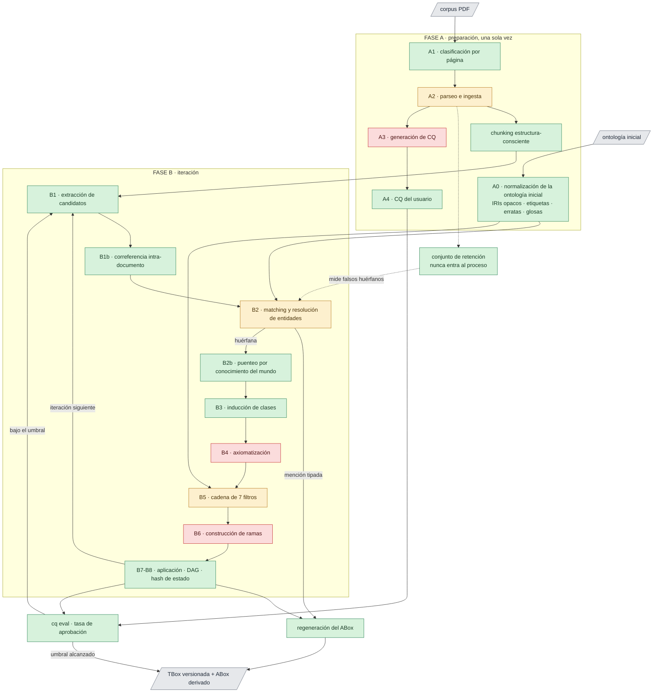
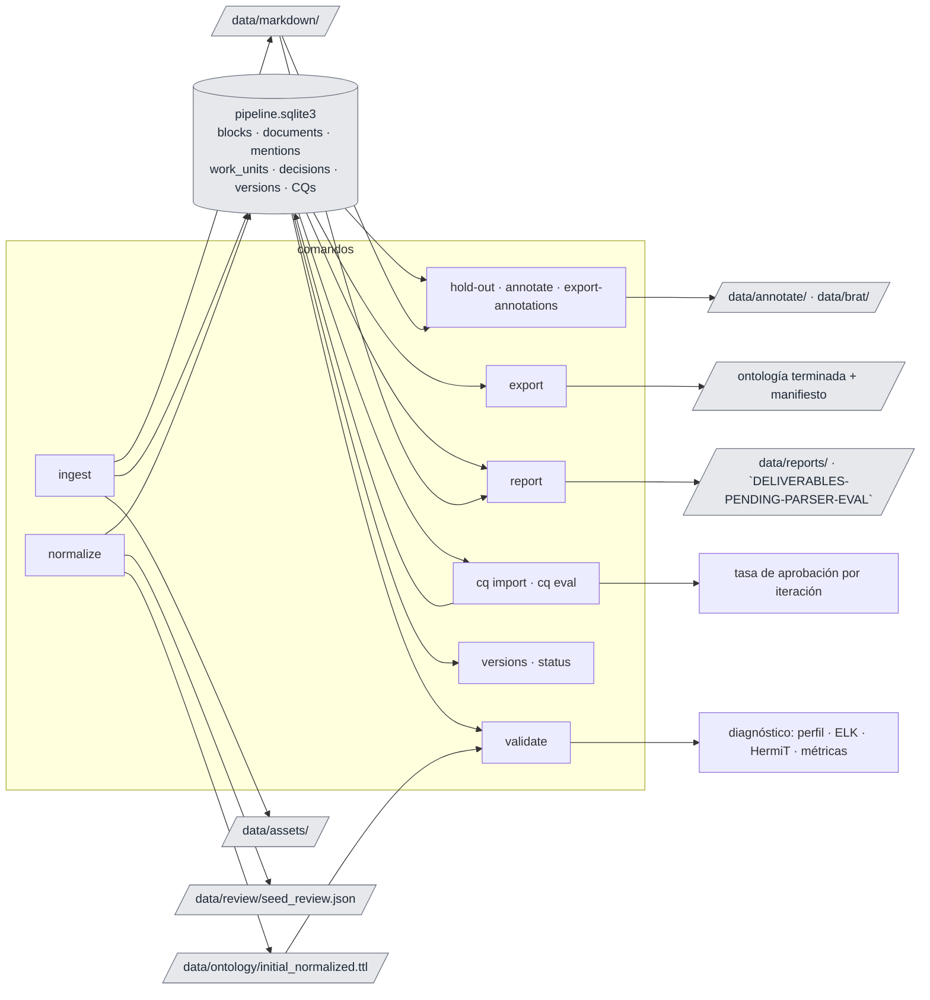
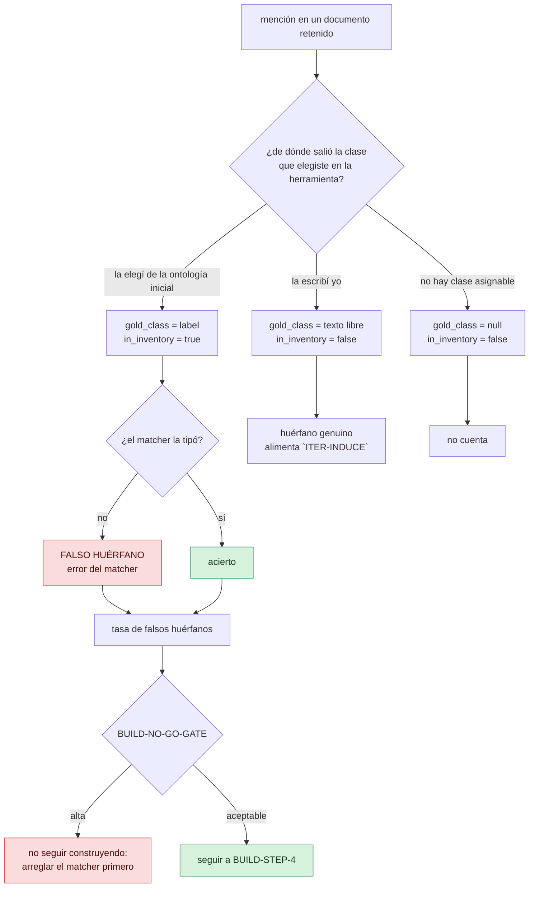

# onto-pipeline

Enriquecimiento ontológico asistido por LLM. La especificación de diseño es
[`main_plan.md`](main_plan.md); este README
sólo explica cómo se usa lo que está construido y qué falta.

Los otros documentos, por si buscás otra cosa: [`findings.md`](findings.md) —qué se midió y qué
se decidió, con el n de cada número—, [`technical_debt.md`](technical_debt.md) —qué falta y qué
conviene rehacer—, [`CONTRIBUTING.md`](CONTRIBUTING.md) —cómo se trabaja acá— y
[`CLAUDE.md`](CLAUDE.md), el índice y los invariantes del proyecto.

El sistema opera en inglés (prompts, esquemas, logs). El corpus y las glosas son bilingües
es/en con etiqueta de idioma.

Licencia **CC BY 4.0** ([`LICENSE`](LICENSE)). Los corpus y las ontologías de los casos de uso
**no** se distribuyen acá y tienen sus propias licencias: ver [`NOTICE.md`](NOTICE.md).

## Índice

Cada parte del diseño tiene un nombre, y el nombre es el identificador que se usa en todos lados:
en el spec, acá, en la deuda técnica y en el código. **El id de una sección lleva el de su
padre**, así que `PREP-NORMALIZE-IRIS` se lee como lo que es, una sub-etapa de `PREP-NORMALIZE`.
Donde hay un número es porque el orden importa y los hermanos son pasos de una secuencia
(`ITER-VALIDATE-1-ELK` a `ITER-VALIDATE-7-STRUCTURE`).

Este índice existe para encontrar las cosas, no para traducirlas: **no hay códigos que traducir.**

### Preparación, una sola vez — `PREP`

| Id | Qué es | Comando |
|---|---|---|
| `PREP-CLASSIFY` | Decide por página: born-digital, escaneada o incierta | `classify` |
| `PREP-PARSE` | Extrae bloques con procedencia y arma el Markdown | `parse` |
| `PREP-NORMALIZE` | Deja la ontología inicial en condiciones de recibir axiomas | — |
| `PREP-NORMALIZE-PROFILE` | Detecta el perfil OWL de la ontología inicial (EL/QL/RL/DL) | `profile` |
| `PREP-NORMALIZE-IRIS` | Acuña IRIs opacos y guarda el original como procedencia | `normalize` |
| `PREP-NORMALIZE-LABELS` | Deriva etiquetas es/en y marca las divergentes | `normalize` |
| `PREP-NORMALIZE-TYPOS` | Cuatro detectores de erratas, sin modelo | `normalize` |
| `PREP-NORMALIZE-GLOSSES` | Escribe una definición para cada clase | `gloss` |
| `PREP-CQ-GENERATED` | Genera competency questions desde el corpus | `cq propose` |
| `PREP-CQ-USER` | Carga las competency questions que escribís vos | `cq import` |

### Iteración — `ITER`

| Id | Qué es | Comando |
|---|---|---|
| `ITER-EXTRACT` | Saca menciones de concepto de cada chunk | `extract` |
| `ITER-COREFER` | Agrupa las menciones que hablan del mismo individuo | `corefer` |
| `ITER-MATCH` | Tipa cada mención contra una clase, y resuelve entidades | `match` · `grey` |
| `ITER-BRIDGE` | Conecta huérfanas con la ontología inicial por conocimiento del mundo | `bridge` |
| `ITER-INDUCE` | Convierte huérfanas en clases nuevas | `induce` |
| `ITER-TUNE` | Ajusta el matcher con las etiquetas acumuladas | `tune` |
| `ITER-CONFLICTS` | Documentos que se contradicen; notarizar, forzar, refutar | `conflicts` · `mark` |
| `ITER-AXIOMATIZE` | Propone axiomas; el código arma el OWL | `axiomatize` |
| `ITER-AXIOMATIZE-ENRICH` | Mejora las glosas con pasajes definicionales del corpus | `enrich` |
| `ITER-VALIDATE` | La cadena de siete filtros | `validate` · `metaproperties` |
| `ITER-BRANCH` | Arma las alternativas coherentes entre las que elegís | `branch` |
| `ITER-FEEDBACK` | Qué se decidió antes, y cómo vuelve al prompt | — |
| `ITER-APPLY` | Aplica la rama, versiona en el DAG, detecta loops | `apply` |
| `ITER-APPLY-FUNCTIONAL` | Candidatas a propiedad funcional, y qué fusionaría declararlas | `functional` |
| `ITER-APPLY-REGENERATE` | Recomputa el ABox desde las menciones | `regenerate` |

Sin sección propia en el spec, pero son comandos: `chunk` (agrupa bloques sin partir tablas),
`next` (qué corresponde correr), `wizard` (la ruta guiada: te pregunta en cada punto de decisión
en vez de frenar), `export` (la ontología terminada, con toda la historia aplicada), `alignment`
(¿el corpus habla de lo que la ontología nombra?).

### El resto del diseño

| Id | Qué es |
|---|---|
| `SCOPE` | Qué construye, con qué entra y qué sale. Incluye `SCOPE-PURPOSE` (sin tarea downstream), `SCOPE-EXPRESSIVITY` y `SCOPE-SCALE` |
| `DECISIONS` | Las 26 decisiones vinculantes, cada una con su nombre y la sección que la fundamenta. **Es la tabla que hay que mirar** antes de citar una: `BRANCH-ONLY-REVIEW`, `GRADED-FEEDBACK`, `SEPARATE-UNTIL-CONFIRMED`… |
| `LAYERS` | Las cuatro capas y por qué no se mezclan. `LAYERS-ONTOLOGY-NOT-GRAPH` prohíbe los algoritmos de grafo sobre la TBox |
| `REORG` | Por qué la ontología inicial es reorganizable y qué cuesta: `REORG-PATH-DEPENDENCE` |
| `CONFIG` | Toda la superficie de configuración |
| `SCHEMAS` | Las tablas: `SCHEMAS-MENTIONS`, `SCHEMAS-BRANCH`, `SCHEMAS-WORK-UNITS`, `SCHEMAS-DECISIONS` |
| `REASONING` | `REASONING-STACK` y `REASONING-ELK-ASYMMETRY`, que es la que más se cita |
| `EVAL` | `EVAL-PIPELINE` (conjunto de retención), `EVAL-ANNOTATION-FORMAT`, `EVAL-STOPPING` |
| `COLDSTART` | Por qué las primeras iteraciones son peores justo cuando más importan |
| `BUILD` | `BUILD-STEP-1` a `BUILD-STEP-5`, con `BUILD-NO-GO-GATE` entre el 3 y el 4 |
| `RISKS` | Los diez riesgos conocidos, del `RISKS-FALSE-ORPHANS` para abajo |
| `DELIVERABLES` | Lo entregado y `DELIVERABLES-PENDING` |

## Estado

El spec define una secuencia de construcción de 5 pasos (`BUILD`) y prohíbe explícitamente armar
el pipeline completo antes de ver datos. **Los cinco pasos están dados**, con una salvedad en el
3 que decide qué se puede hacer después:

| Paso | Qué pedía | Estado |
|---|---|---|
| `BUILD-STEP-1` | De `PREP-CLASSIFY` a `PREP-PARSE` sobre 5 documentos + script de evaluación del parser (`DELIVERABLES-PENDING-PARSER-EVAL`) | **hecho** — `ingest`, `report` |
| `BUILD-STEP-2` | `PREP-NORMALIZE`, `PREP-CQ-GENERATED` y `PREP-CQ-USER` | **hecho** — `normalize`, `cq propose`, `cq import`. Falta llegar a las 40–60 CQ aceptadas que el paso pide: hay **5**, todas escritas a mano (`PREP-CQ-USER`), ninguna generada aún |
| `BUILD-STEP-3` | De `ITER-EXTRACT` a `ITER-MATCH`, con evaluación contra el conjunto de retención | **hecho, con la compuerta abierta** — ver abajo |
| `BUILD-STEP-4` | De `ITER-AXIOMATIZE` a `ITER-VALIDATE` sin ramas, aplicación directa | **hecho** — `axiomatize` + la cadena de siete filtros |
| `BUILD-STEP-5` | De `ITER-BRANCH` a `ITER-APPLY-REGENERATE`: ramas, scoring, DAG completo | **hecho** — `branch`, `versions`, `diff` |

**Sobre `BUILD-NO-GO-GATE`, entre `BUILD-STEP-3` y `BUILD-STEP-4`.** El spec dice: si la tasa de falsos huérfanos es
alta, no seguir construyendo, porque cada falso huérfano se vuelve una clase espuria en la
inducción y con multi-rama se estaría eligiendo entre variantes de ruido. Eso está escrito
suponiendo un dominio objetivo, y **este proyecto no tiene uno**: el entregable es el sistema y su
caracterización a través de casos de uso. Así que una tasa alta sobre uno es un resultado
*sobre ése*, no una razón para frenar — sobre el caso de uso publicado da 18% en el corte
configurado. Lo que sí
sigue abierto es la mejora que el spec propone para bajarla: de sus tres vías —mejor encoder,
mejores glosas, **ajuste del matcher**— las dos primeras se midieron y la tercera está bloqueada
por falta de etiquetas.

Las cuatro tareas de `DELIVERABLES-PENDING` están: `DELIVERABLES-PENDING-PARSER-EVAL` es `report`, `DELIVERABLES-PENDING-EXTRACTION-TESTCASE` el banco de `calibrate`, `DELIVERABLES-PENDING-BRAT-EXPORTER`
`export-annotations`, `DELIVERABLES-PENDING-TELEMETRY` la telemetría en `work_units` desde el principio.

### En cola

Lo abierto, en orden de valor sobre costo. Cada uno tiene su entrada con el detalle; esta lista
existe para que no se pierdan entre las entradas.

| # | Qué | Por qué | Detalle |
|---|---|---|---|
| 1 | **La recuperación es el cuello, y el encoder es la causa** | Es el hallazgo más grande y no tiene tarea asignada. 21,5% de acierto en el primer puesto sobre MaterioMiner, y eso llega hasta el final: 44 de 45 clases inducidas quedan sin padre. Descartados ya: glosas, contexto, re-ranker de fábrica. Queda un encoder asimétrico o entrenado | [`FINDINGS-MEASURED-RETRIEVAL-CEILING`](findings.md), [`FINDINGS-MEASURED-FULL-RUN`](findings.md) |
| 2 | **El tercer punto de la curva de tamaño** (~40k clases: CafeteriaFCD contra FoodOn) | Bajo esfuerzo, alta prioridad: el lector `brat` ya está escrito. Con 428 y 3.418 clases hay dos puntos y un salto de 21,5% a 68,5% entre ellos; dos puntos no dan una forma | [`DEBT-SIZE-CURVE-THIRD-POINT`](technical_debt.md), [`FINDINGS-MEASURED-SIZE-CURVE`](findings.md), [`use_case_selection.md`](use_case_selection.md) |
| 3 | **Disparos automáticos**: `regenerate` tras aplicar una rama, `metaproperties` tras inducir clases nuevas, `match` tras cambiar glosas | Bajo esfuerzo, alta prioridad: los tres son comparar un hash contra el registrado, y `next` es el lugar. El último cierra el bucle de `PREP-NORMALIZE` | [`DEBT-AUTOMATIC-TRIGGERS`](technical_debt.md) |
| 4 | **Precisión de la extracción**: `Scholarly research`, `Table reference` y `Results` se volvieron clases propuestas | Salen de `literature`, `studies`, `researchers`, `Table 1` — el metalenguaje de escribir un paper, no el dominio del que habla. Ninguno de los siete filtros los atrapa: son sintagmas legítimos con soporte suficiente | [`DEBT-ACADEMIC-METALANGUAGE`](technical_debt.md), [`FINDINGS-MEASURED-SPURIOUS-CLASS`](findings.md) |
| 5 | **Resolver imports rotos** con un archivo local en vez de sólo avisar | Hoy se degrada con aviso; una ontología publicada importa otras y ésas pueden no responder | [`DEBT-ONTOLOGY-IMPORTS`](technical_debt.md) |
| 6 | **Escribir el primer juego de shapes** de SHACL | El filtro corre y siempre reporta SKIPPED porque no hay ninguna escrita. Sólo sobre lo que el pipeline mismo escribió: shapes sobre verdades del dominio chocan con el mundo abierto | [`DEBT-VALIDATION-CHAIN`](technical_debt.md) |
| 7 | **Correr dos sesiones con etapas de modelo a la vez** | Lo probado en paralelo es la ingesta, que es CPU. Las llamadas al modelo son secuenciales dentro de una sesión, así que el riesgo está en el ledger —que sí tiene test— pero nadie lo corrió con dos sesiones pagando a la vez | [`DEBT-POSTGRES-UNTESTED`](technical_debt.md) |
| 8 | **Dónde parte `auto` de zona gris** | El barrido mide **un** corte y el pipeline usa **dos**: lo calibrado es el corte de huérfano. Dónde empieza la zona gris es cuánta revisión humana se acepta, y eso no lo contesta ningún corpus — es una decisión, no una medición | [`FINDINGS-MEASURED-MATCHER-CRAFT`](findings.md), [`DEBT-THRESHOLDS`](technical_debt.md) |

<details>
<summary>Lo que estaba en cola y se cerró</summary>

| # | Qué | Por qué ahora | Detalle |
|---|---|---|---|
| ~~1~~ | ~~Entrenar el re-ranker~~ — **hecho** (`tune`): +9,9 puntos en CRAFT, +11,6 en MaterioMiner, y sólo sirve en su propio dominio | La mejora más grande medida en este pipeline | [`FINDINGS-MEASURED-TUNED-RERANKER`](findings.md) |
| ~~2~~ | ~~La variante con contexto~~ — **medida y descartada**: cuatro formas, las cuatro peores que el sintagma solo | El problema no es cómo se representa la mención sino el encoder | [`FINDINGS-MEASURED-RETRIEVAL-CEILING`](findings.md) |
| ~~3~~ | ~~El registro de decisiones~~ — **cerrado entero**: una tabla, seis categorías fijas, `invalid` separado de `not_chosen`, la forma normal guardada, y los precedentes inyectados en el prompt de axiomatización | Lo rechazado no está en ningún otro lado, y guardarlo sólo rinde si vuelve al prompt | [`DEBT-FEEDBACK-HISTORY`](technical_debt.md) |
| ~~4~~ | ~~`next --run`~~ — **hecho**: corre una etapa y frena; frente a una decisión no corre nada. Por subproceso, sin el refactor que parecía necesario | El comando que dice qué hacer ahora lo hace | [`DEBT-NEXT-RUNS`](technical_debt.md) |
| ~~5~~ | ~~Terminar la tarea «corrida completa»~~ — **hecho**: el pipeline entero sobre MaterioMiner, de la ontología inicial a una versión con 45 clases inducidas | La debilidad de recuperación llega hasta el final: 44 de 45 clases quedan sin padre | [`FINDINGS-MEASURED-FULL-RUN`](findings.md) |
| ~~6~~ | ~~Chequeo de desalineación~~ — **hecho** (`alignment`): decide con `--term`, 0/5 sobre el caso de uso roto y 5/5 sobre el bueno. La cobertura global resultó no servir de veredicto | Un corpus desalineado con su ontología era invisible en la tasa de huérfanas | [`DEBT-QUALITATIVE-PAIR`](technical_debt.md) |
| ~~7~~ | ~~Comparación por forma normal~~ — **hecha**: `normal_form` nombra por etiquetas, saltea la glosa, y `already_rejected` la consulta antes de juzgar | Sin ella el mismo compromiso vuelve con otros IRIs y no se detecta como re-proposición | [`DEBT-FEEDBACK-HISTORY`](technical_debt.md) |

</details>

| Etapa | Estado |
|---|---|
| `PREP-NORMALIZE-PROFILE` detección de perfil OWL | listo |
| `PREP-NORMALIZE`: IRIs opacos, etiquetas, erratas | listo; la ontología inicial puede venir en OWL, Turtle o **OBO** |
| `PREP-NORMALIZE-GLOSSES` glosas | listo (requiere proveedor LLM) |
| `PREP-CLASSIFY` clasificación por página | listo |
| `PREP-PARSE` parseo e ingesta | listo: PDF born-digital y **texto plano**; falta la ruta VLM |
| `PREP-CQ-GENERATED` generación de CQ | listo (`cq propose`) |
| `PREP-CQ-USER` CQ del usuario | listo |
| Chunking estructura-consciente | listo |
| `ITER-EXTRACT` extracción de candidatos | listo |
| `ITER-COREFER` correferencia intra-documento | listo |
| `ITER-MATCH` matching y resolución de entidades | cableado y calibrado contra CRAFT (ver Calibración) |
| Zona gris: cola, respuestas y etiquetas | listo (`grey`) |
| Conjunto de retención: hold-out, anotador, exportador | listo |
| Banco de calibración contra corpus publicado | listo (`calibrate`) |
| `ITER-BRIDGE` puenteo por conocimiento del mundo | listo (`bridge`) |
| `ITER-INDUCE` inducción de clases | listo (`induce`) |
| `ITER-AXIOMATIZE` axiomatización | listo (`axiomatize`) |
| `ITER-AXIOMATIZE-ENRICH` enriquecimiento de glosas | listo (`enrich`, `circular`) |
| `ITER-VALIDATE-1-ELK`, `ITER-VALIDATE-2-HERMIT`, `ITER-VALIDATE-7-STRUCTURE` | listo |
| `ITER-VALIDATE` ITER-VALIDATE-3-SHACL (SHACL) | listo (`--extra validation`); las shapes se escriben a mano |
| `ITER-VALIDATE` ITER-VALIDATE-4-ONTOCLEAN (OntoClean) | listo (`metaproperties` + `validate`) |
| `ITER-VALIDATE` ITER-VALIDATE-5-PITFALLS (pitfalls) | listo; subconjunto local del catálogo OOPS!, no OOPS! |
| `ITER-VALIDATE` ITER-VALIDATE-6-EVIDENCE (evidencia textual) | listo; sólo para procedencia `textual` |
| `ITER-BRANCH` construcción de ramas | listo (`branch`); dos patrones de modelado del catálogo |
| Ajuste del matcher (`ITER-TUNE`) | listo (`tune`), completo o LoRA según el tamaño del modelo |
| Registro de decisiones (`ITER-FEEDBACK`) | **a medias**: esquema `GRADED-FEEDBACK` completo y consultable; falta inyectar los precedentes en el prompt y la forma normal. Ver `DEBT-FEEDBACK-HISTORY` |
| `ITER-APPLY`: DAG de versiones, hash de estado, loops | listo |
| Conflictos fácticos (`ITER-CONFLICTS`) | listo (`conflicts`, `mark`) |
| Propiedades funcionales (`ITER-APPLY`) | listo (`functional`); sin propiedades que mirar todavía |
| Criterios de parada (`EVAL-STOPPING`) | listo (`stop`); los cuatro |
| Guía de iteración | listo (`next`); corre una etapa con `--run` y nunca cruza una decisión |
| Sesión interactiva | listo (`wizard`); qué cubre y qué falta, en `DEBT-WIZARD-COVERAGE` |
| Sesiones de usuario en paralelo | listo (`session`); requiere `database.backend: postgres` para dos a la vez |
| Regeneración del ABox | listo (`regenerate`); falta el disparador tras aplicar una rama |
| Entrega de la ontología terminada | listo (`export`); TBox + ABox + manifiesto de procedencia |




Verde: listo. Ámbar: parcial —`A2` sólo por la ruta born-digital, sin VLM—. Rojo: no
implementado, que hoy son el ajuste del matcher y la mitad que falta del registro de decisiones.
**El camino de punta a punta está cerrado:** el corpus llega hasta axiomas aplicados y versionados
—extraído, correferido, tipado, puenteado, inducido, axiomatizado, validado por siete filtros y
ramificado— y la ontología inicial hasta una TBox normalizada, glosada y enriquecida desde el corpus.

**Hay dos interfaces sobre el mismo pipeline.** El CLI de banderas —un comando por etapa, que
es lo que documenta la sección Uso— y `wizard`, que recorre el plan preguntando en cada punto de
decisión en vez de frenar ante él. Las dos llaman a las mismas funciones: los cuerpos de las
etapas viven en `services/`, no en ninguna de las dos interfaces, y hay un test que fija que
ningún servicio importe `typer` ni `rich`. Qué cubre el wizard y qué le falta está en
[`DEBT-WIZARD-COVERAGE`](technical_debt.md).

## Instalación

```bash
uv sync --extra dev                      # base + pytest/ruff
uv sync --extra dev --extra reasoning    # + JPype (ELK, HermiT)
uv sync --extra dev --extra matching     # + sentence-transformers (`ITER-MATCH`)
```

El razonador necesita jars que no se versionan:

```bash
./scripts/fetch-jars.sh        # ~83 jars a lib/, resueltos con Maven
```

Baja Maven a `.tools/` si no lo tenés instalado. Requiere Java 11+.

## Configuración

Un solo archivo central, `config/default.yaml` (`CONFIG` del spec). Todo umbral vive ahí; nada está
hardcodeado. Las rutas relativas se resuelven contra el archivo de config, así que los
comandos funcionan desde cualquier directorio.

```yaml
database:
  backend: sqlite          # sqlite | postgres — postgres admite dos sesiones escribiendo a la vez
  dsn: ""                  # postgresql://usuario@host/base

paths:
  # Respaldo: sobre qué corre el pipeline lo dice el caso de uso de la sesión, y estas dos sólo
  # se usan si la sesión no lo resuelve. Ver Sesiones de usuario, en Uso.
  corpus_root: ../use_cases/qualitative/corpus
  initial_ontology: ../use_cases/qualitative/ontology.rdf
  work_dir: ../data
  reasoner_lib: ../lib
  use_cases_root: ../use_cases        # los casos de uso; ver Calibración, en Uso
```

Ningún módulo sabe contra qué motor corre el almacén: el SQL se escribe con `?` y las filas se
leen por nombre, y lo que difiere entre los dos vive en `store.py`. Los tests corren siempre
sobre SQLite, sin servidor.

**Credenciales.** Nunca en el config, que se versiona. Van en un archivo de entorno explícito
—nunca autodescubierto— que se pasa con `--env-file`:

```bash
cp example.env opencode.env    # y completar OPENCODE_API_KEY
chmod 600 opencode.env         # gitignoreado por *.env
```

El config sólo guarda el **nombre** de la variable:

```yaml
llm:
  provider: openai_compatible
  base_url: https://opencode.ai/zen/go/v1
  api_key_env: OPENCODE_API_KEY
  models: {small: glm-5.3-flash, medium: deepseek-v4-flash, large: glm-5.2}
```

Para Ollama local: `base_url: http://127.0.0.1:11434/v1`, `api_key_env: ""`.

**Generación de candidatos de `match`** (`matching.blocking_strategy`). Comparar todas las
menciones entre sí es cuadrático, así que hay que decidir qué pares se comparan. Con
`embedding` —el default— un par es candidato si su coseno llega a `grey_zone_lower`, o si la
ontología afirma algo sobre él: misma forma superficial, mismo valor de una clave declarada, o
sinónimo declarado. **No agrega ninguna constante propia:** el umbral es el mismo desde el que
se leen las zonas, y por debajo de él la decisión habría sido `separate` de todos modos. Las
tres fuentes exactas van aparte justamente porque no dependen de ningún puntaje.

Los vectores se calculan una vez y se reusan entre el tipado y la resolución. Medido sobre las
848 menciones reales de la base, repartidas en 10 documentos:

| Estrategia | Pares candidatos | Tiempo |
|---|---|---|
| `embedding` | 4.566 | **0,5 s** |
| `surface_and_keys` | 5.283 | 1,7 s |
| `surface_and_keys`, re-encodeando cada par | 5.283 | 29,6 s |

`surface_and_keys` es el heurístico anterior —prefijo de 4 caracteres del primer token
alfabético— y queda disponible para comparar. Separa `in-depth interview` de
`semi-structured interview`, junta en un solo bloque todo lo que empiece con una stopword, y
sus constantes no se pueden calibrar con ningún experimento.

## Uso

`--env-file` es una opción global y va **antes** del subcomando.

Cada comando es una etapa discreta que deja su salida en disco; el siguiente la levanta de ahí.
No hay estado en memoria entre comandos. **`wizard` es la otra puerta a lo mismo** —abajo—: no
reimplementa ninguna etapa, llama a estas mismas funciones y agrega el diálogo.




### Sesiones de usuario

```bash
uv run onto-pipeline session new --use-case craft-cl --name "con glosas"
uv run onto-pipeline session list
uv run onto-pipeline session show            # la actual: fase e historial
uv run onto-pipeline --session craft-cl-2 next
```

Una **sesión de usuario** es una corrida sobre un **caso de uso** —el par (ontología inicial,
corpus) que vive en `use_cases/`—. Tiene identidad (`craft-cl-1`), fase, historial, y sus propios
datos: menciones, versiones, decisiones y artefactos en disco.

**Dos sesiones pueden correr sobre el mismo caso de uso**, y esa es la comparación que el
proyecto existe para poder hacer: el mismo corpus con otra configuración. El caso de uso es
material de entrada, inmutable y compartido.

**Sobre qué corre lo dice la sesión, no el config.** El `Workspace` resuelve el corpus y la
ontología inicial desde el directorio del caso de uso —`corpus` y `ontology.*`, que pueden ser
symlinks—. `paths.corpus_root` y `paths.initial_ontology` quedan como respaldo para un almacén
sin sesiones. Si `paths` mandara, dos sesiones sobre casos de uso distintos leerían el mismo
corpus.

**Lo caro se comparte; la contabilidad no.** Las respuestas del modelo se cachean por contenido,
así que la segunda sesión sobre el mismo corpus **no vuelve a pagar** una etapa que la primera ya
corrió. Lo que sí es por sesión es el estado de las unidades de trabajo — si fuera compartido,
una sesión con trabajo en vuelo frenaría a las demás, y una interrumpida las frenaría para
siempre.

**La fase se deriva de los datos.** `prep` mientras se prepara material; `iter` desde que hay
menciones. Hay una columna, pero es una afirmación que se valida contra el almacén: guardar el
estado en un solo lugar y creerle es cómo dos lugares empiezan a discrepar sobre qué etapa
corresponde.

**Volver atrás no borra: ramifica.**

```bash
uv run onto-pipeline session reopen --why "otra ontología inicial"
```

Dice con números qué queda atrás —versiones, menciones, decisiones— y pide confirmación. Nada se
borra: re-preparar commitea una raíz nueva y el linaje viejo sigue alcanzable, que es lo que el
DAG ya hace con las ramas no elegidas (`ITER-APPLY`, `REORG-PATH-DEPENDENCE`).

**Para correr dos en paralelo hace falta Postgres.** SQLite da un escritor y muchos lectores, que
alcanza para una sesión por vez. Ver Configuración.

### La ruta guiada — `wizard`

```bash
uv run onto-pipeline wizard
uv run onto-pipeline wizard --corpus ../otro/corpus --seed-ontology ../otra.owl
uv run onto-pipeline wizard --run-env-file opencode.env
```

No es un paso de la secuencia que sigue: es la secuencia entera, con alguien a quien
preguntarle. `next` contesta qué corresponde hacer y **frena** cuando lo siguiente es una
decisión tuya, porque cruzarla sería decidirla por default. `wizard` contesta la misma pregunta
y, en vez de frenar, la hace.

Qué hace, en orden:

1. **Confirma la configuración** y dice que toda clave que el archivo no defina toma su default.
2. **Pregunta el par (corpus, ontología inicial) siempre**, aunque el archivo lo tenga: cuál se usa es
   un parámetro de la corrida, no una decisión de configuración. Que hoy viva en `CONFIG` es
   deuda — [`DEBT-RUN-PARAMETERS`](technical_debt.md).
3. **Normaliza la ontología inicial** si todavía no hay ninguna versión, y ofrece escribir las glosas que
   falten.
4. **Recorre el plan** de `next` etapa por etapa: corre lo que se corre solo, pregunta en los
   puntos de decisión, y dice por qué no corre lo que está bloqueado.
5. **Ofrece la entrega** (`export`) al final.

Tres cosas que no hace, y las tres a propósito:

- **No arranca una etapa que llama al modelo sin decírtelo y esperar un sí.** Una corrida de
  horas empezada por un Enter distraído es exactamente lo que no puede pasar.
- **No inventa una respuesta cuando salteás una pregunta.** Saltear deja el punto abierto y las
  etapas que dependían de él siguen bloqueadas, que es la verdad. «Ninguna» sí es una respuesta
  —la mención se vuelve huérfana y la ve la inducción— y va al almacén como tal.
- **No reimplementa ninguna etapa.** Todo lo que corre son las funciones de `services/`, las
  mismas que corren los comandos de abajo.

Cortarlo a la mitad y volver mañana es lo normal: el estado vive en el almacén, no en la
sesión.

### 1. Ingesta del corpus (`PREP-CLASSIFY` + `PREP-PARSE`)

```bash
uv run onto-pipeline ingest --limit 5      # primeros 5 documentos
uv run onto-pipeline ingest                # todo el corpus
uv run onto-pipeline ingest -d ruta/al.pdf # documentos puntuales
```

Clasifica cada página (`born_digital` / `scan` / `uncertain`), parsea las born-digital, y
puebla `blocks`, `documents` y `page_classification` en SQLite más un Markdown por documento.
Las páginas `scan`/`uncertain` se registran como `unparsed`: son la ruta VLM, que no está
implementada. La columna **table gap** cuenta páginas con caption de tabla pero sin tabla
extraída — el parser born-digital sólo ve tablas con líneas.

Es cacheable: re-ingestar un documento sin cambios no reprocesa nada. Cambiar un umbral del
config invalida el caché de esa etapa.

### 2. Normalización de la ontología inicial (`PREP-NORMALIZE`)

```bash
uv run onto-pipeline --env-file opencode.env normalize
```

Acuña IRIs opacos (uuid5, reproducible), deriva etiquetas, corre los cuatro detectores de
erratas, arma los contextos de glosa y —si hay proveedor— genera las glosas. Commitea la
ontología al DAG de versiones.

Salida: `data/ontology/initial_normalized.ttl`. Los hallazgos que necesitan tu decisión
—divergencias de etiqueta, pares sin verificar entre idiomas, erratas— van a la tabla
`review_items`:

```bash
uv run onto-pipeline review list                       # lo que espera decisión
uv run onto-pipeline review list --kind typo --json    # para máquina
uv run onto-pipeline review resolve <id> rejected --comment "es un término del dominio"
```

Un hallazgo tiene identidad derivada de su contenido, así que re-correr `normalize` no
duplica nada ni reabre lo ya decidido: lo que rechazaste queda rechazado. Y si un hallazgo deja
de aparecer porque cambiaste la ontología inicial, pasa a `superseded` en vez de quedar colgado como
pendiente.

Sin proveedor configurado saltea `PREP-NORMALIZE-GLOSSES` y te dice cuántas glosas quedaron pendientes.

### 3. ¿Y ahora qué? (`next`)

```bash
uv run onto-pipeline next
```

Lee el almacén y contesta una sola pregunta: qué corresponde hacer. Tres formas de respuesta —
**ready** (se puede correr, y acá está el comando), **waiting on you** (hay una decisión abierta)
y **blocked** (falta el insumo de una etapa anterior). Que diga cuál de las dos últimas es lo que
separa un consejo de una lista.

**Una decisión pendiente le gana a cualquier etapa que podría correr**, porque todo lo que viene
después estaría construido sobre una respuesta que nadie dio. Este diseño tiene cinco puntos que
decide el usuario —zona gris del matcher (`ITER-MATCH`), rama (`ITER-BRANCH`), propiedad funcional (`ITER-APPLY`),
validación de CQ (`PREP-CQ-GENERATED`), errata en la ontología inicial (`PREP-NORMALIZE`)— y un runner que los pasara de largo los
estaría decidiendo por default, que es la falla que `BRANCH-ONLY-REVIEW` y `AUTO-APPLY-WHEN-NO-AXES` nombran desde los dos lados: no
preguntar nunca y que el sistema elija el modelado en silencio, o preguntar todo y volverse el
trabajo manual que vino a reemplazar.

```bash
uv run onto-pipeline next --run                              # corre UNA etapa y frena
uv run onto-pipeline next --run --run-env-file opencode.env  # si la etapa necesita modelo
```

`--run` ejecuta **una sola** etapa, la siguiente, y para. Frente a un punto de decisión no corre
nada y sale con error: cruzarlo sería decidirlo por default. Lo ejecuta como subproceso —el mismo
comando que imprime— así que la salida, los errores y el código de retorno son los del comando,
no una reimplementación.

**`wizard` es la otra respuesta a esta misma pregunta**: en vez de frenar ante la decisión, te la
hace. Ver «La ruta guiada», arriba.

### 4. Iteración sobre el corpus (`ITER-EXTRACT` → `ITER-INDUCE`)

```bash
uv run onto-pipeline --env-file opencode.env extract    # menciones por chunk
uv run onto-pipeline --env-file opencode.env coref      # agrupar las del mismo individuo
uv run onto-pipeline match                              # tipar contra la ontología inicial
uv run onto-pipeline --env-file opencode.env bridge     # puentear huérfanas (`ITER-BRIDGE`)
uv run onto-pipeline --env-file opencode.env induce     # las que quedan, a clases nuevas
```

**`bridge` no es opcional si vas a correr `induce`.** Antes de dar por huérfana una mención,
pregunta si se relaciona con una clase que la ontología inicial ya tiene *aunque ningún documento lo
diga*: el corpus escribe "focus group" y la ontología inicial tiene `Technique`. Sin esa etapa, cada
mención que la ontología inicial sí cubría pero el matcher no conectó se vuelve una clase inducida
espuria — el falso huérfano alimentando al inductor, que es justo lo que la compuerta no-go de
`BUILD-NO-GO-GATE` quiere evitar. `induce` avisa si no encuentra puentes para esa versión.

Al modelo **nunca se le pide OWL**: recibe un sintagma y una lista corta de clases candidatas, y
responde un juicio atómico —ejemplo de, tipo de, o ninguna—. Una clase que no estaba en la lista
es respuesta rechazada, no puente; se verifica mecánicamente, igual que `coref` verifica que
todo id agrupado exista.

Los puentes quedan marcados `world_knowledge`, y esa marca tiene consecuencia: **el filtro de
evidencia de `ITER-VALIDATE` no se les aplica**. Sin la distinción, "todo axioma sin cita se descarta"
mataría exactamente los puentes que hacen útil a la ontología inicial. Pasan igual por el razonador y por
OntoClean, y te llegan marcados como lo que son.

Medido sobre las 686 huérfanas de `v2`: con `min_candidate_score: 0.45` son 403 preguntas que
cubren el 70% de las huérfanas; bajarlo a 0,30 son 582 preguntas y el 98%. El umbral no está
calibrado, como todos los demás.

#### La zona gris (`ITER-MATCH`)

```bash
uv run onto-pipeline grey list                                   # lo que espera respuesta
uv run onto-pipeline grey answer <mención> --to https://…/id/xyz
uv run onto-pipeline grey answer <mención> --none                # ninguna de estas
uv run onto-pipeline grey labels --export data/labels.jsonl
```

La política conservadora de `ITER-MATCH` **no tipa** estos pares y nada aguas abajo los trata como
tipados: esperan una respuesta en vez de que un umbral los decida, que es exactamente para lo que
existe la zona.

`--none` es una respuesta de verdad y a menudo la correcta: la mención queda huérfana y llega a
inducción, que es donde va un concepto genuinamente nuevo.

**Las respuestas sobreviven al próximo `match`.** Viven en su propia tabla, no en
`mention_typing` —que el matcher reescribe entera cada corrida— porque volver a preguntar lo
mismo todas las veces es cómo un sistema entrena a alguien a dejar de contestar.

Y son, sin ninguna épica, **las etiquetas accept/reject que `ITER-TUNE` quiere** para tunear el
re-ranker. Nadie las anota a propósito: salen de alguien haciendo su trabajo, y son la única
señal de entrenamiento que este diseño produce. El cross-encoder de fábrica midió separación
−0,50; eso es el argumento para necesitarlas, no contra re-rankear.

### 5. Axiomatización, enriquecimiento y ramas (`ITER-AXIOMATIZE` + `ITER-AXIOMATIZE-ENRICH` + `ITER-BRANCH`)

```bash
uv run onto-pipeline --env-file opencode.env axiomatize   # propuestas -> axiomas
uv run onto-pipeline branch                               # ¿hay algo que decidir?
uv run onto-pipeline branch --choose b_fceba3e2 --why "el medio es el corte"
```

`axiomatize` le hace al modelo **una sola pregunta atómica** por propuesta —¿es un tipo de esa
clase, un ejemplo de esa clase, o ninguna?— y el código escribe el OWL. Un modelo que sólo
responde eso no puede confundir subsunción con instanciación, porque nunca escribe el axioma;
esa confusión es el primer sesgo que lista `ITER-EXTRACT`. "Ejemplo de" **rechaza** la propuesta en vez de
colgarla: no era una clase. "Ninguna" la deja raíz, porque un padre forzado es peor que ninguno.

`branch` busca qué hay que decidir entre esos axiomas. **A ningún modelo se le piden
alternativas** — es la única prohibición explícita del spec para esta etapa, porque pedir tres
devuelve tres correlacionadas. Los ejes salen de dos lados y nada más:

- **El razonador.** Una justificación de una clase insatisfacible, restringida a los axiomas de
  esta iteración, es un conjunto de conflicto mínimo; las salidas son sus hitting sets mínimos
  (diagnóstico de Reiter). Si la justificación no toca ningún axioma propuesto, la ontología ya
  estaba rota antes: eso se reporta como defecto, no como rama.
- **Un catálogo enumerado de compromisos de modelado**, que el razonador *no* puede encontrar
  porque los dos lados son consistentes. Hoy tiene dos entradas con detector mecánico:
  `attribute_as_class` (varias subclases que son el padre calificado por un modificador:
  ¿`Semi-Structured Interview` es una clase, o `schedule` es una dimensión de `Interview`?) y
  `division_criterion` (un padre partido por dos criterios a la vez, `SCHEMAS-BRANCH`). Una tercera queda
  catalogada y sin detector a propósito —reificar vs. propiedad directa— para que el hueco se
  vea en vez de insinuarse.

Lo normal es que no haya ningún eje: entonces aplica todo y lo dice. **El multi-rama es el
camino excepcional.** Preguntar en cada iteración sin conflicto real es exactamente el trabajo
manual que el pipeline existe para evitar (`AUTO-APPLY-WHEN-NO-AXES`).

Los ejes que no comparten axiomas se presentan **por separado**: k ejes binarios son k
preguntas, no 2^k ramas. Sólo los acoplados se expanden en ramas completas, con techo de cinco.

Cada rama trae su puntaje —cobertura de huérfanas, costo de reorganización, costo de
regeneración del ABox— y el hash del estado que produciría, así que una rama que vuelve a una
versión ya visitada te lo avisa antes de elegirla. La afinidad histórica llega vacía hasta que
haya algo decidido: es el cold start de `COLDSTART`, reportado como ausente y no como cero.

`--invalid <rama>` marca una hermana que además de no elegida está **mal**. Es la distinción que
`ITER-FEEDBACK` pide y que colapsada se pierde: "elegí otra" y "esto no puede ser" son señales de fuerza
distinta, y sólo la segunda sirve para descartar de entrada una propuesta parecida. Pesa el doble
en la afinidad histórica.

Elegir una rama es lo que **graba los rechazos**. Lo aceptado ya está en la ontología; lo
rechazado no está en ningún otro lado, y es lo que una iteración posterior lee para no volver a
proponer lo mismo (`ITER-FEEDBACK`). Se graba después de aplicar, no antes: el razonador todavía puede
rechazar la rama, y una decisión registrada sobre un estado que nunca se aplicó sería mentira.

#### Enriquecimiento de glosas (`ITER-AXIOMATIZE-ENRICH`)

```bash
uv run onto-pipeline enrich --dry-run                     # qué pasajes hay, sin preguntar nada
uv run onto-pipeline --env-file opencode.env enrich       # mejorar glosas y cosechar sinónimos
uv run onto-pipeline circular                             # los matches que no cuentan como evidencia
```

La glosa no es un valor fijo de `PREP-NORMALIZE`: se arranca desde el vecindario estructural y cada iteración
la mejora con lo que el corpus efectivamente dice. Eso cierra el bucle autocorrectivo de `PREP-NORMALIZE`
—mejor glosa → mejor matching → menos falsos huérfanos— y una mención huérfana en la iteración 3
puede tiparse bien en la 8.

**Los pasajes se encuentran mecánicamente**, por señal definitoria: "X is a", "we define X as",
"X refers to", "también llamado". No se le pregunta a un modelo cuáles párrafos son
definitorios, porque un corpus tiene muchos más párrafos que presupuesto tiene pedidos, y un
filtro que cuesta un pedido por párrafo no es un filtro. Recién los pasajes que pasan el filtro
llegan al modelo, y sólo se le pregunta por ellos.

Dos cosas propias de este pipeline cambian cómo corre ese bucle, y conviene decirlas:

- El matcher resultó mejor contra **etiquetas** que contra glosas, al revés de la premisa del
  spec. Así que lo que realimenta al matching es el `skos:altLabel` que la etapa cosecha, no la
  `skos:definition` que reescribe. La definición sigue importando —es lo que el prompt de
  axiomatización muestra como significado de un candidato, y es lo que lee una persona— pero el
  bucle pasa por los sinónimos.
- Un sinónimo que no aparece literalmente en los pasajes **se descarta**, igual que `coref`
  verifica que todo id agrupado exista y `bridge` que la clase nombrada esté en la ontología. Un
  sinónimo salido del conocimiento del modelo puede incluso ser correcto, pero quedaría grabado
  con una procedencia que no se cumple — y el control de circularidad se apoya en que esa
  procedencia diga la verdad.

**Control de circularidad (`PREP-NORMALIZE`).** Cada enriquecimiento registra qué documentos contribuyeron.
Si después una mención de uno de esos documentos matchea contra esa clase, ese match no es
evidencia independiente: la clase se describió usando ese documento, así que el match es en
parte el pipeline reconociendo su propia escritura. `circular` los cuenta. No son errores y no
se tiran; son los que no hay que sumar como cobertura.

Sobre el par actual el resultado es cero pasajes para las 34 clases de la ontología inicial, que es
exactamente lo que predice el desajuste temático documentado más abajo: no es una falla de la
etapa, es la etapa reportando que el corpus no define nada de lo que la ontología inicial nombra.

### 6. Conflictos fácticos (`ITER-CONFLICTS`)

```bash
uv run onto-pipeline conflicts                       # ¿quién se contradice con quién?
uv run onto-pipeline mark -m m123 --mark refuted --comment "el paper se equivoca"
uv run onto-pipeline mark -m m456 --mark misextracted --export data/eval/b1-errors.jsonl
uv run onto-pipeline regenerate                      # recién ahí el ABox lo refleja
```

Distintos de los compromisos de modelado de `branch`: acá el documento 12 afirma X y el 47
afirma ¬X. Como el ABox deriva de la capa de menciones, lo que un documento afirma sobre una
entidad es su tipo, así que el desacuerdo es una entidad tipada a dos clases por documentos
distintos.

**El filtro de volumen es el diseño.** Decidir caso por caso es la revisión manual que el
pipeline existe para evitar (`BRANCH-ONLY-REVIEW`), así que la división es mecánica:

| El conflicto… | Destino |
|---|---|
| no rompe al razonador | **notarizado sin preguntar** — ambos hechos, con su procedencia, y una marca `notarizedTypeConflict` para que el desacuerdo siga siendo encontrable |
| rompe al razonador | llega a `review`, y van a ser pocos |

Notarizar es el default silencioso porque es la única política que no destruye información. Las
otras dos existen y son por caso: `force` (gana una fuente; sin excepción nombrada gana la clase
mejor atestiguada, empate por IRI para que la salida sea reproducible) y `refute`.

**La subsunción no es desacuerdo.** Una entidad tipada a `Interview` y a `Technique`, siendo la
primera un tipo de la segunda, es un hecho dicho a dos niveles de detalle. Sin ese filtro el
reporte se llena de la jerarquía discutiendo consigo misma — medido sobre el caso de prueba: 4
conflictos aparentes, 1 real.

**Un conflicto es un caso; un patrón es una pregunta sobre la TBox.** Si el mismo par de clases
choca sobre `conflict_pattern_threshold` entidades o más, eso no son N casitos: o las dos clases
se están usando para lo mismo, o la propiedad necesita contextualizarse. Y contextualizar cambia
la forma de todas las consultas sobre esa propiedad, incluidas las SPARQL de las CQ, así que es
un eje de `branch` y nunca una decisión por caso.

**`refuted` y `misextracted` no son lo mismo y no hay que mezclarlos.** Parecen iguales en una
interfaz y son señales opuestas:

- `refuted`: el documento lo afirma y no es cierto. La aserción sale del ABox.
- `misextracted`: el documento nunca dijo eso, el extractor leyó mal. **Es un bug de `ITER-EXTRACT`**, sale
  igual del ABox, y además va al conjunto de evaluación con `--export`. Son etiquetas de error
  de extracción que nadie anotó a propósito: la única fuente gratuita que el sistema tiene.

Las marcas viajan como excepciones de las reglas de mapeo, así que entran al `rules_hash`: una
decisión que no cambiara ninguna regla sería una decisión que el ABox nunca nota, porque
`regenerate` es idempotente sobre (estado, reglas).

Bajo mundo abierto, no asertar X y asertar ¬X son cosas distintas: la primera es silencio, la
segunda es conocimiento. Marcar algo falso **no** escribe una aserción negativa en la ontología.

### 7. Validación (`PREP-NORMALIZE-PROFILE` + `ITER-VALIDATE`)

```bash
uv run onto-pipeline validate                    # última versión
uv run onto-pipeline validate --version v0
```

La cadena está apilada y **sólo lo que la sobrevive llega a formar ramas**. El usuario nunca ve
un axioma individual (`BRANCH-ONLY-REVIEW`): ve ramas, y la cadena decide qué entra en ellas.

| # | Filtro | Tipo | Estado |
|---|---|---|---|
| 1 | ELK | rechazo duro, incompleto | listo |
| 2 | HermiT: consistencia y satisfacibilidad | rechazo duro, con justificaciones | listo |
| 3 | SHACL sobre el ABox | rechazo | listo, si hay `shapes.ttl` |
| 4 | OntoClean | rechazo duro | listo, si las clases están etiquetadas |
| 5 | Pitfalls de modelado | **advertencia, nunca rechazo** | listo (subconjunto local) |
| 6 | Evidencia textual | rechazo, **sólo procedencia `textual`** | listo |
| 7 | Métricas estructurales | rechazo | listo |

Tres cosas de la cadena que no son obvias:

- **El ITER-VALIDATE-6-EVIDENCE se aplica a una procedencia y no a la otra.** La regla "todo axioma sin cita se
  descarta" borraría justamente los puentes que hacen útil a la ontología inicial: un axioma
  `world_knowledge` no tiene cita por construcción (`ITER-BRIDGE`), y eso es para lo que existe.
  Aplicárselo no es una política más estricta, es otra y equivocada.
- **El ITER-VALIDATE-5-PITFALLS nunca rechaza.** Un pitfall es un olor —una clase sin definición, una propiedad
  sin dominio, un ciclo en la jerarquía— y algunos son deliberados. Lo que hay implementado es
  un **subconjunto local del catálogo OOPS!**, no OOPS!: el scanner real es un servicio web, y
  mandarle la ontología de alguien a un tercero es una decisión de su dueño, no un paso que un
  pipeline dé por su cuenta. Qué pitfalls quedan afuera está en la deuda técnica.
- **Las shapes de SHACL se escriben a mano**, en `data/shapes.ttl`. No se derivan de la TBox: OWL
  dice qué tiene que ser verdad y SHACL qué tiene que estar dicho, y bajo mundo abierto son
  afirmaciones distintas. Generar una desde la otra convertiría cada silencio en una violación,
  que es exactamente la lectura de mundo cerrado que este proyecto no está haciendo. Sin shapes
  el filtro reporta que **no corrió**, que no es lo mismo que pasar.

#### `ITER-VALIDATE-4-ONTOCLEAN`

```bash
uv run onto-pipeline --env-file opencode.env metaproperties   # etiquetar las clases
uv run onto-pipeline validate                                  # el filtro ya tiene qué mirar
```

Es el único filtro que atrapa una **subsunción mal formada** en vez de una inconsistencia.
`Student ⊑ Person` está bien; `Person ⊑ Student` es perfectamente consistente en OWL y está mal
por una razón que ningún razonador puede enunciar: ser estudiante es algo que se deja de ser, y
ser persona no.

Al modelo se le hacen **cuatro preguntas en castellano llano** —¿se puede dejar de ser esto?
¿hay forma de decidir si dos son el mismo? ¿cada uno es un todo con borde? ¿necesita otra cosa
para existir?— y nunca se le pide la notación de OntoClean: preguntar en jerga devuelve una
respuesta sobre la jerga. Las cuatro restricciones sobre esas etiquetas sí las aplica el código.

Las etiquetas **viajan entre versiones**: una metapropiedad es un hecho sobre el concepto, no
sobre el estado de la ontología, así que una clase rígida en v3 lo es en v7 y volver a preguntar
sería pagar dos veces la misma respuesta. `--refresh` vuelve a preguntar igual.

Una clase sin etiquetar **no produce violación**: el filtro reporta cuántas subsunciones
verificó y cuántas salteó por falta de etiqueta. Un filtro que revisara en silencio un décimo de
la jerarquía estaría reportando un resultado limpio que nunca estableció.

Es la parte más débil de la cadena y el spec lo dice: con ontología superior las metapropiedades
se heredan; sin ella las etiqueta el LLM, que es "factible, menos confiable, y trabajo adicional
que contradice parcialmente `BRANCH-ONLY-REVIEW`".

Instalación de `ITER-VALIDATE-3-SHACL`: `uv sync --extra validation`.

Perfil OWL, ELK, HermiT con justificaciones, y métricas estructurales.

**ELK nunca aprueba.** Devuelve `REJECTED` (encontró algo, y es real) o `INCONCLUSIVE` (no
encontró nada, pero puede haber ignorado el axioma culpable), nunca `OK`. Si la cobertura EL
cae por debajo del umbral, devuelve `SKIPPED`.

### 8. Competency questions (`PREP-CQ-GENERATED` + `PREP-CQ-USER`)

```bash
uv run onto-pipeline cq import examples/competency_questions.json   # `PREP-CQ-USER`: las tuyas, primero
uv run onto-pipeline --env-file opencode.env cq propose             # `PREP-CQ-GENERATED`: desde el corpus
uv run onto-pipeline cq list --status proposed
uv run onto-pipeline cq accept cq_ab12cd34ef cq_9f8e7d6c5b
uv run onto-pipeline cq eval --iteration 3
```

Cada CQ va pareada con su SPARQL, que tiene que parsear; una CQ generada además necesita cita
con documento y página. `eval` corre todo contra una versión del DAG y registra la tasa de
aprobación, que es el criterio de parada primario.

**Advertencia de circularidad, primero.** Las CQ generadas miden completitud **respecto al
corpus**, no respecto al dominio. Es la misma limitación que la saturación de novedad y no se
arregla desde adentro: la mitigación es `PREP-CQ-USER`, las que escribís vos **sin mirar** las generadas. Por
eso `cq import` va antes en la lista de arriba.

`cq propose` hace los cuatro pasos de `PREP-CQ-GENERATED` y tres son mecánicos:

1. **Muestreo estratificado**, no el corpus entero. Definiciones, tablas, enumeraciones,
   restricciones y procedimientos, 10–15 pasajes por estrato. Los estratos son lo que hace
   posibles los tipos de pregunta: un pasaje que dice "no puede" es de donde sale una pregunta
   restrictiva, y es invisible en un muestreo aleatorio de párrafos. El muestreo es determinista
   con semilla, no "los primeros N" — los primeros bloques de un corpus son los abstracts, y un
   muestreo de abstracts produce preguntas sobre abstracts.
2. **Generación por tipo con cuota**, un prompt por categoría. Los tipos **inferencial** (cuyo
   punto declarado es que aporte el razonador) y **negativo** (que hace explícito el mundo
   abierto) son los que más rinden y los que un modelo nunca escribe solo. Si quedan por debajo
   de la cuota **se reporta y no se rellena**: taparlo con preguntas definicionales escondería
   justo lo que la cuota existe para forzar.
3. **Filtrado mecánico antes de que las lea nadie**: duplicados, las que responde una sola
   tripleta, las cuyo SPARQL no parsea —si no es consulta no sirve de criterio de parada— y las
   que no citan pasaje. La SPARQL se parsea *antes* de juzgar su forma: contar patrones en algo
   que no es una consulta no mide nada.
4. **Validación tuya**, sobre lo que sobrevivió. Es **trabajo de una sola vez**, no por
   iteración.

### 9. Propiedades funcionales (`ITER-APPLY`)

```bash
uv run onto-pipeline functional                                   # ¿qué candidatas hay?
uv run onto-pipeline functional --declare https://…/id/bornIn     # ¿qué fusionaría?
uv run onto-pipeline functional --declare https://…/id/bornIn --yes
```

`owl:FunctionalProperty` es cardinalidad máxima 1 con otro nombre, y es **la única categoría que
el spec manda a decisión individual del usuario**, porque acá el conocimiento de dominio es
irreemplazable.

**Detectar funcionalidad desde el ABox es inválido en principio bajo mundo abierto.** Que cada
entidad tenga un solo valor de X no prueba que X sea funcional; prueba que no se observó
contraejemplo. Son afirmaciones distintas y el corpus sólo puede sostener la segunda. Una
dirección sí es sólida y sale gratis: **un individuo con dos valores la refuta**. Un
contraejemplo es conocimiento; su ausencia es silencio.

La asimetría es lo peligroso. Declarar funcional por error hace que el razonador infiera
`owl:sameAs` entre individuos distintos y los fusione, **sin lanzar ninguna inconsistencia**. Por
eso `--declare` no declara: corre el razonador y muestra exactamente qué se fusionaría. Medido
sobre el caso de prueba:

```
declaring born in functional would merge 1 group(s) of individuals, and the
reasoner would raise no inconsistency doing it:
  …oslo = …oslo_city
```

Recién con `--yes` se commitea. Y el ABox de hoy no es el argumento: la pregunta es si la
propiedad es funcional en el dominio, y esto sólo muestra cuánto costaría el error acá.

La pregunta lleva la **distribución**, no sólo la conclusión: "1 valor en 3 individuos" y "1
valor en 400" son la misma señal cualitativa y decisiones opuestas. Y los individuos marcados
`possible_duplicate_unresolved` quedan **fuera del conteo** (`ITER-MATCH`): dos duplicados con un valor
cada uno se ven exactamente como confirmación de funcionalidad, que es la única forma en que este
relevamiento podría fabricar su propia evidencia.

Hoy no encuentra nada, y con razón: el pipeline extrae tipos y procedencia, no propiedades. La
etapa está lista para cuando las haya.

### 10. ¿Cuándo parar? (`EVAL-STOPPING`)

```bash
uv run onto-pipeline stop                 # los cuatro criterios
uv run onto-pipeline stop --curve         # y la curva documento por documento
```

Son **dos terminaciones distintas** y confundirlas es el error que este comando existe para
evitar: la de iteración (¿esta ronda se agotó?) y la de proceso (¿la ontología está lista?).
Siendo incremental, la segunda nunca es "terminada": es *suficiente hasta que lleguen documentos
nuevos*, y así lo reporta.

| Criterio | Rol | Qué mide |
|---|---|---|
| Competency questions | **primario** | % de CQ que responden vía SPARQL, y **sólo él dice qué falta** |
| Saturación de novedad | secundario | conceptos nuevos por documento en los últimos k |
| Curva de acumulación | **diagnóstico** | conceptos únicos vs. documentos; nunca detiene nada |
| Presupuesto | **duro** | `max_iterations`; arbitrario, y el único que siempre termina |

**La curva de acumulación es la que rompe el círculo.** Los otros tres miran el corpus, así que
pueden coincidir y estar equivocados en la misma dirección — un límite que el spec enuncia y que
no se puede sacar desde adentro del sistema. Una curva que sigue subiendo con pendiente marcada
en el documento 100 dice que **el corpus es insuficiente y ninguna cantidad de iteraciones lo
arregla**; una que aplanó en el 40 dice que los últimos 60 aportaron poco. Es la única distinción
disponible entre un problema del pipeline y un problema de los datos, y por eso es diagnóstico y
no criterio: no detiene nada, informa.

Con menos de dos ventanas de documentos el comando dice **desconocido**, no "aplanó": la cola
*es* el principio, y compararlas es comparar un número consigo mismo.

**La cobertura de menciones no está en la lista, a propósito.** El sistema optimiza lo que se
mide, y una clase paraguas maximiza cobertura destruyendo justo el valor conceptual para el que
existe la ontología. Es diagnóstico y nunca objetivo.

### 11. Regeneración del ABox

```bash
uv run onto-pipeline regenerate                  # última versión
uv run onto-pipeline regenerate --version v3
uv run onto-pipeline regenerate --force          # reescribir aunque las reglas no cambien
```

Recomputa el ABox desde la capa de menciones y los tipados de una versión de ontología, y lo
escribe en `data/ontology/<version>.abox.trig`. **No es una migración**: como el ABox se deriva
de las menciones y no de fuentes externas, reorganizar la TBox nunca necesita una — cambian las
reglas y esto se corre de nuevo.

La función es pura y **sólo lee** la capa de menciones, que es el invariante de `LAYERS` y lo único
que esta etapa podría romper por descuido. Las reglas de mapeo salen de `mapping:` en el config;
el contrato completo está en [`mapping_rules_plan.md`](mapping_rules_plan.md). Dos cosas que
conviene saber al leer la salida:

- **El IRI de un individuo se acuña desde su mención ancla**, no desde el grupo entero. Sumar
  menciones a una entidad —lo que pasa en cada iteración— conserva su IRI; sólo partir el grupo
  genera uno nuevo, que es cuando corresponde.
- **La zona gris no tipa.** Con `type_from: [auto]`, una mención que quedó en zona gris produce
  un individuo con procedencia y sin clase. Existe, y lo que falta es la decisión, no el dato.

La versión queda estampada con el hash de las reglas que produjeron su ABox, así que re-correr
con las mismas reglas no hace nada y lo dice.

### 12. La ontología terminada (`export`)

```bash
uv run onto-pipeline export                          # la versión más nueva
uv run onto-pipeline export --version v7 --out out.trig
uv run onto-pipeline export --tbox-only --format ttl
```

Lo que se entrega. Hasta acá la ontología estaba partida en dos: la TBox versionada vive en
SQLite —cada versión guarda su Turtle entero— y el ABox en `data/ontology/<versión>.abox.trig`.
`export` junta las dos mitades en un archivo.

**Qué quiere decir «aplicar toda la historia».** No hay deltas que reproducir: la cabeza de un
linaje ya *es* la acumulación de todo lo que se aplicó para llegar hasta ella. Lo que agrega el
comando es recorrer el linaje para poder decir **qué aportó cada iteración** —cuántos axiomas
agregó, cuántos sacó, cuántas anotaciones cambió— y eso va en la tabla que imprime y en el
manifiesto que escribe al lado.

**El ABox se regenera antes de exportar.** Es función pura de (menciones, tipados, reglas), así
que ponerlo al día no llama al modelo ni al razonador y no puede sorprender a nadie; exportar
uno viejo, en cambio, entrega instancias que no corresponden a la TBox que va en el mismo
archivo. `--no-refresh-abox` lo desactiva.

**La procedencia va afuera de la ontología, en un manifiesto JSON.** Escribirla adentro pediría
propiedades de anotación que la ontología inicial no declara, y eso saca la ontología de OWL 2 DL sin dar
ningún error: el síntoma sería ELK salteándose en silencio (`initial_ontology.DECLARED_ANNOTATIONS`). Hay un
test que fija que el export no escriba ninguna.

`--format trig` —el default— conserva la procedencia por documento en grafos con nombre.
`--format ttl` la aplana y **lo dice**: perderla está permitido, perderla en silencio no.

### 13. Inspección

```bash
uv run onto-pipeline report                 # `DELIVERABLES-PENDING-PARSER-EVAL`: HTML por documento
uv run onto-pipeline chunks <doc_id>        # unidades de extracción de `ITER-EXTRACT`
uv run onto-pipeline blocks <doc_id> -p 3   # bloques con procedencia, JSON
uv run onto-pipeline versions               # el DAG
uv run onto-pipeline diff                   # qué cambió la última versión
uv run onto-pipeline diff --version v3 --against v1
uv run onto-pipeline status                 # telemetría: llamadas y tokens por etapa
uv run onto-pipeline hold-out --help        # qué documentos están retenidos
```

**El diff es semántico, no textual** (`ITER-APPLY`): compara conjuntos canónicos de axiomas lógicos con
los blank nodes canonicalizados, así que reordenar la serialización no es un cambio y un
renombre aparece como cambio de anotación, no como axiomas que van y vienen. En pantalla se lee
por etiquetas —con IRIs opacos, un diff de IRIs crudos no es revisable— y el JSON que queda en
`data/ontology/<origen>-to-<destino>.diff.json` conserva los IRIs completos.

Cada comando que commitea una versión lo emite solo: además de la ontología entera, deja el
diff contra la versión inmediatamente anterior del DAG. Una versión raíz lo dice y no genera
archivo.

El **reporte `DELIVERABLES-PENDING-PARSER-EVAL`** es el criterio de avance de `BUILD-STEP-1`: un HTML autocontenido por documento con
el render de cada página al lado de lo que el parser entendió, mostrando clase de página con
sus señales, tipo de bloque, bbox, idioma y span en el Markdown. Los bloques que el filtro de
boilerplate descartó aparecen atenuados.

### 14. Ajustar el matcher (`ITER-TUNE`)

```bash
uv run onto-pipeline tune craft-cl --out data/models/reranker-craft
uv run onto-pipeline tune craft-cl --eval-on materiominer   # ¿sirve en otro dominio?
```

Es el **único componente del pipeline que se entrena**, y la razón es estructural: esto es
clasificación de pares, no generación. El bi-encoder recupera y el cross-encoder reordena lo que
aquél trajo.

| Par | bi-encoder solo | + ajustado | techo (@10) | ganancia |
|---|---|---|---|---|
| CRAFT/CL (n=1.237) | 66,3% | **76,2%** | 77,5% | **+9,9** (88% del margen) |
| MaterioMiner (n=653) | 28,5% | **40,1%** | 47,0% | **+11,6** (63% del margen) |

Evaluado sobre documentos que el entrenamiento nunca vio; 79 segundos en una GPU de notebook. Es
la mejora más grande que este pipeline midió, y el mismo modelo **sin ajustar** empeoraba el
orden.

**Un modelo ajustado sólo sirve en su propio dominio.** El de CRAFT aplicado a MaterioMiner da **−2,1 puntos**: peor
que no usar ninguno. Tres documentos propios le ganan a setenta y siete ajenos por catorce
puntos. Las etiquetas tienen que salir del dominio donde se va a usar.

Tres cosas de método, porque sin ellas el número no significa nada:

- **La partición es por documento, nunca por mención.** Dos menciones del mismo paper comparten
  vocabulario y tema; separarlas al azar mide memoria.
- **Los negativos salen de las clases que el bi-encoder puso entre las diez primeras y no eran
  la correcta**, no de clases al azar. El bi-encoder ordena las 428 (o 3.418) clases por
  parecido y se queda con las diez de arriba; nueve están mal, y ésas son exactamente las
  confusiones que hay que corregir. Una clase al azar es una que el recuperador nunca iba a
  proponer: entrenar contra eso enseña a distinguir lo que ya estaba distinguido.
- **Se reporta el techo junto a la ganancia.** Subir 9,9 puntos cuando había 11,2 disponibles es
  otra cosa que subir 9,9 cuando había 40.

Para usarlo: apuntar `matching.cross_encoder` al directorio guardado y poner
`use_cross_encoder: true`.

### 15. Conjunto de retención

Son 5–10 documentos anotados por vos que **nunca entran al proceso** (`EVAL-PIPELINE`). Sirven para medir
la tasa de falsos huérfanos, que es lo que gobierna el punto de decisión no-go de `BUILD-NO-GO-GATE`.

```bash
uv run onto-pipeline ingest -d ruta/al/doc.pdf      # 1. parsear
uv run onto-pipeline hold-out <doc_id> [<doc_id>…]  # 2. marcar como retenidos
uv run onto-pipeline annotate                       # 3. generar la herramienta
uv run onto-pipeline export-annotations doc.jsonl   # 4. validar e ir a BRAT
```

Hay que parsearlos aunque no entren al proceso: los offsets de la anotación indexan el
Markdown que produce `PREP-PARSE`, así que sin parsear no hay a qué anclarlos. `hold-out` marca la
diferencia; sin esa marca el conjunto se filtra a `ITER-EXTRACT` y la evaluación mediría el pipeline contra
su propio insumo. La marca sobrevive a una re-ingesta.

**La herramienta de anotación** (`BUILD-STEP-3`) es un HTML autocontenido por documento en
`data/annotate/`. Se abre en el navegador —el corpus no sale de tu máquina— y tiene tres
acciones: seleccionar texto y elegir una clase de la ontología inicial, escribir una clase que la ontología inicial
no tiene, o marcar la mención como válida sin clase asignable.

`in_inventory` no se pregunta: se deriva de por dónde elegiste la clase. Es la distinción sobre la
que descansa toda la métrica y es demasiado fácil de errar si es un checkbox.

| Acción en la herramienta | `gold_class` | `in_inventory` | Qué significa si el matcher no la tipa |
|---|---|---|---|
| Clase de la ontología inicial | el label | `true` | **falso huérfano** — un error del matcher |
| Clase nueva | lo que escribas | `false` | **huérfano genuino** — alimenta `ITER-INDUCE` |
| Sin clase asignable | `null` | `false` | no cuenta: no es falla del matcher |




Va guardando en `localStorage` del navegador; exportá antes de cerrar. El JSONL exportado
valida los offsets contra el `markdown_hash`: si cambió el parser, se niega en vez de
desalinear en silencio.

El formato es propio porque `in_inventory` no lo contempla ningún estándar; el exportador a
BRAT/INCEpTION lo degrada a atributo ad-hoc, que es la única pérdida.

### 16. Calibración contra un corpus publicado

El conjunto de retención mide un corpus anotado a mano, documento por documento. Para fijar los
umbrales hace falta otra cosa: un corpus **ya** anotado contra una ontología, donde `in_inventory` es
decidible por construcción —la clase gold está en la ontología o no está— y por lo tanto la
métrica no necesita campaña de anotación. Todos los casos de uso, propios y publicados, son
instrumentos: el proyecto no tiene un dominio objetivo al que "volver".

```bash
uv run onto-pipeline calibrate craft-cl -m label -m gloss -m label_and_gloss
uv run onto-pipeline calibrate craft-cl -m label --cross-encoder
uv run onto-pipeline calibrate craft-cl -m label --holdout 0.2
```

Los casos de uso viven en [`use_cases/`](use_cases/README.md) y `paths.use_cases_root` apunta
ahí. **El directorio está adentro del repo y sus datos no se versionan**: son 40 MB de
artefactos publicados de terceros y cada nota de fase 0 dice cómo regenerarlos, así que lo único
versionado de cada uno es lo que no se puede regenerar — su `use_case.yml` y esa nota. El
primario es
**CRAFT · CL+extensions**: 97 artículos, 8.723 menciones, 3.418 clases.

Por qué se eligieron éstos y no otros —los criterios, lo medido de cada candidato y el porqué de
cada descarte— está en [`use_case_selection.md`](use_case_selection.md).

Lo que reporta, además del barrido de umbrales:

- **La separación** entre los scores del top-1 correcto y los del top-1 equivocado. Es la
  pregunta que va *antes* de dónde poner el umbral: si las dos distribuciones se pisan, ningún
  umbral ayuda y lo que hay que arreglar es el ranking.
- **Huérfanos genuinos fabricados.** Un corpus anotado contra O no tiene ninguno, así que esa
  mitad de la compuerta quedaría sin probar. `--holdout` retiene una fracción determinista del
  inventario: toda mención de una clase retenida es un huérfano genuino de respuesta conocida.
- **Clases que nunca pueden ser correctas.** CRAFT publica, por conjunto de anotación, las clases
  que sus anotadores decidieron no usar. Salen del inventario por defecto; `--keep-excluded`
  mide cuánto error causaban.

Los resultados están en [`findings.md`](findings.md), y por qué se eligieron estos casos de uso y no
otros, en [`use_case_selection.md`](use_case_selection.md).

## Dónde queda todo

```
data/                 gitignoreado; todo es derivado y regenerable
  pipeline.sqlite3    menciones, bloques, work_units, decisiones, versiones, CQs
  markdown/           un .md por documento; los spans de los bloques indexan esto
  assets/             recortes de figuras
  reports/            HTML de evaluación del parser (`DELIVERABLES-PENDING-PARSER-EVAL`)
  ontology/           la ontología inicial normalizada, el diff y el ABox de cada versión
  review/             lo que espera tu revisión
  brat/               exportación del conjunto de retención
  calibration/        resultados del barrido, un JSON por caso de uso
  sessions/<id>/      lo derivado de cada sesión: markdown, ontology, annotate, reports
  current_session     cuál es la actual (`session use`); es estado de esta máquina
lib/                  jars del razonador (gitignoreado)

use_cases/            los casos de uso. Sólo README.md, use_case.yml y PROCEDENCIA.md se versionan
  README.md           índice de casos de uso
  craft-cl/           use_case.yml y PROCEDENCIA.md versionados; ontology/ no
  _craft/             el clone esparso de CRAFT; gitignoreado entero, ver la nota
```

## Caché, checkpoint y telemetría

Son **un solo mecanismo**, la tabla `work_units` (`SCHEMAS-WORK-UNITS`). La clave incluye etapa, versión del
prompt, temperatura y hash del input, así que editar un prompt invalida el caché de esa etapa.
Cada etapa enumera todas sus unidades antes de emitir nada; reanudar es volver a correr el
comando. Los fallos reintentan con backoff y quedan registrados sin frenar la etapa, salvo que
la tasa supere `execution.stage_failure_rate_abort`.

`onto-pipeline status` muestra unidades, fallos y tokens por etapa.

## Desarrollo

```bash
uv run pytest -q                                       # 126 tests
uv run --extra reasoning --extra matching pytest -q    # incluye razonador y encoders
uv run ruff check .
```

Los tests del razonador se saltean solos si no corriste `fetch-jars.sh`.

Las mejoras a futuro y las decisiones tomadas con evidencia insuficiente están en
[`technical_debt.md`](technical_debt.md), que además lleva la nota de coordinación entre las
conversaciones que trabajan sobre este repo.

## Limitaciones conocidas

- **El corpus y la ontología inicial no se corresponden.** Medido sobre los 495.213 caracteres de los 10
  documentos parseados: `field note`, `informant`, `ethnograph`, `coding scheme`,
  `thematic analysis`, `content analysis`, `grounded theory` y `theoretical framework` aparecen
  **cero veces**. La ontología inicial es de metodología cualitativa; el corpus son papers de política de
  ciencia abierta, que hablan *sobre* investigación en vez de reportar estudios cualitativos.
  Una tasa de falsos huérfanos medida sobre este caso de uso no sería mala: sería sin significado,
  porque mediría el desajuste temático y no la calidad del matcher.

- **Corrido sobre datos reales, `ITER-MATCH` tipa mal.** De 1.725 menciones: 32 automáticas, 219 en zona
  gris, 1.474 huérfanas (85%). Y las 32 automáticas son **todas** eco léxico — `question` 0.998,
  `information` 0.998, `support` 0.993, `subject` 0.992 — el nombre de la clase apareciendo como
  palabra corriente, ninguna una instanciación real. Con el corpus y la ontología inicial desalineados ese
  85% no es un veredicto sobre el matcher.
- **El matcher compara contra etiquetas, no contra glosas, al revés de lo que dice `ITER-MATCH`.**
  Ya no es provisional. Medido sobre CRAFT/CL —8.723 menciones gold contra 3.418 clases, 96% con
  definición escrita por curadores— recall@1: etiqueta 69,8%, etiqueta+glosa 13,3%, glosa 7,9%.
  Y lo que decide no es el recall sino el signo de la separación entre aciertos y errores:
  +1,61 con etiquetas, **−0,42 con glosas**, donde los errores puntúan más alto que los
  aciertos y ningún umbral ayuda. Una mención es un sintagma corto y una etiqueta también; una
  glosa es una oración, y un encoder simétrico pierde más por esa diferencia de forma de lo que
  gana en significado. Se revisa con un encoder asimétrico, no con un umbral.
- **La zona gris se desborda mientras los umbrales no estén calibrados.** Con generación de
  candidatos por embedding, todo par candidato ya está por encima de `grey_zone_lower` por
  construcción, así que sobre las 848 menciones caen 2.155 pares en zona gris contra 480 del
  heurístico anterior. No es una regresión: esos pares antes no se formaban, y se separaban en
  silencio sin que nadie los mirara. Ahora son visibles, y son trabajo para el usuario hasta
  que la calibración mueva el piso a donde corresponda.
- **Los umbrales 0.92/0.70 resultaron bien puestos, sobre otro par.** El barrido sobre CRAFT/CL
  pone el máximo de F1 en 0,774 con el corte en 0,90, así que 0,92 está casi en el óptimo. Dos
  salvedades: el óptimo de F1 deja la tasa de falsos huérfanos en 26,3%, y el punto de operación
  depende del tamaño del inventario, que acá son 3.418 clases contra las 34 de la ontología inicial.
- **El cross-encoder viene apagado, ahora con evidencia.** Re-rankeando el top-5 del bi-encoder
  sobre CRAFT/CL, el recall@1 cae de 6.090 a 2.220 y la separación se va a **−0,56**: no solo
  aplasta los puntajes a ~0,1–0,3 —que es el falso huérfano que nombra `RISKS-FALSE-ORPHANS`— sino que además
  ordena peor. Recién sirve tuneado con LoRA sobre etiquetas acumuladas (`ITER-TUNE`).
- **Tablas sin bordes salen como prosa.** `find_tables` sólo ve tablas con líneas; la
  estrategia por texto devuelve la página entera como tabla. El pipeline reporta el hueco en
  vez de adivinar. La respuesta del spec es rutear esas páginas a MinerU.
- **No hay ruta VLM.** Páginas `scan`/`uncertain`, captioning de figuras y fórmulas quedan sin
  procesar.
- **Fuera de v1** (`BUILD-OUT-OF-SCOPE`): embeddings de grafos, minería de reglas, herramientas dedicadas de
  correferencia, persistencia en Fuseki, importador desde BRAT.
