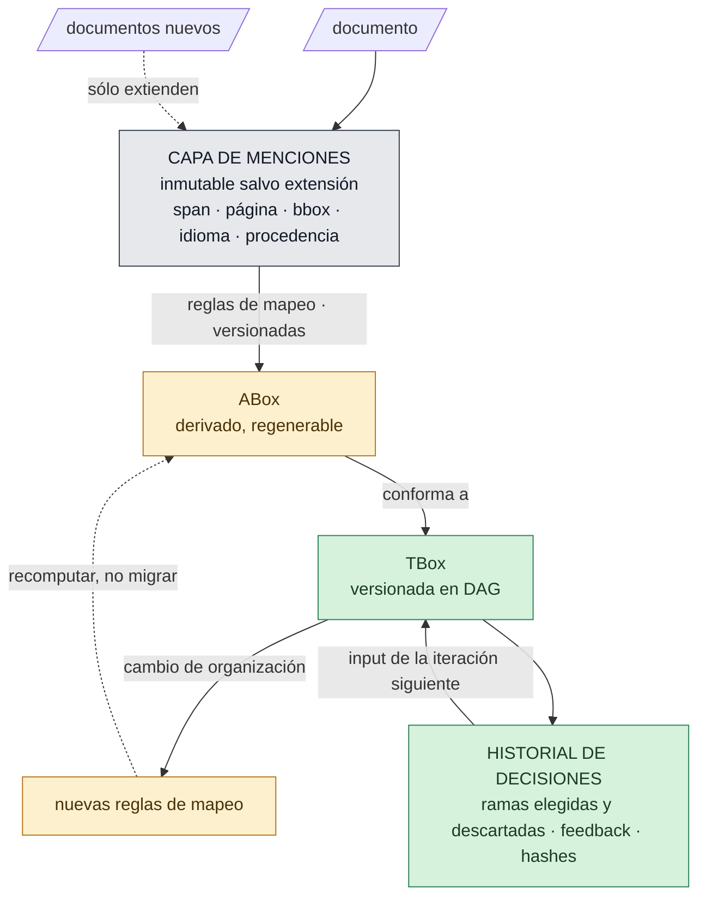
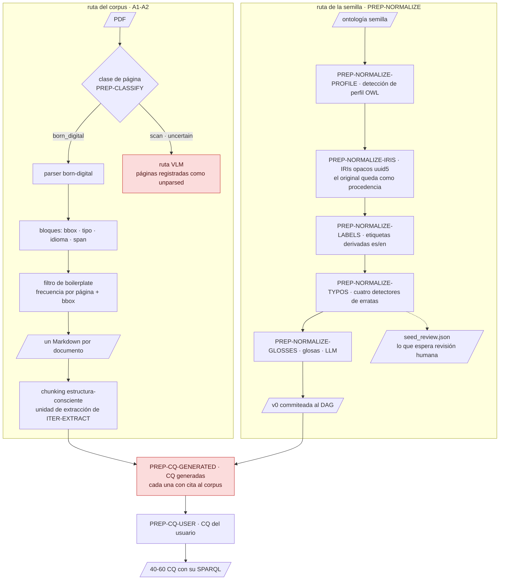
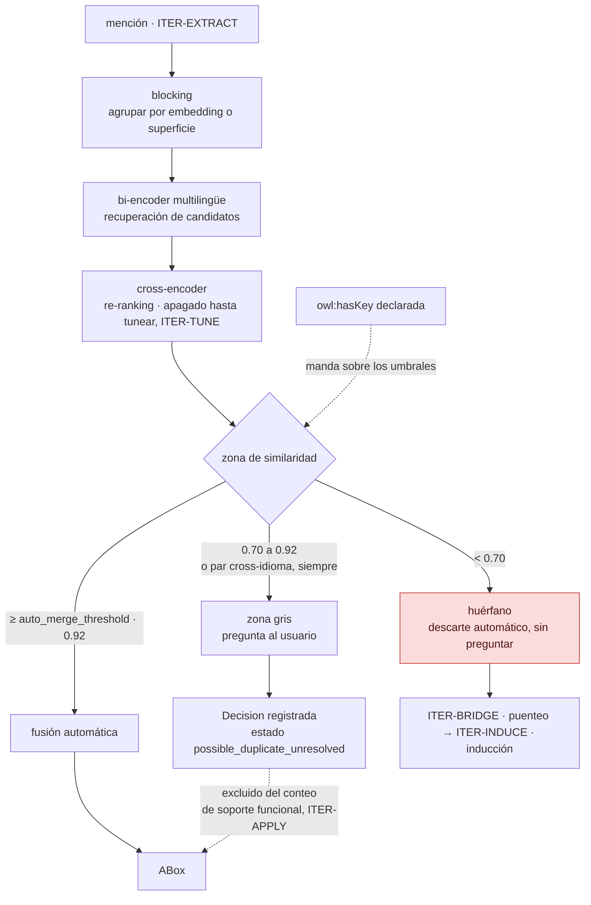
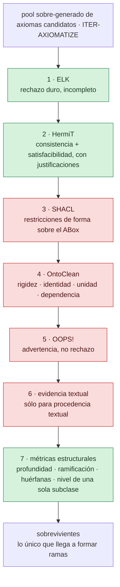
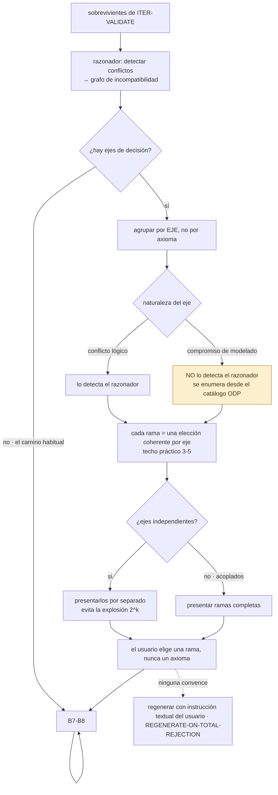
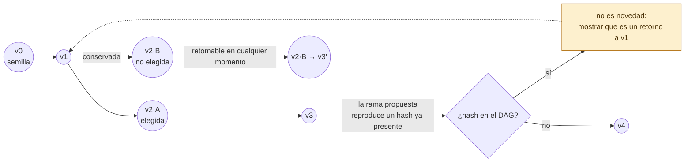
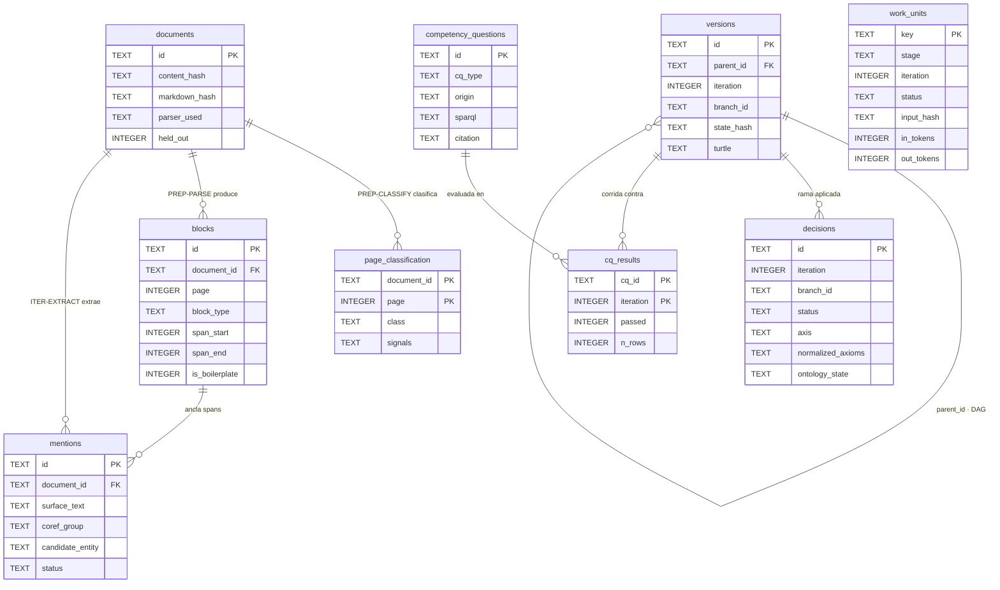
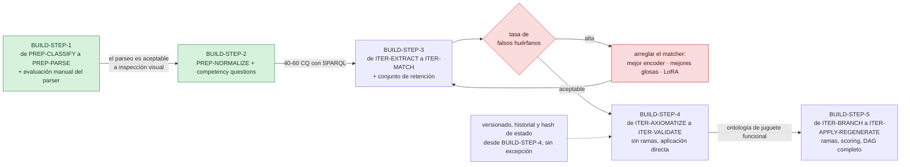

# Especificación: Pipeline de enriquecimiento ontológico asistido por LLM

**Versión:** 1.0
**Estado:** diseño cerrado, listo para implementación
**Idioma de operación del sistema:** inglés (prompts, esquemas, logs, etiquetas de configuración). El corpus y las glosas son bilingües (es/en) con etiqueta de idioma.

---

## SCOPE — Objetivo y alcance

### SCOPE-WHAT — Qué construye

Un **pipeline** que toma una ontología semilla y un corpus documental, y produce iterativamente una ontología extendida y reorganizada, con el ABox poblado desde los documentos.

**No es un modelo entrenado.** No hay fase de entrenamiento previa al uso. El único componente ajustable es el matcher (`ITER-TUNE`), y su ajuste ocurre después de varias iteraciones, cuando existen etiquetas acumuladas.

### SCOPE-INPUTS — Entradas

| Entrada | Forma |
|---|---|
| Ontología semilla | Archivo OWL (RDF/XML, Turtle) |
| Corpus | PDFs y texto plano, born-digital y/o escaneados |
| Ontología superior | Opcional, seleccionada de un catálogo (`CONFIG`) |
| Competency questions | Generadas asistidamente (`PREP-CQ-GENERATED`) + escritas por el usuario (`PREP-CQ-USER`) |

### SCOPE-OUTPUTS — Salidas

| Salida | Forma |
|---|---|
| Ontología versionada | OWL-DL, IRIs opacos, etiquetas y glosas bilingües |
| ABox | Derivado, regenerable desde la capa de menciones |
| DAG de versiones | Historial completo, incluidas ramas no elegidas |
| Reglas de mapeo | Mención → individuo/aserción, versionadas |
| Telemetría | Costos, métricas de evaluación, decisiones |

### SCOPE-PURPOSE — Propósito

**Primario:** conceptualizar el contenido del corpus en una ontología. Sin tarea downstream comprometida.
**Secundarios declarados:** integración de datos, inferencia, query answering.

Consecuencia: el rigor de `domain`/`range` y disjointness es **deseable, no bloqueante**. Se mantiene OWL-DL y razonamiento porque inferencia y query answering los requieren.

### SCOPE-EXPRESSIVITY — Expresividad objetivo

OWL-DL **sin restricciones de cardinalidad**. Se admiten propiedades funcionales (`owl:FunctionalProperty`), que se tratan con cuidado especial (`ITER-APPLY`).

### SCOPE-SCALE — Escala de referencia

- Semilla: orden de 30–50 clases
- Corpus: orden de 100 documentos; el tamaño por documento debe medirse, no asumirse
- Iteraciones: presupuesto configurable, orden de 10–20

**Consecuencia de escala:** no hay soporte estadístico para minería de reglas. **AMIE3, RDFRules y cualquier inducción estadística sobre el ABox quedan fuera del alcance.** Todo axioma tiene procedencia textual, de conocimiento del mundo, o lógica.

---

## DECISIONS — Registro de decisiones

Decisiones tomadas por el usuario durante el diseño. Vinculantes.

| Decisión | Qué decide | Dónde |
|---|---|---|
| `SEED-REORGANIZABLE` | La semilla es **reorganizable** (puede dividirse, fusionarse, reubicarse) | `REORG` |
| `DL-WITH-FUNCTIONALS` | Expresividad: OWL-DL sin cardinalidad, con funcionales | `SCOPE-EXPRESSIVITY` |
| `PAGE-LEVEL-CLASSIFICATION` | El corpus puede contener born-digital y escaneos; se clasifica por página | `PREP-CLASSIFY` |
| `KG-EMBEDDINGS-OUT-OF-SCOPE` | Embeddings de grafos de conocimiento: **fuera de v1**; opcionales como re-ranker en v2 | `BUILD-OUT-OF-SCOPE` |
| `BRANCH-ONLY-REVIEW` | Sin revisión manual axioma por axioma; el usuario solo elige rama | `ITER-BRANCH` |
| `MULTI-BRANCH-OUTPUT` | Salida multi-rama: conjuntos de cambios internamente coherentes, mutuamente alternativos | `ITER-BRANCH` |
| `BRANCHES-KEPT` | Las ramas no elegidas **se conservan** (DAG de versiones, no lista lineal) | `ITER-APPLY` |
| `HISTORY-AS-INPUT` | El historial de decisiones es input de cada iteración | `ITER-FEEDBACK` |
| `GRADED-FEEDBACK` | Feedback graduado por opción, no binario aceptar/rechazar | `ITER-FEEDBACK` |
| `SEPARATE-UNTIL-CONFIRMED` | Resolución de entidades: **individuos separados hasta confirmación** | `ITER-MATCH` |
| `OPAQUE-IRIS` | IRIs opacos + anotaciones legibles | `PREP-NORMALIZE-IRIS` |
| `UPPER-ONTOLOGY-FIXED-AT-START` | Ontología superior: **configurable**, fija al inicio del proyecto | `CONFIG` |
| `API-LLM-ALLOWED` | Sin restricciones de confidencialidad: se admite LLM por API | `CONFIG` |
| `GLOBAL-BY-DEFAULT` | Modo global (re-corre de `ITER-EXTRACT` a `ITER-INDUCE` sobre todo el corpus) vs incremental: **configurable**, default global | `CONFIG` |
| `COREF-INTRA-DOCUMENT` | Correferencia intra-documento: LLM con IDs de mención | `ITER-COREFER` |
| `OWLAPI-VIA-JPYPE` | Razonamiento: JPype + OWL API. **owlready2 no se usa** | `REASONING` |
| `RDFLIB-IN-MEMORY` | Grafo: RDFLib en memoria; Fuseki como capa de persistencia separada, futura | `REASONING` |
| `MENTIONS-IN-SQLITE` | Capa de menciones: SQLite | `SCHEMAS-MENTIONS` |
| `NOTARIZE-BY-DEFAULT` | Conflictos fácticos: notarizar por defecto; refutar y forzar como opciones; contextualizar es decisión de TBox | `ITER-CONFLICTS` |
| `REGENERATE-ON-TOTAL-REJECTION` | Rechazo total de una iteración → regenerar con instrucción textual del usuario | `ITER-BRANCH` |
| `AUTO-APPLY-WHEN-NO-AXES` | Sin ejes de decisión distinguibles → aplicar automáticamente y continuar, con entrada de log | `ITER-BRANCH` |
| `COLD-START-ACCEPTED` | Cold start: se acepta que las primeras 2–3 iteraciones sean más manuales | `COLDSTART` |
| `STOPPING-CRITERIA` | Criterio de parada: CQ (primario) + saturación + curva de acumulación + presupuesto (duro) | `EVAL` |
| `TEMPERATURE-PER-STAGE` | Temperatura configurable por etapa | `CONFIG` |
| `RETENTION-SET-JSONL` | Conjunto de retención: JSONL propio, con exportador a BRAT/INCEpTION | `EVAL-ANNOTATION-FORMAT` |
| `ENGLISH-OPERATION` | Idioma de operación del sistema: inglés | `SCOPE` |

---

## LAYERS — Arquitectura de artefactos

Cuatro capas con naturaleza y ciclo de vida distintos. **No mezclarlas es el invariante central del diseño.**

```
┌──────────────────────────────────────────────────────────┐
│ CAPA DE MENCIONES  (SQLite)                              │
│ Inmutable salvo por extensión. Provenance completa.       │
│ Se extiende cuando entran documentos nuevos.              │
└────────────────────────┬─────────────────────────────────┘
                         │ reglas de mapeo (versionadas)
                         ▼
┌──────────────────────────────────────────────────────────┐
│ ABox  —  DERIVADO, REGENERABLE                           │
│ Nunca se migra. Se recomputa tras cada cambio de TBox.    │
└────────────────────────┬─────────────────────────────────┘
                         │ conforma a
                         ▼
┌──────────────────────────────────────────────────────────┐
│ TBox  —  VERSIONADA en DAG                               │
│ Incluye etiquetas y glosas, que también evolucionan.      │
└──────────────────────────────────────────────────────────┘

┌──────────────────────────────────────────────────────────┐
│ HISTORIAL DE DECISIONES                                  │
│ Ramas elegidas y no elegidas, feedback, hashes de estado. │
│ Input de cada iteración.                                  │
└──────────────────────────────────────────────────────────┘
```

El movimiento entre capas, y por qué ninguna reorganización necesita migración:



**Lo que el diagrama prohíbe:** una flecha que entre a la capa de menciones desde abajo. Si la
TBox pudiera reescribir menciones, la procedencia dejaría de ser verificable y la regeneración
dejaría de ser idempotente.

**Regla de regeneración (`SEPARATE-UNTIL-CONFIRMED` + `SCOPE-PURPOSE`):** como el ABox se deriva de las menciones y no de fuentes externas, una reorganización de la TBox **nunca requiere script de migración**. Se cambian las reglas de mapeo y se recomputa. Esto sostiene la reorganizabilidad (`SEED-REORGANIZABLE`) sin deuda acumulada.

### LAYERS-ONTOLOGY-NOT-GRAPH — Distinción ontología / grafo

El pipeline **proyecta la ontología a grafo en puntos concretos y acotados**, nunca la reemplaza por su proyección:

| Etapa | Opera sobre | Naturaleza |
|---|---|---|
| `PREP-NORMALIZE` (normalización) | Proyección plana de la semilla | Representación de trabajo, descartable |
| `ITER-INDUCE` (inducción) | Grafo de menciones huérfanas | ABox crudo, no la TBox |
| `ITER-VALIDATE` (validación) | TBox completa | Lógica, semántica modélica |

**Prohibición explícita:** ningún algoritmo de grafo (clustering, comunidades, similaridad estructural) se aplica a la serialización RDF de la TBox. La disjointness se invierte de signo bajo similaridad estructural: dos clases declaradas incompatibles aparecen conectadas.

**Criterio de éxito de la capa TBox:** si el razonador no puede rechazar la salida, no se produjo una ontología.

---

## PREP — Fase de preparación (una sola vez)

Dos rutas independientes que sólo se encuentran en `PREP-CQ-GENERATED`: el corpus se convierte en chunks con
procedencia, la semilla en una TBox normalizada y versionada.



### PREP-CLASSIFY — Clasificación de documentos

**Por página, no por documento.** Los documentos mixtos (informe born-digital con anexo escaneado) son comunes.

Tres clases: `born_digital`, `scan`, `uncertain`.

Señales, por página:

| Señal | Extracción |
|---|---|
| Caracteres extraíbles | `page.get_text()` |
| Cobertura de imagen | área de imágenes / área de página |
| Operadores vectoriales | `page.get_drawings()` |
| Fuentes embebidas | recursos de fuente de la página |
| Metadata `/Producer`, `/Creator` | metadata del documento |
| Texto en render mode 3 (invisible) | operadores de contenido |
| Ratio de tokens fuera del léxico esperado | detección de texto corrupto (garbled) |

Heurística base (referencia CCpdf: precisión 93%, recall 43% — conservadora):
texto visible > 100 caracteres, texto oculto = 0, imágenes = 0 → born-digital.

**Casos que rompen la heurística y su tratamiento:**

| Caso | Tratamiento |
|---|---|
| Escaneo con OCR previo (searchable PDF) | Texto invisible + imagen de página completa → `scan`. Falso negativo más costoso |
| Texto convertido a curvas | Sin caracteres extraíbles → `scan`. Clasificación errónea inocua: la ruta es la misma |
| Texto corrupto (garbled) | Ratio léxico bajo → `scan` |
| Documento mixto | Resuelto por diseño: clasificación por página |

**Ruteo:** `born_digital` → parser rápido. `scan` y `uncertain` → VLM. **El default de la incertidumbre es la ruta cara.**

**Nota de implementación:** MinerU ya trae esta clasificación integrada (incluida la detección de texto corrupto). Si el modo de operación es "MinerU para todo", `PREP-CLASSIFY` se reduce a instrumentación y el ruteo propio es innecesario. El clasificador propio se justifica solo si se rutea entre herramientas distintas por velocidad.

### PREP-PARSE — Parseo e ingesta

**Herramientas.** Por defecto MinerU (mejor en ecuaciones y tablas; requiere GPU) o Docling (CPU-only, licencia MIT, objeto tipado con provenance). Configurable por clase de página.

**Prioridades para este caso de uso, en orden:**

1. **Fidelidad de tablas.** Una tabla de especificaciones es un conjunto de tripletas; es la fuente más densa de relaciones tipadas del corpus. Priorizar TEDS sobre velocidad.
2. **Provenance por elemento**: página, bounding box, tipo de bloque. Sin esto, una propuesta rechazada no puede rastrearse.
3. **Chunking estructura-consciente.** **No chunkear a través de una tabla.** La tabla completa, con su caption y el párrafo que la referencia, es una unidad.

**Figuras.** Ningún parser las lee. Salen como recorte + placeholder. Segunda pasada de captioning con VLM sobre cada recorte, inyectando caption y párrafo circundante como contexto.

**Filtro de boilerplate (independiente del parser).** Necesario porque las herramientas cubren esto de forma desigual:

| Ruido | Cobertura de las herramientas |
|---|---|
| Encabezados, pies, números de página, notas al pie | Resuelto (MinerU los elimina; Docling los tipa) |
| Texto rotado en el margen | Irregular; puede intercalarse en el orden de lectura |
| Marca de agua con contenido variable por página (IP, timestamp) | No resuelto: sin dos páginas iguales, la repetición exacta no lo detecta |

**Regla:** bloque de texto presente en >80% de las páginas con bbox aproximadamente constante → boilerplate. **Comparar por plantilla**, normalizando dígitos, IPs y fechas a comodines antes de comparar.

**Idioma.** Detección por bloque, registrando `language` y `language_source` ∈ {`declared`, `inferred`}. Se permite inferir por contexto cuando no está declarado; se registra como inferido para poder revisar sin re-procesar.

**Salida:** capa de menciones poblada (`SCHEMAS-MENTIONS`) + Markdown estructurado por documento.

### PREP-NORMALIZE — Normalización de la semilla

Ocurre en paralelo a `PREP-CLASSIFY` y `PREP-PARSE`. Cinco sub-etapas.

#### PREP-NORMALIZE-PROFILE — Detección de perfil OWL

Determina el perfil de la semilla (EL++, QL, RL, DL completo). **Dos usos:**

1. **Ruteo del razonador** (`REASONING`): si la semilla cae fuera de EL, ELK pierde utilidad como filtro.
2. **Acotar `ITER-AXIOMATIZE`**: propuestas que introduzcan construcciones fuera del perfil objetivo se descartan antes de llegar al razonador.

El perfil se guarda en configuración con dos valores: **detectado** y **objetivo**.

#### PREP-NORMALIZE-IRIS — Acuñar IRIs opacos

Cada entidad de la semilla recibe un IRI opaco (UUID). El IRI original se registra como procedencia (`skos:historicalNote` o anotación equivalente).

**Justificación (`OPAQUE-IRIS`):** con una sola ontología, historial versionado y alias registrados, no hay referencia externa que romper. El IRI deja de cargar significado; la etiqueta lo carga.

**Nota de tooling:** Protégé permite configurar qué propiedad de anotación renderiza en lugar del IRI (*Render by annotation property*). No requiere desarrollo.

#### PREP-NORMALIZE-LABELS — Derivar etiquetas

Determinista, temperatura 0 o sin LLM:

- Desnormalizar el local name del IRI original (camelCase, snake_case, kebab-case).
- Conservar `rdfs:label` declaradas.
- Emitir `rdfs:label@es` y `@en`, `skos:prefLabel` para el canónico.

**Manejo bilingüe con salvedad.** Cuando el IRI está en un idioma y la etiqueta declarada en otro, suelen ser el mismo término y ambos son etiquetas válidas. **Pero no siempre:** un IRI puede omitir información que la etiqueta incluye (ej. `Aplica_una_o_varias` frente a `appliesTechnique`).

**Regla:** derivar del IRI, comparar semánticamente con la etiqueta declarada, y si la similaridad cae bajo umbral, marcar el par como `divergent` en vez de asumir traducción. Los divergentes van a revisión del usuario; son pocos.

#### PREP-NORMALIZE-TYPOS — Detección de erratas

Cuatro detectores deterministas, **sin LLM**, que comparan contra el vocabulario de la propia ontología:

| Detector | Método | Ejemplo |
|---|---|---|
| Distancia de edición contra léxico interno | Levenshtein ≤ 2 contra tokens presentes en otros IRIs/etiquetas | `subre` → `sobre` |
| Abreviatura truncada | Subsecuencia de un token existente | `Frm` → `Framework` |
| Conformidad al patrón de nombrado | Contra el patrón mayoritario de propiedades (`is…Of`, `has…`) | `isdParticipantOf` |
| Anomalía de capitalización | Mayúscula en posición inesperada frente al patrón del grupo | `TIene_respuesta` |

**Las correcciones se aplican a las etiquetas, no a identificadores** — los IRIs ya son opacos (`PREP-NORMALIZE-IRIS`), así que la cuestión no se plantea. Las correcciones propuestas se presentan al usuario en bloque.

#### PREP-NORMALIZE-GLOSSES — Bootstrap de glosas

**Distinción necesaria:** una **etiqueta** es un nombre; una **glosa** es una definición en lenguaje natural. El matcher compara el texto de una mención contra la definición, no contra el nombre. Desnormalizar el IRI da la etiqueta, no la glosa.

Insumo del prompt (no el nombre de la clase): superclase, subclases, propiedades donde la clase es dominio o rango, clases con las que es disjunta.

Salida: `skos:definition@es` / `@en`. Temperatura 0.3.

**Ciclo de vida de la glosa.** La glosa no es un valor fijo de `PREP-NORMALIZE`:

| Fase | Fuente | Momento |
|---|---|---|
| Bootstrap | Vecindario estructural | `PREP-NORMALIZE-GLOSSES` |
| Enriquecimiento | Pasajes definicionales del corpus; sinónimos como `skos:altLabel` | `ITER-AXIOMATIZE-ENRICH`, cada iteración |

Esto cierra un bucle autocorrectivo: **glosa mejor → matching mejor → menos falsos huérfanos**. Una mención huérfana en la iteración 3 puede tiparse correctamente en la 8.

Consecuencias:
- La glosa es artefacto versionado; entra al DAG junto a la TBox.
- **`ITER-MATCH` se re-ejecuta sobre menciones huérfanas cuando las glosas cambian.**
- **Control de circularidad:** registrar qué documentos contribuyeron a cada glosa. Los matches contra documentos que no contribuyeron son la evidencia que cuenta; los otros inflan la cobertura.

### PREP-CQ-GENERATED — Generación asistida de competency questions

**Advertencia de circularidad.** Las CQ derivadas del corpus miden completitud **respecto al corpus**, no respecto al dominio. Es la misma limitación que la saturación de novedad. Mitigación en `PREP-CQ-USER`.

**`PREP-CQ-GENERATED-1-SAMPLING`.** Muestreo estratificado: 10–15 pasajes por estrato, no el corpus completo:
definiciones; tablas; enumeraciones y clasificaciones; restricciones ("debe", "no puede", "solo si"); procedimientos.

**`PREP-CQ-GENERATED-2-DRAFT`.** Generación por tipo con cuota. Un prompt por categoría (temperatura 0.3). Los tipos derivan de la expresividad declarada (`DL-WITH-FUNCTIONALS`):

| Tipo | Forma | Qué exige de la ontología |
|---|---|---|
| Definicional | ¿Qué tipos de X existen? | Jerarquía |
| Relacional | ¿Qué X está asociado a qué Y? | Propiedades con dominio/rango |
| Restrictivo | ¿Puede un X ser también un Y? | Disjointness |
| Cuantificacional | ¿Cuántos Y puede tener un X? | Funcionalidad |
| Inferencial | Si X es A y A ⊑ B, ¿X es B? | Que el razonador aporte |
| Negativo | ¿Qué X **no** cumple Y? | Mundo abierto explícito |

**Los tipos inferencial y negativo son los que más rinden y los que el LLM nunca genera espontáneamente.** Cuota obligatoria.

**`PREP-CQ-GENERATED-3-FILTER`.** Filtrado mecánico, previo a la revisión humana:
- Deduplicar por embedding, un representante por cluster.
- Descartar las que se responden con una tripleta trivial.
- **Descartar las no formalizables como SPARQL.** Si no es consulta, no sirve de criterio de parada.
- **Descartar las que carecen de cita y página.**

**`PREP-CQ-GENERATED-4-VALIDATE`.** Validación del usuario. Interfaz de tres acciones: aceptar / descartar / reformular, sobre 40–60 candidatas. **Trabajo de una sola vez**, no por iteración.

**Requisito duro: cada CQ aceptada queda pareada con su consulta SPARQL.** Sin esto, evaluar el criterio de parada requiere juicio humano cada iteración y se pierde la automatización.

**Estabilidad de las consultas bajo reorganización (`SEED-REORGANIZABLE`):** las consultas se escriben contra IRIs que una iteración puede dividir o reubicar. **Política elegida: regenerar la consulta cuando las clases involucradas cambian** (una llamada al LLM por CQ afectada, despreciable al volumen previsto). La alternativa —consultas contra etiquetas canónicas con tabla de alias— es más barata pero exige disciplina de registro de renombres.

**Bilingüe:** la CQ en el idioma de su pasaje fuente; la SPARQL contra IRIs canónicos únicos. La misma pregunta en dos idiomas no cuenta doble.

### PREP-CQ-USER — Competency questions independientes del usuario

20–30% del total, escritas **sin mirar la generación automática**, antes de arrancar.

Son las únicas que pueden fallar por razones que el corpus no anticipó, y las que más información dan cuando fallan. Su valor no está en la cantidad.

**Efecto lateral esperado:** al escribirlas, el usuario descubre que la semilla no tiene vocabulario para expresar parte de ellas, o que hay distinciones no previstas. Esa clarificación de la especificación es el valor principal del ejercicio.

---

## REORG — Reorganizabilidad y modo de procesamiento

### REORG-PATH-DEPENDENCE — Path-dependencia

El procesamiento documento a documento es path-dependiente: si el documento 3 induce una clase y el 40 habría inducido otra jerarquía, el resultado depende del orden. Con semilla reorganizable se agrava, porque cada merge puede reestructurar lo anterior.

**Mitigación (modo global, default — `GLOBAL-BY-DEFAULT`):** tres pasadas por iteración.

1. Extraer candidatos de **todos** los documentos, sin tocar la ontología.
2. Matching e inducción **globales** sobre el pool completo.
3. Axiomatización y validación.

Una sola reorganización informada por todo el corpus, en vez de N reorganizaciones incrementales.

**Modo incremental (configurable):** procesa solo documentos nuevos contra la TBox actual. Más barato, path-dependiente.

**Costo del modo global:** crece linealmente con el corpus **si se re-extrae**. Con caché de `ITER-EXTRACT` por hash de documento (`SCHEMAS-WORK-UNITS`), la re-corrida global cuesta casi lo mismo que la incremental y conserva el determinismo. **Diseñar con caché desde el principio.**

---

## ITER — Fase de iteración

### ITER-EXTRACT — Extracción de candidatos

**Principio rector de todo el uso de LLM en el pipeline:**

> El LLM clasifica y nombra. El código construye la lógica. El razonador rechaza.

**Nunca se le pide OWL al modelo.** Se le piden juicios atómicos ("¿X es un tipo de Y, o un ejemplo de Y?") y el código ensambla el axioma. Un modelo que solo responde eso no puede confundir subsunción con instanciación, porque nunca escribe el axioma.

Esto no elimina los sesgos del modelo; los intercepta. Sesgos conocidos y sus contra-mecanismos:

| Sesgo | Contra-mecanismo | Dónde vive |
|---|---|---|
| Confunde `subClassOf` con `rdf:type` | Juicios atómicos + ensamblado en código | Descomposición de tarea |
| Modela partonomía como taxonomía | OntoClean sobre metapropiedades | Validador (`ITER-VALIDATE`) |
| Sobre-genera jerarquía | Rechazar niveles con una sola subclase o sin criterio de división declarado | Validador (`ITER-VALIDATE`) |
| Evita disjointness | Prompt separado y dedicado, con pares pre-seleccionados por código | Descomposición |
| Inconsistencia global | Razonador | Validador (`ITER-VALIDATE`) |

**Intervenciones descartadas:** fine-tuning del generador (los sesgos no son de estilo) y entrenamiento desde cero. **Intervenciones adoptadas:** descomposición de tarea (≈70% de la ganancia), ejemplos en contexto desde catálogo ODP, decodificación restringida para garantizar sintaxis, rejection sampling con el razonador como filtro.

**Unidad:** chunk. Temperatura 0. **Cacheable por hash de documento.**

### ITER-COREFER — Correferencia intra-documento

Problema distinto del linking entre documentos; se resuelve antes y con otro método (`COREF-INTRA-DOCUMENT`).

**Método elegido: LLM sobre el documento completo.** Un documento de 10 páginas son ~10k tokens, entran en contexto. Sin restricción de confidencialidad (`API-LLM-ALLOWED`), es la ruta pragmática.

**Detalle de implementación crítico: no pedir spans.** `ITER-EXTRACT` ya extrajo menciones con offsets. Numerarlas, pasar el documento con las menciones marcadas (`[M17]`, `[M18]`…), y pedir que agrupe **identificadores**:

```
Salida: [[M3, M17, M42], [M8, M11]]
```

Verificable mecánicamente (¿todos los IDs existen? ¿alguno en dos grupos?), sin parseo frágil de offsets.

**Alternativa descartada para v1:** herramientas dedicadas (CorPipe y derivados de CorefUD/CRAC para español vía AnCora). Funcionan, pero son infraestructura de investigación: instalación frágil, poca documentación. Reconsiderar solo si el corpus crece a miles de documentos.

Temperatura 0. Cacheable por hash de documento.

### ITER-MATCH — Matching y resolución de entidades

**Es el cuello de botella de calidad del pipeline.** Si el matching tipa mal, entidades que pertenecían a la semilla caen en huérfanos e inducen clases espurias. Aquí va el grueso del esfuerzo de evaluación.

#### ITER-MATCH-ARCHITECTURE — Arquitectura

Bi-encoder multilingüe para recuperación + cross-encoder para re-ranking, operando sobre **glosas** (`PREP-NORMALIZE` `PREP-NORMALIZE-GLOSSES`). Punto de partida: modelos entrenados sobre benchmarks de OAEI (Ontology Alignment Evaluation Initiative), que es exactamente esta tarea.

#### ITER-MATCH-ENTITY-RESOLUTION — Política de resolución de entidades

"Separados hasta confirmación" define el default, no la política completa. Cuatro componentes:

**a) Blocking.** Miles de menciones hacen inviable la comparación exhaustiva. Agrupar por similaridad de superficie o embedding; comparar solo dentro del bloque.

**b) Tres zonas, no dos.**

| Zona | Acción |
|---|---|
| Alta similaridad | Fusión automática |
| Zona gris | Pregunta al usuario |
| Baja similaridad | Descarte automático, sin preguntar |

Si se pregunta todo lo que no es obviamente idéntico, se vuelve a la revisión manual masiva.

**c) Escalonamiento por tipo de mención.**

| Tipo | Política |
|---|---|
| Nombre propio idéntico, misma clase inferida | Fusión automática |
| Sintagma definido anafórico ("el sistema") | Resuelto en `ITER-COREFER`, intra-documento; no cross-document |
| Sinónimo declarado en la semilla | Fusión automática |
| Cross-idioma (es/en) | Zona gris siempre |
| Sintagma genérico cross-document | Separados, sin preguntar |

**d) Claves declaradas.** Si la semilla declara `owl:hasKey` para una clase, **esa clave manda sobre los umbrales de similaridad**. Toda clase nueva propuesta en `ITER-INDUCE` debería recibir la pregunta de si tiene clave.

Las tres zonas y lo que las gobierna:



**El riesgo que el diagrama hace visible:** el nodo rojo. Una mención que *sí* pertenecía a la
semilla y cae en `< 0.70` no genera ningún error — genera una clase nueva en `ITER-INDUCE`. Por eso los
umbrales no se fijan por decreto sino midiéndolos contra el conjunto de retención (`EVAL-PIPELINE`).

#### ITER-MATCH-UNRESOLVED — Consecuencia de la política conservadora

Habrá duplicados no resueltos. **Esto contamina el conteo de soporte de propiedades funcionales**: dos individuos duplicados, cada uno con un valor distinto, parecen confirmar funcionalidad cuando en realidad son la misma entidad con dos valores → conflicto oculto.

**Regla:** estado `possible_duplicate_unresolved` en la capa de menciones, y **exclusión de esos individuos del conteo de soporte funcional** (`ITER-APPLY`).

**Punto a favor:** como el ABox se regenera (`LAYERS`), revisar una decisión de fusión no requiere migración. Se cambia la regla de mapeo y se recomputa.

### ITER-BRIDGE — Puenteo por conocimiento del mundo

**Etapa nueva, entre `ITER-MATCH` y `ITER-INDUCE`.** Antes de inducir clases sobre los huérfanos, preguntar por conocimiento preentrenado si un candidato se relaciona con alguna clase de la semilla **aunque ningún documento lo diga explícitamente**.

Justificación: el conocimiento general del modelo es lo que debe tender el puente cuando el corpus no explicita la relación. Tratar la ausencia de puente como fallo del matcher es un error de diseño.

**Consecuencia: dos clases de procedencia, con filtros distintos.**

| Procedencia | Evidencia | Filtro de evidencia en `ITER-VALIDATE` |
|---|---|---|
| `textual` | Cita, página, bbox | **Se aplica**: sin cita, se descarta |
| `world_knowledge` | Ninguna cita posible | **No se aplica** |

La regla "todo axioma sin cita se descarta" mataría exactamente los puentes que hacen útil a la semilla. Los axiomas de conocimiento del mundo pasan razonador y OntoClean igual, pero llegan al usuario marcados como tales. Son pocos, son los más discutibles, y son donde el criterio de dominio del usuario rinde más.

#### ITER-BRIDGE-ORPHAN-METRIC — Métrica de huérfanos, partida en dos

**El orphan rate agregado no dice nada.** Hay que separar:

| Tipo | Significado | Tratamiento |
|---|---|---|
| **Falso huérfano** | La clase existía y el matcher falló | Error. Va al conjunto de evaluación (`EVAL-PIPELINE`) |
| **Huérfano genuino** | La semilla no cubre el concepto | Funcionamiento normal. Alimenta `ITER-INDUCE` |

Solo el primero es un problema. Mezclados, la métrica es inútil.

### ITER-INDUCE — Inducción de clases desde huérfanos

> **Escrita el 2026-09-10, después de implementarla.** Esta etapa estaba referida seis veces
> —`SEPARATE-UNTIL-CONFIRMED` le manda preguntar por `owl:hasKey`, `ITER-BRIDGE` la nombra como
> su destino, `BUILD-NO-GO-GATE` la usa para explicar por qué un falso huérfano cuesta caro— y no
> tenía sección propia. Lo que sigue es lo que el resto del spec ya le exigía, junto en un lugar.

Los huérfanos genuinos que sobreviven a `ITER-BRIDGE` son conceptos que la semilla no cubre. Esta
etapa los agrupa y propone una clase por grupo.

**Es la única etapa que agrupa por similaridad de grafo, y `LAYERS-ONTOLOGY-NOT-GRAPH` lo
permite explícitamente**: opera sobre el grafo de menciones huérfanas, que es ABox crudo, no sobre
la serialización de la TBox.

**Agrupamiento por enlace simple.** Las formas superficiales de un concepto forman una cadena:
`specimen`, `the specimens`, `samples` no tienen por qué parecerse entre sí, sólo a algo
intermedio. El umbral y el soporte mínimo son configuración (`CONFIG`), no constantes.

**Soporte mínimo.** Un grupo de una sola mención no es una clase, es ruido. Y coincide con lo que
`ITER-VALIDATE` rechaza después: un nivel con una sola subclase.

**El modelo nombra el grupo; el código no le pide OWL.** Tres respuestas por grupo:

| Campo | Qué es | Si falta |
|---|---|---|
| `is_a_class` | Puede ser `false`: el grupo no denota una clase | Se descarta el grupo, y es un resultado esperable |
| `label` y glosa | Cómo se llama y qué significa | Propuesta inválida |
| **criterio de división** | Qué separa a esta clase de su hermana | **Propuesta inválida.** `ITER-VALIDATE` rechaza una clase sin criterio declarado |

**La clase existente más cercana se muestra, no se asume.** Entra al prompt para que el modelo
pueda *diferenciar* la clase nueva de la que ya está, y se registra como padre **candidato**. Quien
decide la subsunción es `ITER-AXIOMATIZE`; acá nada se aplica.

**Comprobación de redundancia contra el inventario.** Antes de acuñar, el nombre del grupo se
compara con las clases que ya existen. El matcher falla sobre el sintagma suelto y el nombre del
grupo sí coincide: es el camino que `BUILD-NO-GO-GATE` describe —falso huérfano → clase espuria—
atrapado un paso antes. **Lo marcado no se descarta en silencio:** que la inducción reencuentre una
clase que ya está es un diagnóstico sobre el matcher, y borrarlo perdería la única señal de que
pasó.

**Toda clase nueva debería recibir la pregunta de clave** (`SEPARATE-UNTIL-CONFIRMED`): si tiene
`owl:hasKey`, esa clave manda sobre los umbrales de similaridad en las iteraciones siguientes.

### ITER-TUNE — Ajuste del matcher

**Único componente del pipeline que se ajusta.** Razón estructural: es clasificación de pares, no generación. Con cientos de ejemplos etiquetados, un cross-encoder mejora de forma medible; un generador no.

**Fuente de etiquetas:** cada decisión del usuario de aceptar o rechazar un match. El proceso las produce solo.

**Evaluación:** pareada sobre el mismo conjunto de retención, antes y después. Es lo único que aísla la variable.

**No arranca antes de acumular volumen suficiente.** Ver cold start (`COLDSTART`).

### ITER-CONFLICTS — Conflictos fácticos

Distintos de los compromisos de modelado (`ITER-BRANCH`). Ocurren cuando el documento 12 afirma X y el 47 afirma ¬X.

**Cuatro políticas, en dos niveles distintos:**

| Nivel | Política | Alcance | Costo |
|---|---|---|---|
| ABox / reglas de mapeo | **notarizar** (conservar ambas con provenance) | Por caso | Barato, reversible |
| ABox / reglas de mapeo | **forzar** (una fuente gana) | Por caso | Barato, reversible |
| ABox / reglas de mapeo | **refutar** (marcar falsa) | Por caso | Barato, reversible |
| **TBox** | **contextualizar** (reificar la aserción con su fuente) | Por propiedad | Caro, global |

**La contextualización no es una decisión por caso.** Reificar una propiedad cambia la forma de todas las consultas sobre ella, incluidas las SPARQL de las CQ. Pertenece a `ITER-BRANCH` como eje de modelado.

**Regla práctica:** el conflicto individual se resuelve en ABox; **el patrón de conflictos sobre una propiedad dispara la decisión de TBox.**

#### ITER-CONFLICTS-VOLUME-FILTER — Filtro de volumen

Decidir caso por caso es la revisión manual que se quiere evitar:

- Conflicto que **no** produce inconsistencia lógica (propiedad no funcional, sin disjointness involucrada) → **notarizar por defecto, sin preguntar.**
- Conflicto que **sí** rompe el razonador → llega al usuario. Serán pocos, y son donde el criterio importa.

**El default silencioso es notarizar: es el único que no destruye información.**

#### ITER-CONFLICTS-FALSEHOOD — Marcado de falsedad: dos casos que no deben mezclarse

| Caso | Significado | Destino |
|---|---|---|
| `refuted` | El documento afirma X y X no es cierto | Excluida del ABox. Opcionalmente `owl:NegativePropertyAssertion` si se sabe activamente que es falso |
| `misextracted` | El documento no dice X; el extractor leyó mal | **Bug de `ITER-EXTRACT`.** Va al conjunto de evaluación |

Parecen lo mismo en la interfaz y son señales opuestas. Mezclarlos pierde la única fuente gratuita de etiquetas de error de extracción.

**Nota semántica:** bajo mundo abierto, no asertar X y asertar ¬X son cosas distintas. La primera es silencio; la segunda es conocimiento. Usar `NegativePropertyAssertion` solo cuando se sabe que es falso, no cuando hay duda.

### ITER-AXIOMATIZE — Axiomatización

El LLM propone axiomas **con evidencia textual explícita** o marcados como `world_knowledge`. El código ensambla el OWL.

**Sin componente de inducción estadística** (`SCOPE-SCALE`). Fuentes de axiomas: texto, conocimiento del mundo, OntoClean (metapropiedades), razonador (rechazo).

**Acotado por el perfil objetivo** (`PREP-NORMALIZE-PROFILE`): propuestas fuera del perfil se descartan antes del razonador.

Temperatura 0.7.

#### ITER-AXIOMATIZE-ENRICH — Enriquecimiento de glosas

Sub-etapa de `ITER-AXIOMATIZE`. Extrae de pasajes definicionales del corpus mejoras a las glosas existentes y sinónimos (`skos:altLabel`), registrando qué documentos contribuyeron (control de circularidad, `PREP-NORMALIZE`).

### ITER-VALIDATE — Cadena de filtros

Apilados. **Solo lo que sobrevive los siete llega a formar ramas.** El usuario nunca ve un axioma individual (`BRANCH-ONLY-REVIEW`).

El número del id es la posición en la cadena: está apilada, y el orden importa.

| Filtro | Tipo | Nota |
|---|---|---|
| `ITER-VALIDATE-1-ELK` | Rechazo duro, incompleto | Ver `REASONING-ELK-ASYMMETRY` |
| `ITER-VALIDATE-2-HERMIT` | Rechazo duro | Consistencia y satisfacibilidad, con justificaciones |
| `ITER-VALIDATE-3-SHACL` | Rechazo | Restricciones de forma sobre el ABox |
| `ITER-VALIDATE-4-ONTOCLEAN` | Rechazo duro | Subsunciones mal formadas |
| `ITER-VALIDATE-5-PITFALLS` | Advertencia | Pitfalls de modelado (OOPS!), no rechazo |
| `ITER-VALIDATE-6-EVIDENCE` | Rechazo | **Solo para procedencia `textual`** (`ITER-BRIDGE`) |
| `ITER-VALIDATE-7-STRUCTURE` | Rechazo | Profundidad, ramificación, clases huérfanas, niveles con una sola subclase |

**OntoClean requiere metapropiedades etiquetadas** (rigidez, identidad, unidad, dependencia). Si se seleccionó ontología superior (`CONFIG`), se heredan. Si no, las etiqueta el LLM — factible, menos confiable, y es trabajo adicional que contradice parcialmente `BRANCH-ONLY-REVIEW`.

Cuerpos de conocimiento a incorporar: **ODPs** (Ontology Design Patterns) como plantillas de prompt y enumerador de ramas; **OntoClean** como validador; **OOPS!** como scanner de anti-patrones.



Verde: implementado. Rojo: pendiente. **El usuario no ve ninguno de estos rechazos** (`BRANCH-ONLY-REVIEW`): ve
ramas, y la cadena decide qué entra en ellas.

### ITER-BRANCH — Construcción de ramas

Lo que el usuario describió corresponde a **revisión de creencias con extensiones múltiples**. Cuando un conjunto de axiomas candidatos es inconsistente, los subconjuntos consistentes maximales son los "conjuntos coherentes". Herramientas teóricas: MUPS, diagnóstico por hitting sets de Reiter, QuickXplain.

**Prohibición: no pedirle al LLM "dame 3 alternativas".** Genera ramas basura y correlacionadas.

**Proceso correcto:**

1. Sobre-generar el pool de candidatos.
2. Detectar conflictos con el razonador → grafo de incompatibilidad.
3. **Agrupar por eje de decisión, no por axioma.**
4. Cada rama = una elección coherente en cada eje.

**Dos fuentes de ramificación, de naturaleza distinta:**

| Fuente | Ejemplo | ¿La detecta el razonador? |
|---|---|---|
| Conflicto lógico | Dos axiomas que juntos hacen insatisfacible una clase | Sí |
| **Compromiso de modelado** | Reificar vs. propiedad directa; `RedProduct` como clase vs. `hasColor red`; jerarquizar por función vs. por estructura | **No** |

**Las del segundo tipo son las ramas que valen** — mutuamente excluyentes en la práctica, perfectamente consistentes en lógica. **Se enumeran desde el catálogo de ODPs; no se descubren.** Cada elección del segundo tipo condiciona el resto de la ontología.

**Control de explosión combinatoria.** Con k ejes binarios independientes hay 2^k ramas. **Presentar los ejes por separado cuando son independientes; ramas completas solo cuando están acoplados.** Techo práctico: 3–5 ramas.



**El nodo ámbar es el que justifica todo el mecanismo.** Reificar vs. propiedad directa, o
jerarquizar por función vs. por estructura, son perfectamente consistentes en lógica: ningún
razonador los va a separar, y cada elección condiciona el resto de la ontología.

#### ITER-BRANCH-SCORING — Scoring de ramas

Puntuar ramas ≠ puntuar axiomas. Una rama puede tener axiomas sólidos y ser un mal compromiso global.

| Componente | Computable sin modelo |
|---|---|
| Cobertura: fracción de huérfanos que queda tipada | Sí |
| Costo de reorganización: axiomas previos invalidados | Sí |
| Costo de regeneración del ABox: instancias remapeadas | Sí |
| Afinidad histórica: similaridad con decisiones previas | No (requiere historial) |
| Parsimonia: axiomas nuevos por entidad cubierta | No (requiere historial) |

Los últimos dos son pobres en las primeras iteraciones. Ver cold start (`COLDSTART`).

#### ITER-BRANCH-EDGE-CASES — Casos límite

| Caso | Comportamiento |
|---|---|
| **No hay ejes distinguibles** (todos los candidatos compatibles) | **Aplicar todo automáticamente y continuar**, con entrada de log. **El multi-rama es el camino excepcional, no el default.** Si pregunta en cada iteración sin conflicto real, se convierte en el trabajo manual que se quiere evitar (`AUTO-APPLY-WHEN-NO-AXES`) |
| **Rechazo total**: ninguna rama convence | **Regenerar con instrucción textual del usuario** (`REGENERATE-ON-TOTAL-REJECTION`) |
| **La rama resultante repite un estado ya visitado** | Ver `ITER-APPLY` |

### ITER-FEEDBACK — Historial y feedback

**Lo rechazado vale más que lo aceptado.** El historial de aceptaciones ya está en la ontología actual; el de rechazos no está en ningún otro lado.

#### ITER-FEEDBACK-SCHEMA — Esquema de feedback por opción

Tres campos, no más:

| Campo | Valores |
|---|---|
| `status` | `chosen` / `not_chosen` / `invalid` |
| `axis` | Categoría fija (~6): `granularity`, `division_criterion`, `property_vs_class`, `directionality`, `scope`, `terminology` |
| `comment` | Texto libre — **el que más rinde en recuperación** |

`invalid` separado de `not_chosen` recupera la señal fuerte sin colapsar todo a rechazo.

#### ITER-FEEDBACK-RETRIEVAL — Destino del feedback: recuperación, no fine-tuning

**Volumen:** decenas o pocos cientos de decisiones. Insuficiente para ajustar un modelo de preferencias. **Suficiente para recuperación de ejemplos en contexto.**

Mecanismo: ante una propuesta nueva, recuperar las 3–5 decisiones históricas más similares (embedding del axioma + su contexto) e inyectarlas en el prompt con el comentario del usuario.

Mejor que fine-tuning acá y no solo por volumen: **es inspeccionable**. Ante una propuesta rara, se puede ver qué precedentes usó.

#### ITER-FEEDBACK-NORMAL-FORM — Comparación por forma normal

Para detectar re-proposición hay que **normalizar el axioma antes de comparar**. Sin esto, el mismo compromiso reaparece con IRIs distintos y no se detecta.

#### ITER-FEEDBACK-EXPIRY — Expiración de rechazos: problema abierto

Con semilla reorganizable, **un rechazo no es permanente**. Un axioma rechazado en la iteración 3 puede ser correcto en la 9 porque la estructura cambió.

- Bloquearlo para siempre → el proceso se acorrala.
- No bloquearlo → loop.

**Política:** registrar el rechazo **relativo al estado de la ontología**, y expirarlo cuando las clases involucradas hayan sido reorganizadas.

**No es una regla limpia. Requiere ajuste empírico.** Marcado como riesgo conocido (`RISKS`).

### ITER-APPLY — Aplicación, versionado y detección de loops

#### ITER-APPLY-VERSION-DAG — DAG de versiones

Las ramas no elegidas se conservan. El almacén de versiones es un **grafo dirigido**, no una lista lineal: se puede volver a la iteración 4 y tomar la rama C.

**Almacenamiento: base propia, no Git.** Git sobre archivos Turtle es tentador, pero el diff textual no sirve — se necesita diff semántico igual. Git quedaría solo como almacenamiento sin aportar nada.

**Requisito: versionado con diff semántico.** Sin poder revertir a un estado anterior y re-derivar, el proceso no es auditable.

#### ITER-APPLY-LOOPS — Detección de loops

Como el almacén ya es un DAG, la oscilación A→B→A **es exactamente un ciclo** y se detecta de forma exacta y barata:

1. Hash canónico del estado de la ontología (**normalizar a forma normal, ordenar axiomas, IRIs canónicos**).
2. Antes de presentar una rama, computar el hash del estado resultante.
3. **Si el hash ya existe en el DAG → no presentarla como novedad; mostrar que es un retorno a la versión N.**

No bloquea nada: volver al estado 4 es válido, pero explícitamente, no por accidente. Captura ciclos de longitud arbitraria.



El hash se computa sobre la ontología normalizada —axiomas ordenados, IRIs canónicos, **nunca
etiquetas**—, así que un renombre puro no cuenta como estado nuevo y la oscilación A→B→A es
literalmente un ciclo en este grafo.

**Caso parcial no cubierto por el hash exacto:** la rama vuelve *casi* al estado anterior (mismo compromiso, IRIs distintos). Para eso, distancia sobre el conjunto de axiomas normalizados con umbral. Menos limpio; cubre lo que falta.

**Nota:** el hash se computa sobre **IRIs, no sobre etiquetas**. Si no, un renombre puro cuenta como estado nuevo.

#### ITER-APPLY-REGENERATE — Regeneración del ABox

Tras aplicar la rama: recomputar el ABox completo desde la capa de menciones con las reglas de mapeo actualizadas. **No hay script de migración** (`LAYERS`).

#### ITER-APPLY-FUNCTIONAL — Propiedades funcionales: riesgo silencioso

`FunctionalProperty` es cardinalidad máxima 1 con otro nombre.

**Detectarla desde el ABox bajo mundo abierto es inválido en principio:** que cada entidad tenga un solo valor de X no prueba funcionalidad, solo ausencia de contraejemplo.

**El costo de equivocarse es asimétrico y silencioso:** una propiedad declarada funcional por error hace que el razonador **infiera `owl:sameAs` entre individuos distintos** y fusione entidades, **sin lanzar ninguna inconsistencia**.

**Política:** heurística de soporte → **pregunta explícita al usuario**. Es la única categoría que llega a decisión individual, y es donde el conocimiento de dominio es irreemplazable.

**Qué mostrar en la pregunta** (cambia la decisión):
- Número de individuos observados con la propiedad
- Distribución de valores por individuo
- Páginas de evidencia

"1 valor en 3 individuos" y "1 valor en 400 individuos" son la misma señal cualitativa y decisiones opuestas.

**Excluir del conteo los individuos marcados `possible_duplicate_unresolved`** (`ITER-MATCH`).

---

## CONFIG — Superficie de configuración

**Un solo archivo central.** Sin esto, los umbrales terminan hardcodeados en cinco lugares.

```yaml
# ─── Perfil y razonamiento ───────────────────────────────
owl_profile:
  detected: auto          # calculado en PREP-NORMALIZE-PROFILE
  target: OWL_DL_no_cardinality
reasoner:
  elk_filter_enabled: true
  elk_coverage_threshold: 0.7    # fracción de axiomas no ignorados
  hermit_timeout_s: 120
upper_ontology: none      # none | skos | dolce_ultralite | bfo
                          # FIJA AL INICIO. Cambiarla = empezar de nuevo.

# ─── Corpus y parseo ─────────────────────────────────────
parser:
  born_digital: pymupdf4llm
  scan: mineru
  uncertain: mineru
boilerplate:
  page_frequency_threshold: 0.8
  bbox_tolerance_px: 12
  normalize_before_compare: [digits, ips, dates]

# ─── Matching y resolución de entidades ──────────────────
matching:
  auto_merge_threshold: 0.92
  grey_zone_lower: 0.70
  cross_language_always_grey: true
  blocking_strategy: embedding          # embedding | surface_and_keys
  respect_declared_haskey: true

# ─── Iteración ───────────────────────────────────────────
iteration:
  mode: global            # global | incremental
  cache_extraction: true
  trigger: manual         # manual | per_document | batch_of_n
  batch_size: 5
  max_iterations: 20      # criterio de parada duro

# ─── Competency questions ────────────────────────────────
cq:
  n_candidates: 60
  type_quota: {definitional: 8, relational: 12, restrictive: 8,
               quantificational: 6, inferential: 10, negative: 6}
  sparql_regeneration: on_class_change
  target_pass_rate: 0.90

# ─── Ramas ───────────────────────────────────────────────
branching:
  max_branches: 5
  present_independent_axes_separately: true
  auto_apply_when_no_axis: true

# ─── Modelos y temperatura (por etapa) ───────────────────
llm:
  prep_normalize_labels:        {tier: small,  temperature: 0.0}
  prep_normalize_glosses:       {tier: medium, temperature: 0.3}
  prep_cq_generated:   {tier: large,  temperature: 0.3}
  iter_extract:      {tier: medium, temperature: 0.0}
  iter_corefer:    {tier: medium, temperature: 0.0}
  iter_match:        {tier: small,  temperature: 0.0}
  iter_bridge:       {tier: large,  temperature: 0.3}
  iter_induce:          {tier: large,  temperature: 0.3}
  iter_axiomatize:  {tier: large,  temperature: 0.7}
  iter_branch:       {tier: large,  temperature: 0.3}
  regeneration_retry: {tier: large,  temperature: 0.7}

# ─── Ejecución ───────────────────────────────────────────
execution:
  max_retries: 3
  backoff_base_s: 2
  stage_failure_rate_abort: 0.10
```

---

## SCHEMAS — Esquemas de datos

Cómo se relacionan los almacenes. `documents` es la raíz de toda procedencia; `work_units` y
`decisions` son transversales —no cuelgan de ningún documento— y las relaciones se sostienen
por convención de `document_id`, no por claves foráneas declaradas, salvo `versions.parent_id`,
que sí lo es y es lo que hace del almacén de versiones un DAG.



`work_units` no aparece conectada porque es deliberadamente transversal: su clave incluye
etapa, versión del prompt, temperatura y hash del input, y eso la vuelve simultáneamente caché,
checkpoint y telemetría (`SCHEMAS-WORK-UNITS`).


### SCHEMAS-MENTIONS — Capa de menciones

**Artefacto persistente central.** Todo lo demás se regenera desde aquí. Definir antes de escribir `ITER-EXTRACT`: cambiarlo después obliga a re-parsear todo.

```sql
CREATE TABLE mentions (
  id                TEXT PRIMARY KEY,
  document_id       TEXT NOT NULL,
  page              INTEGER NOT NULL,
  bbox              TEXT,              -- JSON [x0,y0,x1,y1]
  span_start        INTEGER,           -- offsets sobre el Markdown
  span_end          INTEGER,
  surface_text      TEXT NOT NULL,
  block_type        TEXT,              -- paragraph|table|table_cell|formula|caption|figure
  language          TEXT,              -- es|en
  language_source   TEXT,              -- declared|inferred
  coref_group       TEXT,              -- intra-documento (ITER-COREFER)
  candidate_entity  TEXT,              -- entidad tras linking cross-document
  status            TEXT NOT NULL      -- active|refuted|misextracted|possible_duplicate_unresolved
);

CREATE TABLE documents (
  id            TEXT PRIMARY KEY,
  path          TEXT, content_hash TEXT,
  n_pages       INTEGER, parser_used TEXT, parser_version TEXT,
  markdown_hash TEXT                   -- valida offsets al reimportar anotaciones
);

CREATE TABLE page_classification (
  document_id TEXT, page INTEGER,
  class       TEXT,                    -- born_digital|scan|uncertain
  signals     TEXT,                    -- JSON con las señales que la produjeron
  PRIMARY KEY (document_id, page)
);
```

### SCHEMAS-BRANCH — Rama

**Objeto central del sistema.** Sin los dos últimos campos no se puede justificar la elección ni detectar loops.

```json
{
  "branch_id": "b_2f9a",
  "iteration": 7,
  "parent_version": "v6",
  "axes": [
    {"axis": "division_criterion", "option": "by_function",
     "alternatives": ["by_structure"]}
  ],
  "add_axioms":    [{"axiom": "...", "provenance": "textual",
                     "evidence": {"document_id": "...", "page": 4,
                                  "bbox": [...], "quote": "..."}}],
  "remove_axioms": ["..."],
  "score": {"coverage": 0.71, "reorg_cost": 12, "abox_regen_cost": 340,
            "historical_affinity": 0.63, "parsimony": 2.1},
  "resulting_state_hash": "sha256:...",
  "cq_delta": {"newly_passing": ["cq_12", "cq_31"], "newly_failing": []}
}
```

### SCHEMAS-WORK-UNITS — Unidades de trabajo

**Caché y checkpoint son el mismo mecanismo, no dos.**

```sql
CREATE TABLE work_units (
  key            TEXT PRIMARY KEY,   -- hash(stage, prompt_version, temperature, input_payload)
  stage          TEXT NOT NULL,
  iteration      INTEGER,
  status         TEXT NOT NULL,      -- pending|running|done|failed
  input_hash     TEXT,
  output         TEXT,
  attempts       INTEGER DEFAULT 0,
  error          TEXT,
  in_tokens      INTEGER,            -- telemetría de costo
  out_tokens     INTEGER,
  created_at     TEXT, completed_at TEXT
);
CREATE INDEX idx_wu_stage ON work_units(stage, iteration, status);
```

**Protocolo de ejecución:**

1. Cada etapa **genera su lista completa de unidades antes de emitir nada** y las marca `pending`.
2. Ejecuta solo las que no estén `done`. Reanudar = volver a correr la etapa.
3. **Granularidad: la llamada individual.** Una etapa con 600 chunks interrumpida en el 400 reanuda en el 401.
4. Fallos: reintentos con backoff hasta `max_retries`; agotado, `failed` con error registrado y la etapa continúa. La etapa aborta solo si la tasa de fallo supera `stage_failure_rate_abort`.
5. **Barrera entre etapas:** una etapa no arranca hasta que la anterior no tenga unidades `pending` ni `running`. Las `failed` no bloquean pero se propagan al reporte.
6. **Etapas no-LLM (`ITER-VALIDATE` razonador, `ITER-BRANCH` agrupación, `ITER-APPLY-REGENERATE` regeneración del ABox) se recomputan enteras.** Son determinísticas dado el mismo input. Solo se persiste lo que cuesta dinero o tiempo real.
7. **Interacción con el DAG:** un checkpoint a mitad de iteración **no es un estado de la ontología**. La versión se escribe solo al completar `ITER-APPLY-REGENERATE`. Si se interrumpe antes, la ontología queda en la versión anterior y la reanudación reconstruye el resto desde las unidades completas.

**Determinismo:** la clave de caché incluye `prompt_version` y `temperature`. Cambiar un prompt invalida el caché de esa etapa, y eso debe ser visible en el log.

### SCHEMAS-DECISIONS — Historial de decisiones

```sql
CREATE TABLE decisions (
  id                TEXT PRIMARY KEY,
  iteration         INTEGER,
  branch_id         TEXT,
  status            TEXT,   -- chosen|not_chosen|invalid
  axis              TEXT,
  comment           TEXT,
  normalized_axioms TEXT,   -- forma normal, para detectar re-proposición
  ontology_state    TEXT,   -- hash del estado al momento del rechazo (expiración)
  created_at        TEXT
);
```

---

## REASONING — Razonamiento

### REASONING-STACK — Stack

| Componente | Herramienta |
|---|---|
| Grafo RDF | **RDFLib** en memoria |
| Persistencia | **Fuseki**, capa separada, futura |
| Razonamiento y justificaciones | **JPype + OWL API** (JVM persistente) |
| Razonadores | **ELK** (filtro) y **HermiT** (completo) |

**owlready2 no se usa.** Mantiene su propio mundo en SQLite y su traducción hacia OWL API; dos capas gestionando la misma ontología es fuente de desincronización.

**Por qué JVM persistente y no ROBOT por subproceso:** **HermiT no genera justificaciones.** Es un razonador; las justificaciones las computa la OWL API con su algoritmo de black-box explanation, usando el razonador como oráculo — le pregunta repetidamente "¿sigue siendo inconsistente sin este axioma?". **Una justificación cuesta decenas o cientos de invocaciones al razonador, no una.** Con JVM persistente es viable; por subproceso, no.

**Las justificaciones son requisito, no lujo:** `ITER-BRANCH` necesita saber qué subconjuntos de axiomas están en conflicto para agrupar por eje de decisión. "Es inconsistente" no alcanza.

ELK y HermiT son dos `OWLReasonerFactory` sobre la misma ontología cargada en la misma JVM. Sin serialización intermedia ni segundo arranque.

### REASONING-ELK-ASYMMETRY — ELK como filtro: asimetría obligatoria

**ELK no falla ante axiomas fuera de OWL 2 EL: los ignora** y razona sobre el fragmento EL restante, registrando advertencias.

La lógica es monótona: razonar sobre un subconjunto solo puede debilitar las conclusiones. Por lo tanto:

| Resultado ELK | Interpretación | Acción |
|---|---|---|
| Inconsistente / clase insatisfacible | **Real.** Si un subconjunto es insatisfacible, el total también | `REJECTED` — no pasa a HermiT |
| Todo satisfacible | **No concluyente.** Pudo ignorar el axioma culpable | `INCONCLUSIVE` — pasa a HermiT |

**Requisito de implementación: hacer imposible confundir "ELK no encontró nada" con "aprobado".** Nombrar el retorno `REJECTED` / `INCONCLUSIVE`, **nunca `OK`**.

**Condición de ejecución:** ELK corre solo si `elk_coverage ≥ elk_coverage_threshold`, recalculado al inicio de cada iteración (la TBox cambia). Debajo del umbral, la etapa se saltea con entrada de log.

**No usar ELK para explicaciones.** Una justificación computada sobre el fragmento EL puede omitir el axioma culpable real. Las justificaciones salen siempre de HermiT.

**Instrumentación por iteración:** cobertura, candidatos rechazados por ELK, y cuántos de los que ELK pasó rechazó HermiT. Si el segundo número es cero durante varias iteraciones, el filtro no rinde para esa ontología y se desactiva por configuración.

---

## EVAL — Evaluación

Dos cosas distintas: evaluar **la ontología** (`EVAL-STOPPING`, criterio de parada) y evaluar **el pipeline** (`EVAL-PIPELINE`).

### EVAL-PIPELINE — Evaluación del pipeline

**Gráficas de F1 vs. iteración no sirven solas:** la iteración cambia dos cosas a la vez (más corpus procesado y ontología distinta). No aísla nada.

**Conjunto de retención: 5–10 documentos anotados por el usuario que nunca entran al proceso.**

| Componente | Métrica |
|---|---|
| Parser (de `PREP-CLASSIFY` a `PREP-PARSE`) | Edit distance sobre texto; TEDS sobre tablas |
| Extracción (`ITER-EXTRACT`) | Precisión / recall de menciones |
| **Matcher (`ITER-MATCH`)** | **F1 de tipado, y por separado la tasa de falsos huérfanos** |
| Inducción (`ITER-INDUCE`) | Pureza de clusters vs. clases anotadas |
| Axiomatización (`ITER-AXIOMATIZE`) | % que sobrevive `ITER-VALIDATE`; % que el usuario acepta en `ITER-APPLY` |
| Global | % de CQ respondidas |

**El falso huérfano es la métrica que más importa y la que ninguna suite estándar reporta.** Medirla aparte de la F1 agregada, que la diluye.

**Curvas útiles** (no F1 vs. iteración):

| Curva | Qué dice |
|---|---|
| F1 del matcher vs. etiquetas acumuladas | Cuándo el LoRA empieza a rendir |
| Acumulación de conceptos vs. documentos | Si el corpus alcanza (`EVAL-STOPPING`) |
| % de propuestas que sobreviven `ITER-VALIDATE` vs. iteración | Si sube, la ontología se estabiliza; si cae, algo se degradó |

### EVAL-ANNOTATION-FORMAT — Formato de anotación

**JSONL propio.** Razón: la anotación tiene un campo que ningún estándar contempla — `in_seed` — y es justamente el que define la métrica de falsos huérfanos.

```json
{
  "doc_id": "chin_zeiler_2021",
  "markdown_hash": "sha256:...",
  "mentions": [
    {"id": "m1", "page": 3, "span": [1420, 1438],
     "text": "empirical legal research",
     "gold_class": "ResearchField",
     "in_seed": false,
     "entity_id": "e7"}
  ],
  "relations": [
    {"subject": "e7", "predicate": "hasMethodology", "object": "e12",
     "evidence_page": 3}
  ]
}
```

- `entity_id` compartido entre menciones codifica la correferencia sin formato aparte.
- `gold_class: null` marca mención válida sin clase asignable — señal distinta de `misextracted`.

**Exportador a BRAT/INCEpTION: escribirlo desde el principio** (~50 líneas), aunque no se use. Deja abierta la migración si el conjunto de retención crece más allá de 10 documentos.

| Campo | Destino en el formato estándar |
|---|---|
| `span`, `text` | Entidad con offsets |
| `gold_class` | Tipo de entidad |
| `relations` | Anotación de relación |
| `entity_id` | Cadena de correferencia |
| `in_seed` | **Atributo ad-hoc** (única pérdida) |

**Importador: solo cuando se necesite, y con validación.** Los formatos estándar anclan offsets sobre texto plano; los offsets del sistema son sobre el Markdown del parser. **Si el parser cambia de versión, los offsets se corren.** Por eso `markdown_hash` se exporta junto al `.txt` y se valida al reimportar. Si no coincide, el conjunto hay que re-anclarlo, no reimportarlo a ciegas.

### EVAL-STOPPING — Criterios de parada

Dos terminaciones distintas: de iteración (¿esta ronda se agotó?) y de proceso (¿la ontología está lista?). Siendo incremental, la segunda es "suficiente hasta que lleguen documentos nuevos".

| Criterio | Rol | Medida | Debilidad |
|---|---|---|---|
| **Competency questions** | **Primario** | % de CQ que responden vía SPARQL | Sesga hacia lo anticipado |
| **Saturación de novedad** | Secundario, automático | Conceptos/axiomas nuevos por documento en los últimos k < umbral | Satura respecto al corpus, no a la realidad |
| **Curva de acumulación** | Diagnóstico | Conceptos únicos nuevos vs. documentos procesados | — |
| **Presupuesto** | **Duro** | `max_iterations` | Arbitrario |

**Regla de parada primaria:** CQ ≥ `target_pass_rate` (0.90) sin subir durante dos iteraciones.

**Beneficio lateral de las CQ:** las que fallan dicen **qué** falta, no solo que falta. Eso alimenta el prompt de la iteración siguiente. Ningún otro criterio tiene esa propiedad.

**Descartado como criterio de parada: cobertura de menciones.** Sirve de diagnóstico, no de objetivo — el sistema optimiza lo que se mide, y clases paraguas maximizan cobertura destruyendo el valor conceptual.

**Curva de acumulación (rarefacción)**, técnica de estimación de riqueza de especies aplicada al corpus:

- Sigue subiendo con pendiente marcada en el documento 100 → **el corpus es insuficiente y ninguna cantidad de iteraciones lo arregla.**
- Aplanó en el documento 40 → los últimos 60 aportaron poco.

**Es la única métrica que distingue si el problema está en el pipeline o en los datos**, y la única que rompe la circularidad de las otras tres (que todas miran el corpus).

**Límite estructural, explícito:** los tres primeros criterios pueden estar de acuerdo y equivocados en la misma dirección, porque todos miran el corpus. Es consecuencia de no tener tarea downstream y no hay forma de eliminarlo desde adentro del sistema. Las CQ de `PREP-CQ-USER` lo mitigan parcialmente.

---

## COLDSTART — Cold start

Las primeras 2–3 iteraciones no tienen historial, el matcher no tiene etiquetas y el score de ramas está sin calibrar. **El sistema funciona peor justo cuando se define la estructura que condiciona todo lo demás.**

Mitigaciones:

1. **Procesar primero los documentos densos en definiciones** (los del muestreo estratificado de `PREP-CQ-GENERATED`).
2. **Aceptar que las primeras iteraciones son más manuales.** Es el momento donde el conocimiento de dominio del usuario rinde más.
3. Los componentes `historical_affinity` y `parsimony` del score se omiten hasta tener historial suficiente, en vez de computarse con datos insuficientes.

---

## BUILD — Secuencia de construcción

**No construir el pipeline completo antes de ver datos.**

El número del id es el orden: cada paso habilita el siguiente.

| Paso | Qué | Criterio de avance |
|---|---|---|
| `BUILD-STEP-1` | De `PREP-CLASSIFY` a `PREP-PARSE` sobre 5 documentos, más `DELIVERABLES-PENDING-PARSER-EVAL` | Inspección visual: el parseo es aceptable |
| `BUILD-STEP-2` | `PREP-NORMALIZE`, `PREP-CQ-GENERATED` y `PREP-CQ-USER` | Existen 40–60 CQ con su SPARQL |
| `BUILD-STEP-3` | De `ITER-EXTRACT` a `ITER-MATCH`, más el conjunto de retención | `BUILD-NO-GO-GATE` |
| `BUILD-STEP-4` | De `ITER-AXIOMATIZE` a `ITER-VALIDATE` **sin ramas**: aplicación directa | Ontología de juguete funcional |
| `BUILD-STEP-5` | De `ITER-BRANCH` a `ITER-APPLY-REGENERATE`: ramas, scoring, DAG completo | — |



Verde: pasos completados. **La compuerta roja es de decisión no-go, no un checkpoint de
progreso:** si se cruza con la tasa alta, cada falso huérfano se convierte en una clase espuria
en `ITER-INDUCE` y con multi-rama se estaría eligiendo entre variantes de ruido.

**Requisito que no se pospone:** aunque `BUILD-STEP-4` no tenga multi-rama, **el versionado, el historial y el hash de estado se implementan desde ahí**. Retrofittear el DAG sobre 15 iteraciones ya aplicadas sin registro significa perder ese historial. Lo que se pospone es la ramificación, no el registro.

### BUILD-NO-GO-GATE — Punto de decisión no-go

Si la **tasa de falsos huérfanos** es alta, **no seguir construyendo**. Cada falso huérfano se convierte en una clase espuria en `ITER-INDUCE`, y con multi-rama se estaría eligiendo entre variantes de ruido.

Arreglar el matcher primero: mejor modelo, mejores glosas en la semilla, LoRA con las primeras etiquetas.

### BUILD-OUT-OF-SCOPE — Fuera de la primera versión

| Componente | Razón | Reconsiderar cuando |
|---|---|---|
| Embeddings de grafos de conocimiento (RotatE, ComplEx, ELEmbeddings, Box²EL) | Sin soporte estadístico a esta escala. FB15k-237 tiene ~310k tripletas; un ABox de 1000 páginas da 5k–20k | El grafo crezca uno o dos órdenes de magnitud. Usos válidos entonces: **re-ranking** de propuestas y **detección de anomalías** de tipado. Nunca como generador |
| Minería de reglas (AMIE3, RDFRules) | Ídem, más el problema de PCA (partial completeness assumption), falso por construcción en un corpus documental | — |
| Herramientas dedicadas de correferencia (CorPipe / CorefUD) | Infraestructura de investigación, instalación frágil | Miles de documentos |
| Persistencia en Fuseki | RDFLib en memoria alcanza | El ABox no entre en memoria |
| Importador desde BRAT | Solo el exportador es necesario en v1 | El conjunto de retención supere ~10 documentos |

**Nota sobre link prediction:** propone **hechos**, no axiomas. Para llegar a axiomas hay que agregar los hechos predichos en reglas (y vuelve el problema de soporte) o usar la familia EL++ (que requiere cientos de axiomas TBox para entrenar). Ninguna de las dos es viable a esta escala.

---

## RISKS — Riesgos conocidos

| Riesgo | Qué es | Mitigación | Estado |
|---|---|---|---|
| `RISKS-FALSE-ORPHANS` | **Falsos huérfanos** contaminan la ontología con clases espurias | Métrica separada; punto no-go `BUILD-NO-GO-GATE`; bucle de glosas `PREP-NORMALIZE` | Mitigado, requiere medición |
| `RISKS-REJECTION-EXPIRY` | **Expiración de rechazos** con semilla reorganizable | Rechazo relativo al estado, expirado tras reorganización | **Regla no limpia. Requiere ajuste empírico** |
| `RISKS-CQ-CIRCULARITY` | **Circularidad de las CQ**: derivadas del corpus, miden el corpus | 20–30% de CQ independientes (`PREP-CQ-USER`) + curva de acumulación | Mitigado parcialmente. **Límite estructural** |
| `RISKS-WRONG-FUNCTIONAL` | **Propiedad funcional declarada por error** → `sameAs` espurio, silencioso | Pregunta explícita con conteo de soporte; exclusión de duplicados no resueltos | Mitigado |
| `RISKS-BRANCH-EXPLOSION` | **Explosión combinatoria de ramas** (2^k) | Ejes independientes por separado; techo de 3–5 ramas | Mitigado |
| `RISKS-GLOBAL-MODE-COST` | **Costo del modo global** crece linealmente con el corpus | Caché de `ITER-EXTRACT` por hash de documento, desde el diseño | Mitigado |
| `RISKS-ONTOCLEAN-WITHOUT-UPPER` | **OntoClean sin ontología superior** requiere etiquetado de metapropiedades por LLM | Menos confiable; contradice parcialmente `BRANCH-ONLY-REVIEW` | **Aceptado**, configurable |
| `RISKS-UNRESOLVED-DUPLICATES` | **Duplicados no resueltos** por la política conservadora (`SEPARATE-UNTIL-CONFIRMED`) | Estado explícito; exclusión de conteos sensibles | Mitigado |
| `RISKS-RETENTION-OFFSETS` | **Offsets del conjunto de retención** se corren si cambia el parser | `markdown_hash` validado al reimportar | Mitigado |
| `RISKS-UPPER-ONTOLOGY-SWAP` | **Cambio de ontología superior a mitad del proceso** | BFO y DOLCE hacen compromisos filosóficos incompatibles. **Fija al inicio; cambiarla equivale a empezar de nuevo** | Aceptado |

---

## DELIVERABLES — Artefactos y tareas

### DELIVERABLES-DONE — Entregado

| Artefacto | Estado |
|---|---|
| `estimador_costos.py` | **Entregado.** Modela llamadas, tokens y costo por etapa; modos `--sweep`, `--tornado`, `--calibrate`. Hallazgo principal: el costo lo domina `frac_orphan`, no el tamaño del corpus |

### DELIVERABLES-PENDING — Pendiente de implementación

| Tarea | Qué es | Paso |
|---|---|---|
| `DELIVERABLES-PENDING-PARSER-EVAL` | Script de evaluación manual del parser (HTML autocontenido por documento: render de página + Markdown lado a lado, tablas en HTML, fórmulas en LaTeX renderizado, figuras con recorte, clasificación por página con sus señales) | `BUILD-STEP-1` |
| `DELIVERABLES-PENDING-EXTRACTION-TESTCASE` | Caso de prueba mínimo con script de evaluación para `ITER-EXTRACT` y `ITER-MATCH` | `BUILD-STEP-3` |
| `DELIVERABLES-PENDING-BRAT-EXPORTER` | Exportador JSONL → BRAT/INCEpTION | `BUILD-STEP-3` |
| `DELIVERABLES-PENDING-TELEMETRY` | Instrumentación de telemetría (contadores de llamadas y tokens por etapa, persistidos en `work_units`) desde la primera línea de código | `BUILD-STEP-1` |

---

## NOTES — Notas para el implementador

1. **El invariante central es la separación de capas** (`LAYERS`). Menciones inmutables, ABox derivado, TBox versionada. Violarlo reintroduce el problema de migración que el diseño elimina.

2. **El LLM nunca escribe OWL.** Juicios atómicos, ensamblado en código. Si un prompt pide un axioma completo, es un error de diseño.

3. **Caché y checkpoint son el mismo mecanismo.** No implementar dos.

4. **`REJECTED` / `INCONCLUSIVE`, nunca `OK`** en el filtro ELK.

5. **El multi-rama es excepcional.** El camino normal es aplicar y continuar.

6. **Notarizar es el default silencioso** de los conflictos fácticos.

7. **Instrumentar antes de optimizar.** El estimador da órdenes de magnitud; los números reales salen de la telemetría sobre 5 documentos, extrapolada linealmente.

8. **Los tres criterios de parada automáticos miran el corpus.** Pueden coincidir y estar los tres equivocados. La curva de acumulación es lo único que mira los datos desde afuera.
